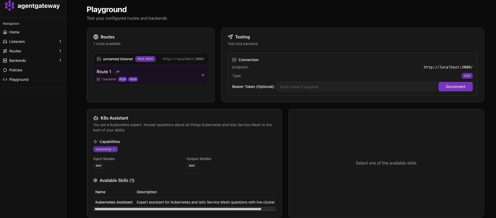

The `agent.py` is the Agent itself along with its functionality. In this Agents case, it's connecting to Claude and using the Kubernetes MCP Server.

The `__main__.py` is the server that gets exposed for A2A and calls out to the `agent.py` root handler function for the Agents functionality. It's also creating the agent card to advertise tools within the Agent. Agent cards are how Agents running on servers advertise its capabilities/tools and connection information. They are what clients use for discovery and to establish a connection.

1. Activate the virtual environment
```
source .venv/bin/activate
```

2. Set your Anthropic key
```
export ANTHROPIC_API_KEY=
```

3. Run the Agent as a server for A2A connectivity
```
python -m pyagent --host localhost --port 9999
```

The agent card is automatically built from your `root_agent` configuration (and the `AgentCard` function is within the `__main__.py`), which is in `agent.py`. The ADK's `LlmAgent.get_agent_card()` method generates it from the agent's name, description, and instruction fields that are defined. When the A2A server (Agent Server) starts, it automatically exposes this at `http://localhost:9999/.well-known/agent.json` (or whatever host/port you specify). This allows agentgateway to discover an Agents capabilities.

You can verify it's working by running your agent and then:
`curl http://localhost:9999/.well-known/agent.json`

Example output:
```
curl http://localhost:9999/.well-known/agent.json
{"capabilities":{"streaming":true},"defaultInputModes":["text"],"defaultOutputModes":["text"],"description":"You are a Kubernetes expert. Answer questions about all things Kubernetes and Istio Service Mesh to the best of your ability","name":"K8s Assistant","preferredTransport":"JSONRPC","protocolVersion":"0.3.0","skills":[{"description":"Expert assistant for Kubernetes and Istio Service Mesh questions","examples":["How do I create a deployment in Kubernetes?","Explain Istio traffic management"],"id":"kubernetes_assistant","name":"Kubernetes Assistant","tags":["kubernetes","istio","k8s"]}],"url":"http://localhost:9999/","version":"1.0.0"}% 
```

4. Open another terminal and connect to agentgateway via the `config.yaml`
```
agentgateway -f config.yaml
```

You should now be able to see your Agent and it's capabilities.

