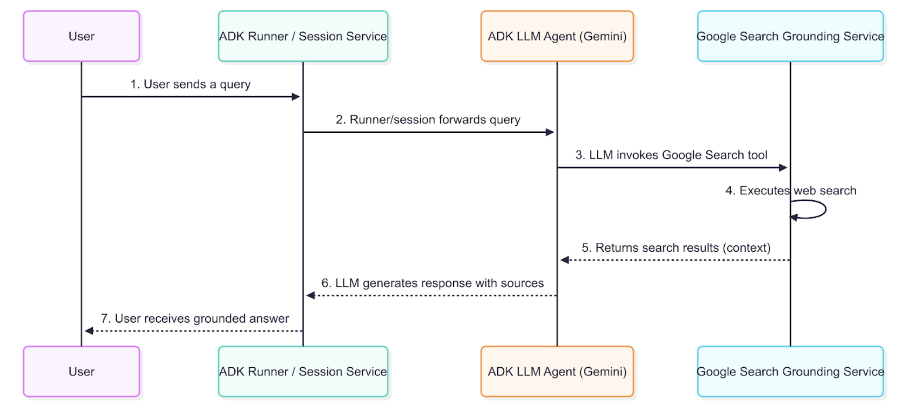

# Agent Breakdown

Below is how the Agent works and what tools it uses out of the box.

The goal of this Agent is to be your troubleshooting assistant. Whether you're an SRE, Platform Engineer, or DevOps Engineer, this Agent can help you figure out what is going on within your environment.

## Agent Development Kit (ADK)

ADK is an Agent framework (like CrewAI, kagent, or langchain) to build Agents. The thing with Agent frameworks, however, is they don't come with the ability to orchestrate/deploy/manage Agents (aside from built-in tools like ADK deploying to GCP).

Because of that, you can use the BYO feature in kagent (OSS and enterprise) to import Agents and use them with any LLM on any k8s cluster. Agentgateway (another OSS and enterprise tool) can then be used to observe, route, secure, and manage all Agentic traffic (traffic going from the Agentic to its destination like an MCP Server or an LLM)

## Search

Instead of using a search tool like Serper, Google Search Grounding is used and part of the toolset in ADK.

It allows you to get real-time search results from trusted sources (instead of implemented a KB via a RAG). The goal of Google Search Grounding is to provide accurate results on information that the LLM you're using may not be trained on.

## MCP

To provide a few different tools for the SRE/Platform Engineering Agent to be as effective as possible, MCP Servers are incorporated in. The MCP Servers used within the Agent are `stdio`, which means you need a way to secure the traffic to said MCP Server (that is where agentgateway comes into play for Auth and Tool Selection security).

The MCP Server used is `` and the tools used are:
