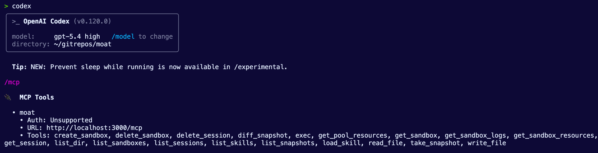
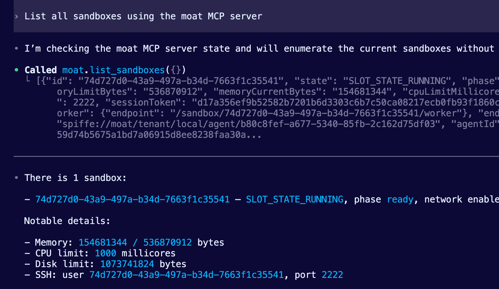
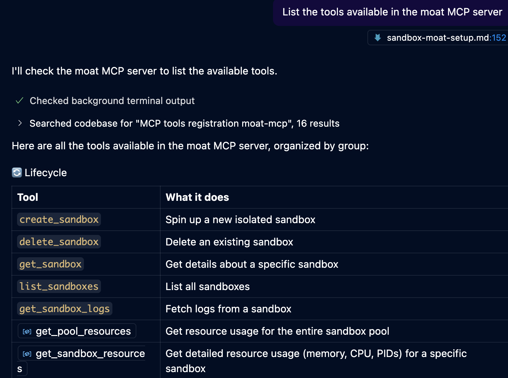

# Demos

Below are a collection of demos that showcase:
1. Using `moat` with your Agent runtimes and LLM provider of choice.
2. Snapshots
3. Sandbox creation & running Agents in a sandbox
4. Interacting with MCP via `moat` in Agents and IDEs (VS Code)

## Setup

Add moat binaries to your PATH so commands work from any directory:

```bash
# Add to ~/.zshrc or ~/.bashrc
export PATH="/Users/michaellevan/gitrepos/moat/target/debug:$PATH"

# Reload your shell
source ~/.zshrc
```

Verify the binaries are accessible:
```bash
which moat moatctl moat-mcp
```

---

## Connect Via Codex

1. Build moat-mcp:
```
cargo build -p moat-mcp
```

2. Start moat-mcp as an HTTP server (in a separate terminal):
```bash
moat-mcp --moat-url http://localhost:8080 --mode single --transport http --port 3000
```

3. Add the MCP server to Codex:
```bash
codex mcp add moat --url http://localhost:3000/mcp
```

4. Verify it is configured:
```bash
codex mcp list
```

5. Start Codex and verify connection:
```
/mcp
```
You should see `moat` in the MCP server list.

6. Test that the tools actually work:
```
List all sandboxes using the moat MCP server
```
If working, Codex should call the moat MCP tools and show results. If not, the tools are not registered properly.




**Available tools:**

| Tool | What it does |
|------|--------------|
| `create_sandbox` | Spin up a new isolated sandbox |
| `exec` | Run commands in the sandbox |
| `read_file` / `write_file` | File operations in `/workspace` |
| `list_dir` | List directory contents |
| `take_snapshot` | Save sandbox state |
| `delete_sandbox` | Clean up |

**Modes:**
- `--mode single` — Codex implicitly uses one sandbox
- `--mode multi` — Tool calls must specify `sandbox_id`

## Moat In VS Code

1. Build `moat-mcp`:
```bash
cargo build -p moat-mcp
```

2. Start `moat-mcp` as an HTTP server in a separate terminal:
```bash
moat-mcp --moat-url http://localhost:8080 --mode single --transport http --port 3000
```

3. In VS Code, open the Command Palette and run `MCP: Add Server`.

4. Add a new HTTP MCP server named `moat` with URL `http://localhost:3000/mcp`.

5. Add it to the current workspace if you want the config stored in this repo, or to your user profile if you only want it for your local VS Code setup.

6. Run `MCP: List Servers` (**Cmd+Shift+P**) and confirm `moat` is listed. Start it from there if VS Code has not already started it.

7. Open Copilot Chat in VS Code and switch the chat mode to `Agent`.

8. Click the tools icon in the chat UI and confirm that the `moat` server and its tools are available.

9. Test it with:
```text
List the tools available in the moat MCP server
```



## Time-Travel Debugging for AI Agents

This demo shows how AI agents can experiment freely with snapshots.

**What it demonstrates:** Snapshots enable experimentation without fear. The AI agent can try approaches, snapshot known-good states, and restore when things go wrong.

### Prerequisites

Moat server running:
```bash
moat serve --port 8080 --slots 12
```

### Demo Script

**Step 1: Create a sandbox with a named session**

Sessions persist snapshots across sandbox deletions, enabling true time-travel.

```bash
SANDBOX_ID=$(echo '{"session": "demo-session"}' | moatctl sandbox create -q -)
echo "Created sandbox: $SANDBOX_ID"
```

**Step 2: Create working code and verify it passes**

```bash
# Create the main module
moatctl sandbox write-file $SANDBOX_ID /workspace/calc.py << 'EOF'
def add(a, b):
    return a + b

def subtract(a, b):
    return a - b

def multiply(a, b):
    return a * b
EOF

# Create tests
moatctl sandbox write-file $SANDBOX_ID /workspace/test_calc.py << 'EOF'
from calc import add, subtract, multiply

def test_all():
    assert add(2, 3) == 5, "add failed"
    print("add: PASS")
    assert subtract(5, 3) == 2, "subtract failed"
    print("subtract: PASS")
    assert multiply(4, 3) == 12, "multiply failed"
    print("multiply: PASS")
    print("\nAll tests passed!")

if __name__ == "__main__":
    test_all()
EOF

# Run tests - should pass
moatctl sandbox exec $SANDBOX_ID -- python3 /workspace/test_calc.py
```

Expected output:
```
add: PASS
subtract: PASS
multiply: PASS

All tests passed!
```

**Step 3: Take a snapshot of the working state**

```bash
moatctl snapshot take $SANDBOX_ID
```

Output:
```
Snapshot #0 taken (0 changes)
```

**Step 4: Introduce a bug**

```bash
moatctl sandbox write-file $SANDBOX_ID /workspace/calc.py << 'EOF'
def add(a, b):
    return a + b

def subtract(a, b):
    return a - b

def multiply(a, b):
    return a + b  # BUG: should be a * b
EOF
```

**Step 5: Run tests - they fail now**

```bash
moatctl sandbox exec $SANDBOX_ID -- python3 /workspace/test_calc.py
```

Output (stops at multiply):
```
add: PASS
subtract: PASS
```

**Step 6: Take a snapshot of the broken state and view the diff**

```bash
# Take snapshot
moatctl snapshot take $SANDBOX_ID

# Show what changed since snapshot #0
moatctl snapshot diff $SANDBOX_ID 0
```

Output:
```
Snapshot #1 taken (1 changes)
TYPE  PATH                       SIZE DELTA
~     /workspace/calc.py         +24

Diff for snapshot #0 (1 changes to restore)
TYPE  PATH                       SIZE DELTA
~     /workspace/calc.py
```

**Step 7: Restore to the working state**

Delete the broken sandbox and create a new one that restores from snapshot #0:

```bash
# Delete broken sandbox
echo "y" | moatctl sandbox delete $SANDBOX_ID

# Create new sandbox, restoring from snapshot #0
NEW_ID=$(echo '{"session": "demo-session", "restore_snapshot": 0}' | moatctl sandbox create -q -)
echo "Restored sandbox: $NEW_ID"
```

**Step 8: Verify tests pass again**

```bash
moatctl sandbox exec $NEW_ID -- python3 /workspace/test_calc.py
```

Output:
```
add: PASS
subtract: PASS
multiply: PASS

All tests passed!
```

### Key Takeaways

- **Sessions persist across sandbox deletion** — snapshots are stored by session name, not sandbox ID
- **Diff before restore** — see exactly what will change before committing
- **Fast iteration** — AI agents can experiment freely, knowing they can always roll back
- **Content-addressable storage** — identical files are deduplicated across snapshots

---

## Secure API Access Without Exposing Credentials

This demo shows how sandboxes can call authenticated APIs without ever seeing the credentials. The credential proxy injects headers on the host side.

**What it demonstrates:** Credentials are injected by the host-side proxy via TLS MITM. The sandbox has zero knowledge of secrets. If malicious code tries to exfiltrate credentials, there's nothing to steal.

### Architecture

```
┌─────────────────────────────────────────────────────────────────┐
│ Sandbox                                                         │
│   curl https://api.openai.com/v1/models                         │
│   (no API key in code, env, or memory)                          │
└──────────────────────────┬──────────────────────────────────────┘
                           │ HTTPS (encrypted)
                           ▼
┌─────────────────────────────────────────────────────────────────┐
│ Credential Proxy (host-side, agentgateway)                      │
│   1. Intercepts TLS via per-sandbox CA                          │
│   2. Decrypts request                                           │
│   3. Injects Authorization: Bearer ${OPENAI_API_KEY}            │
│   4. Re-encrypts and forwards to upstream                       │
└──────────────────────────┬──────────────────────────────────────┘
                           │ HTTPS (re-encrypted)
                           ▼
┌─────────────────────────────────────────────────────────────────┐
│ api.openai.com                                                  │
│   Receives properly authenticated request                       │
└─────────────────────────────────────────────────────────────────┘
```

### Prerequisites

1. Set your API key as an environment variable:
```bash
export OPENAI_API_KEY="sk-..."
```

2. Create a moat config file with credential injection:
```bash
cat > moat-config.json << 'EOF'
{
  "port": 8080,
  "slots": 12,
  "egress": {
    "hosts": [
      {
        "host": "api.openai.com",
        "ports": [443],
        "headers": [
          {
            "name": "Authorization",
            "value": "Bearer ${OPENAI_API_KEY}"
          }
        ]
      }
    ]
  }
}
EOF
```

3. Start moat with the config:
```bash
moatctl serve --config moat-config.json
```

### Demo Script

**Step 1: Create a sandbox with api.openai.com allowed**

```bash
SANDBOX_ID=$(echo '{"network": {"hosts": [{"host": "api.openai.com", "ports": [443]}]}}' | moatctl sandbox create -q -)
echo "Created sandbox: $SANDBOX_ID"
```

**Step 2: Call the OpenAI API from inside the sandbox (no API key in code)**

```bash
moatctl sandbox exec $SANDBOX_ID -- \
  curl -s https://api.openai.com/v1/models | head -20
```

The request succeeds — credentials were injected by the proxy.

**Step 3: Prove the sandbox has no access to credentials**

```bash
# Check environment variables
moatctl sandbox exec $SANDBOX_ID -- env | grep -i openai
# (nothing)

# Check process memory
moatctl sandbox exec $SANDBOX_ID -- cat /proc/self/environ | tr '\0' '\n' | grep -i key
# (nothing)
```

**Step 4: Show that unauthorized hosts are blocked**

```bash
# Try to access google.com (not in allowed_hosts)
moatctl sandbox exec $SANDBOX_ID -- curl -s -I https://google.com
```

Output:
```
HTTP/1.1 404 Not Found
content-type: text/plain
content-length: 15
```

The gateway returns 404 for any host not in the allowed list.

### Key Security Features

| Feature | What It Does |
|---------|--------------|
| **Host-side credential injection** | Secrets never enter sandbox memory |
| **Per-sandbox TLS CA** | Each sandbox trusts a unique CA; proxy signs leaf certs on-the-fly |
| **Hostname allowlist** | Only explicitly allowed hosts can be reached |
| **SSRF protection** | Cloud metadata endpoints (169.254.169.254, etc.) are always blocked |
| **DNS rebinding defense** | IP is re-validated after DNS resolution |
| **Zeroization** | Credentials are cleared from proxy memory after use |

### Testing Network Isolation (without credentials)

Even without credential config, you can test network isolation:

```bash
# Create sandbox with httpbin.org allowed
SANDBOX_ID=$(echo '{"network": {"hosts": [{"host": "httpbin.org", "ports": [443]}]}}' | moatctl sandbox create -q -)

# This works (host is allowed)
moatctl sandbox exec $SANDBOX_ID -- curl -s https://httpbin.org/ip

# This is blocked (host not in allowlist)
moatctl sandbox exec $SANDBOX_ID -- curl -s -I https://example.com
# Returns: 404 Not Found
```

### Key Takeaways

- **Zero-knowledge design** — sandbox code never sees credentials
- **Transparent to application code** — standard curl/requests/fetch just work
- **Defense in depth** — allowlist + SSRF protection + DNS rebinding defense
- **Audit trail** — credential access is logged on the host, never visible to sandbox

---

## Running Claude Code in a Sandbox

This demo shows how to run Claude Code (the AI coding agent) inside a moat sandbox. Any code Claude generates and executes is fully contained — it cannot access your host system, other sandboxes, or exfiltrate credentials.

**What it demonstrates:** An AI agent running in complete isolation. Claude Code can write and execute arbitrary code, install packages, and interact with APIs — all safely sandboxed.

### Architecture

```
┌─────────────────────────────────────────────────────────────────┐
│ Your Terminal                                                   │
│   moatctl sandbox ssh $SANDBOX_ID                               │
└──────────────────────────┬──────────────────────────────────────┘
                           │
                           ▼
┌─────────────────────────────────────────────────────────────────┐
│ Moat Sandbox (isolated Linux VM)                                │
│                                                                 │
│   ┌─────────────────────────────────────────────────────────┐   │
│   │ Claude Code                                             │   │
│   │   - Generates and executes code                         │   │
│   │   - Works in /workspace                                 │   │
│   │   - All operations contained within sandbox             │   │
│   └─────────────────────────────────────────────────────────┘   │
│                                                                 │
│   Network: api.anthropic.com only                               │
│   Credentials: API key injected by host proxy                   │
│   Filesystem: /workspace (persistent via snapshots)             │
└─────────────────────────────────────────────────────────────────┘
```

### Prerequisites

**Important:** Claude Code's native binary requires glibc, but the default moat rootfs uses Alpine Linux (musl libc). You must pre-install Claude Code using npm. The setup differs by backend:

#### libkrun (macOS)

One-time rootfs setup — run this once, then all future sandboxes will have Claude Code:

```bash
docker run --rm --platform linux/arm64 \
  -v ~/.local/state/moat/krun-rootfs:/rootfs \
  node:20-alpine \
  sh -c "apk --root /rootfs --initdb add --no-cache nodejs npm && \
         npm install -g @anthropic-ai/claude-code --prefix /rootfs/usr"
```

#### Firecracker (Linux)

Add to your Firecracker rootfs build process. If using the moat scripts:

```bash
# In the rootfs build, add:
apk add --no-cache nodejs npm
npm install -g @anthropic-ai/claude-code
```

Or modify `scripts/build-firecracker-rootfs.sh` to include these packages.

#### Bubblewrap (Linux)

Bubblewrap uses the host filesystem. Install Claude Code directly on the host:

```bash
npm install -g @anthropic-ai/claude-code
```

The `claude` binary will be available inside sandboxes automatically.

1. Set your Anthropic API key:
```bash
export ANTHROPIC_API_KEY="sk-ant-..."
```

2. Create a moat config file with egress access for Claude Code:
```bash
cat > moat-claude-config.json << 'EOF'
{
  "port": 8080,
  "slots": 12,
  "egress": {
    "hosts": [
      {
        "host": "api.anthropic.com",
        "ports": [443],
        "headers": [
          {
            "name": "x-api-key",
            "value": "${ANTHROPIC_API_KEY}"
          }
        ]
      }
    ]
  }
}
EOF
```

3. Start moat with the config:
```bash
moat serve --config moat-claude-config.json
```

### Demo Script

**Step 1: Create a sandbox with network access for Claude Code**

```bash
SANDBOX_ID=$(echo '{
  "session": "claude-sandbox",
  "network": {
    "hosts": [
      {"host": "api.anthropic.com", "ports": [443]}
    ]
  }
}' | moatctl sandbox create -q -)
echo "Created sandbox: $SANDBOX_ID"
```

**Step 2: Verify Claude Code is available**

Claude Code was pre-installed in the rootfs during the one-time setup:

```bash
moatctl sandbox exec $SANDBOX_ID -- claude --version
```

**Step 3: Run Claude Code interactively via SSH**

SSH into the sandbox for an interactive session:

```bash
moatctl sandbox ssh $SANDBOX_ID
```

Then inside the sandbox:
```bash
cd /workspace
claude
```

Claude Code is now running inside the sandbox. Any code it generates executes in `/workspace`, isolated from your host system.

**Step 4: Or run Claude Code with a one-shot command**

```bash
moatctl sandbox exec $SANDBOX_ID -- \
  sh -c 'cd /workspace && claude -p "Create a Python script that prints hello world, then run it"'
```

**Step 5: Take a snapshot of your Claude session**

Save your work so you can resume later:

```bash
moatctl snapshot take $SANDBOX_ID
```

**Step 6: Resume later from the snapshot**

```bash
# Delete the old sandbox
echo "y" | moatctl sandbox delete $SANDBOX_ID

# Create a new sandbox, restoring from the snapshot
NEW_ID=$(echo '{"session": "claude-sandbox", "restore_snapshot": 0}' | moatctl sandbox create -q -)

# Continue where you left off
moatctl sandbox ssh $NEW_ID
```

### Security Benefits

| Concern | How Moat Addresses It |
|---------|----------------------|
| **Malicious code execution** | Sandbox is isolated — cannot access host filesystem, network, or other sandboxes |
| **API key theft** | Key is injected by host proxy; sandbox never sees it |
| **Network exfiltration** | Only explicitly allowed hosts (api.anthropic.com) are reachable |
| **Persistent compromise** | Restore from a known-good snapshot to reset the environment |
| **Resource exhaustion** | Sandbox has memory/CPU/disk limits enforced by moat |

### Use Cases

1. **Safe experimentation** — Let Claude try risky operations (install packages, modify system files) without fear
2. **Untrusted code review** — Have Claude analyze potentially malicious code in isolation
3. **Reproducible environments** — Snapshot a working setup, share the session, restore anywhere
4. **Multi-tenant AI** — Run multiple Claude instances in separate sandboxes, fully isolated from each other

### Key Takeaways

- **Full isolation** — Claude Code runs in a VM, not just a container
- **Credential safety** — API key never enters sandbox memory
- **Snapshot/restore** — Save and resume Claude sessions across sandbox lifecycles
- **Network control** — Explicit allowlist for all outbound traffic