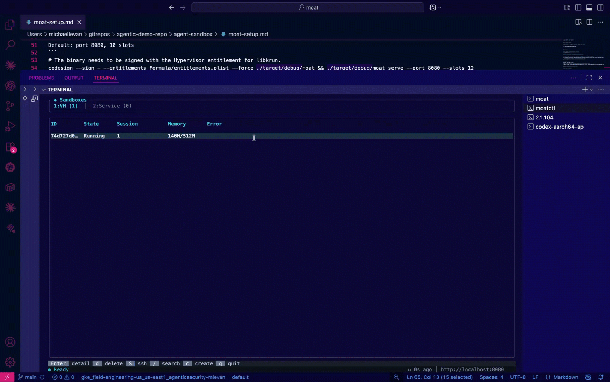

## Run moat

1. Install host prerequisites:
```
curl --proto '=https' --tlsv1.2 -sSf https://sh.rustup.rs | sh

source ~/.cargo/env 

which cargo
```

```
brew tap slp/krun
```

```
brew install libkrun libkrunfw zig
```

```
cargo install cargo-zigbuild
```

```
brew install protobuf
```

2. Build moat for macOS and moat-worker for the Linux guest:
```
cd /Users/michaellevan/gitrepos/moat
```

```
make build
```

```
rustup target add aarch64-unknown-linux-musl
make build-worker
```

3. Sign the moat binary with the Hypervisor entitlement:

codesign --sign - --entitlements Formula/entitlements.plist --force target/debug/moat

4. Create the VM Rootfs The libkrun backend needs a Linux root filesystem for the guest VM. This downloads Alpine Linux and installs the moat-worker binary into it.
```
./scripts/build-krun-rootfs.sh ~/.local/state/moat/krun-rootfs
```

## Build Sandbox

5. Run the Server

Default: port 8080, 10 slots
```
# The binary needs to be signed with the Hypervisor entitlement for libkrun.
codesign --sign - --entitlements Formula/entitlements.plist --force ./target/debug/moat && ./target/debug/moat serve --port 8080 --slots 12
```

6. Build the CLI binary to run locally

```
cargo build -p moatctl
```

7. Test It. In another terminal, create a sandbox:
```
echo '{}' | ./target/debug/moatctl sandbox create -
```



## Connect Via Codex

1. Build moat-mcp:
```
cargo build -p moat-mcp
```

2. Start moat-mcp as an HTTP server (in a separate terminal):
```bash
/Users/michaellevan/gitrepos/moat/target/debug/moat-mcp --moat-url http://localhost:8080 --mode single --transport http --port 3000
```

3. Add the MCP server to Codex:
```bash
codex mcp add moat --url http://localhost:3000/mcp
```

4. Verify it is configured:
```bash
codex mcp list
```

5. Start Codex and verify connection:
```
/mcp
```
You should see `moat` in the MCP server list.

6. Test that the tools actually work:
```
List all sandboxes using the moat MCP server
```
If working, Codex should call the moat MCP tools and show results. If not, the tools are not registered properly.


**Available tools:**

| Tool | What it does |
|------|--------------|
| `create_sandbox` | Spin up a new isolated sandbox |
| `exec` | Run commands in the sandbox |
| `read_file` / `write_file` | File operations in `/workspace` |
| `list_dir` | List directory contents |
| `take_snapshot` | Save sandbox state |
| `delete_sandbox` | Clean up |

**Modes:**
- `--mode single` — Codex implicitly uses one sandbox
- `--mode multi` — Tool calls must specify `sandbox_id`

## Moat In VS Code

1. Build `moat-mcp`:
```bash
cargo build -p moat-mcp
```

2. Start `moat-mcp` as an HTTP server in a separate terminal:
```bash
/Users/michaellevan/gitrepos/moat/target/debug/moat-mcp --moat-url http://localhost:8080 --mode single --transport http --port 3000
```

3. In VS Code, open the Command Palette and run `MCP: Add Server`.

4. Add a new HTTP MCP server named `moat` with URL `http://localhost:3000/mcp`.

5. Add it to the current workspace if you want the config stored in this repo, or to your user profile if you only want it for your local VS Code setup.

6. Run `MCP: List Servers` (**Cmd+Shift+P**) and confirm `moat` is listed. Start it from there if VS Code has not already started it.

7. Open Copilot Chat in VS Code and switch the chat mode to `Agent`.

8. Click the tools icon in the chat UI and confirm that the `moat` server and its tools are available.

9. Test it with:
```text
List the tools available in the moat MCP server
```
