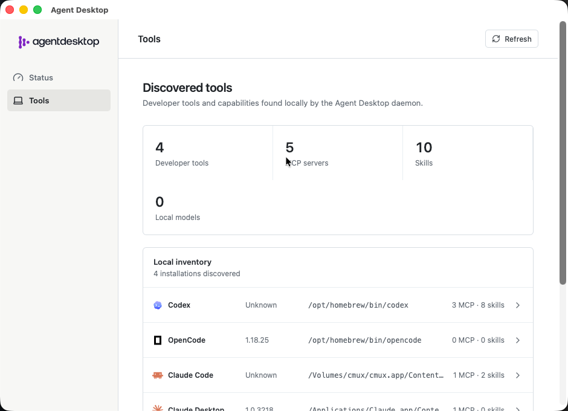
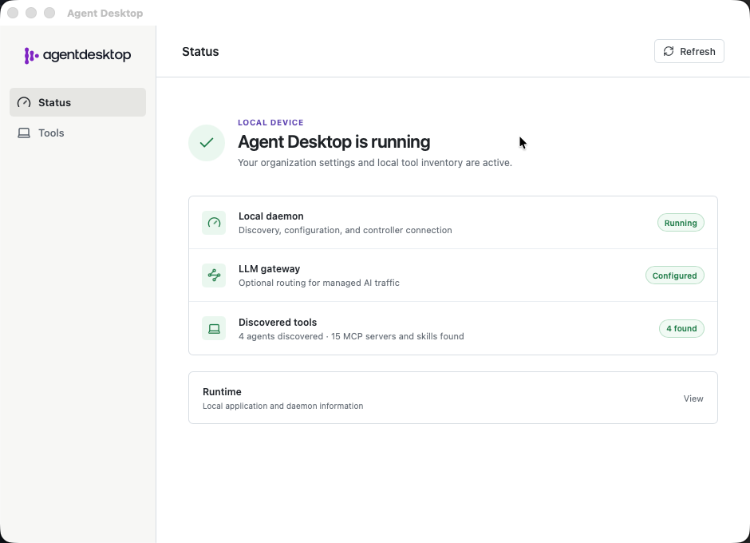
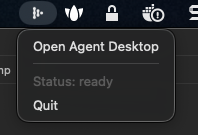

# agentdesktop quickstart

Hands-on install and configuration for **Claude Code**. Agents always run on the
laptop. agentdesktop does not need an LLM API key to discover or manage local
tools. An Anthropic key is only required if you stand up the example
**agentgateway** so Claude Code can send model traffic through it.

Two modes:

| Mode | What you run | Config | Auth to the gateway |
| --- | --- | --- | --- |
| Standalone | Daemon on this machine only | Local YAML | `type: oidc` |
| Controller-managed | Controller (brains) + daemon on the device | Controller pushes YAML to enrolled devices | `type: controllerJwt` |

Do not reuse the standalone YAML for managed mode. Stop the standalone daemon
before starting the managed one.

Official source and examples live in a sibling clone:

```bash
git clone https://github.com/agentdesktop-dev/agentdesktop.git ~/gitrepos/agentdesktop
cd ~/gitrepos/agentdesktop
```

All commands below assume that repository root unless noted.

agentdesktop does **not** require Docker. The daemon and controller are local binaries. Docker shows up in this lab only because the repo packages two *other* services as containers:

- **Dex** — stand-in OIDC identity provider (enrollment / gateway login)
- **agentgateway** — stand-in LLM gateway so Claude Code can send traffic through a proxy

Those two are defined in `examples/*/compose.yaml`. `docker compose` is just how this repo starts them. You could run the same images with `docker run`, or point agentdesktop at a real IdP and gateway and skip Docker entirely.

## Prerequisites

- Git, Make, curl, OpenSSL
- Claude Code on `PATH` (`claude`)
- For **managed** or a from-source build: Rust (see `rust-toolchain.toml`, channel `1.97`), Node.js 24.17.0 (`frontend/.nvmrc`), Corepack, and [Tauri prerequisites](https://v2.tauri.app/start/prerequisites/)
- On macOS: Xcode command-line tools if missing (`xcode-select --install`)
- Docker Desktop for the Dex + agentgateway labs (it already includes `docker compose`; do not install Compose separately)
- Anthropic API key for the example agentgateway (`export ANTHROPIC_API_KEY=sk-ant-...`)

On Docker Desktop, the managed agentgateway example uses host networking: **Settings > Resources > Network**. Linux already supports host networking.

- Get the binaries

**Device binary (daemon, CLI, tray app)** from [GitHub Releases](https://github.com/agentdesktop-dev/agentdesktop/releases). Put `agentdesktop` on your `PATH`.

The **controller** is not in that download. For the local managed lab, build both from source:

```bash
cd ~/gitrepos/agentdesktop
corepack enable
make install
export PATH="$HOME/.cargo/bin:$PATH"
command -v agentdesktop
command -v agentdesktop-controller
```

`make install` builds the frontends and installs both binaries into Cargo’s bin directory. `make build` only compiles; binaries land in `target/debug/`.

Confirm:

```bash
agentdesktop --help
```

## 2. Standalone (this laptop only)

Start Dex and agentgateway, then write the YAML that points at them, then run the daemon. In `--user` mode the daemon merges Claude Code settings into `~/.claude/settings.json`.

### 2.1 Dex and agentgateway

Requires Docker Desktop and `ANTHROPIC_API_KEY`. Standalone ports: Dex `127.0.0.1:5557`, agentgateway `127.0.0.1:4001`. These containers are not agentdesktop; they come from `examples/standalone/compose.yaml`.

```bash
export ANTHROPIC_API_KEY=sk-ant-...
docker compose -f examples/standalone/compose.yaml up -d
```

Wait until both are up:

```bash
curl --fail --silent --show-error \
  --retry 10 --retry-all-errors --retry-delay 1 \
  http://127.0.0.1:5557/dex/.well-known/openid-configuration \
  > /dev/null && echo "Dex is ready"

curl --fail --head --silent --show-error \
  --retry 10 --retry-all-errors --retry-delay 1 \
  http://127.0.0.1:4001/ \
  > /dev/null && echo "agentgateway is ready"
```

### 2.2 Claude Code config

```bash
cat > /tmp/agentdesktop-standalone.yaml <<'EOF'
llmGateway:
  url: http://127.0.0.1:4001
  authentication:
    type: oidc
    issuer: http://127.0.0.1:5557/dex
    clientId: agentdesktop-local
    scopes: [openid, email, offline_access]
    allowInsecure: true

programs:
  claudeCode:
    useLlmGateway: true
    companyAnnouncements: ["Using the local Agentgateway through Agentdesktop"]
EOF
```

### 2.3 Preview, then run the daemon

```bash
agentdesktop daemon \
  --config /tmp/agentdesktop-standalone.yaml \
  --user \
  --dry-run
```

That prints a unified diff and writes nothing. Then:

```bash
agentdesktop daemon \
  --config /tmp/agentdesktop-standalone.yaml \
  --user
```

Leave it in the foreground. The browser opens for Dex sign-in: `admin@example.com` / `password`.

The daemon stores user-mode state under `~/.local/state/agentdesktop` and listens on a user socket (`$XDG_RUNTIME_DIR/agentdesktop.sock` or `~/.local/state/agentdesktop/agentdesktop.sock`).

### 2.4 Verify from another terminal

```bash
agentdesktop status
# ok

agentdesktop discover
# example:
# claude-code     2.1.231 /Users/you/.local/bin/claude
# vscode          1.131.0 /opt/homebrew/bin/code
```

`agentdesktop` itself is not calling Anthropic. The key, if you set one, is used by the **agentgateway** container when Claude Code sends a request.

### 2.5 Tray UI

The daemon has no web UI. The tray app is a separate process:

```bash
agentdesktop
```



If the window disappears, it is hidden: menu bar / tray → **Open Agent Desktop**.



- **Status → Runtime**: standalone mode, daemon up
- **Tools**: discovered harnesses, MCP names, skills, local models

## 3. Stop standalone before managed

Only one agentdesktop daemon should be running. Find it:

```bash
pgrep -lf agentdesktop
```

In the daemon terminal, Ctrl-C. If that window is gone:

```bash
pkill -f 'agentdesktop daemon'
```

Confirm it is gone:

```bash
pgrep -lf agentdesktop
```

If the tray app is open, **Quit** from the menu so it does not respawn a user daemon.

Stop the standalone Dex/gateway containers (they use different ports than the managed lab):

```bash
cd ~/gitrepos/agentdesktop
docker compose -f examples/standalone/compose.yaml down
rm -f /tmp/agentdesktop-standalone.yaml
```

Do not reuse `/tmp/agentdesktop-standalone.yaml` for the next section.

## 4. Controller-managed (local fleet)

The controller is the control plane: enrollment, device certs, pushed daemon YAML, inventory, telemetry, short-lived gateway JWTs. The daemon on the laptop is the hands (writes tool settings, reports inventory).

This lab runs everything on one machine using the `examples/claude` Compose/IdP files, with a Claude Code–only policy you write yourself. In production the controller lives on Kubernetes and the daemons stay on devices.

Managed ports: Dex `5556`, fleet API `8443`, controller UI `8080`, agentgateway `4000`.

### 4.1 Dev keys

```bash
cd ~/gitrepos/agentdesktop
./examples/claude/create-keys.sh
```

Writes `/tmp/agentdesktop-keys/` (controller TLS, device CA, gateway JWT key). The script refuses to overwrite; `rm -rf /tmp/agentdesktop-keys` to regenerate.

### 4.2 Dex

Required for this lab: `/tmp/agentdesktop-controller.yaml` sets `oidc.issuer` to `http://127.0.0.1:5556/dex`. Dex is not agentdesktop; it is the stand-in IdP from `examples/claude/compose.yaml`.

```bash
docker compose -f examples/claude/compose.yaml up -d dex

curl --fail --silent \
  --retry 10 --retry-all-errors --retry-delay 1 \
  http://127.0.0.1:5556/dex/.well-known/openid-configuration \
  > /dev/null && echo "Dex is ready"
```

### 4.3 Controller (Claude Code policy)

Write the YAML the controller will push, then a controller config that watches it. Do not use the repo’s `examples/claude/claude-code.yaml` as-is.

```bash
cat > /tmp/agentdesktop-claude-code.yaml <<'EOF'
llmGateway:
  url: http://localhost:4000
  authentication:
    type: controllerJwt
    audience: "agentgateway"
    allowedClientIds: [claude-code]

telemetry:
  events:
  - session.new
  - tool.use

programs:
  claudeCode:
    companyAnnouncements: ["Managed by Agentdesktop"]
EOF

cat > /tmp/agentdesktop-controller.yaml <<'EOF'
fleetListen: 0.0.0.0:8443
allowInsecureDev: true
databaseUrl: sqlite:///tmp/agentdesktop-controller.db?mode=rwc
tls: /tmp/agentdesktop-keys

oidc:
  issuer: http://127.0.0.1:5556/dex
  clientId: local-public

daemonConfig:
  path: /tmp/agentdesktop-claude-code.yaml

gatewayJwt:
  privateKey: /tmp/agentdesktop-keys/gateway-jwt-key.pem
EOF
```

`allowedClientIds` is who may mint a **gateway JWT**, not an allow list of which agents may run.

New terminal, leave the controller running:

```bash
export PATH="$HOME/.cargo/bin:$PATH"
agentdesktop-controller --config /tmp/agentdesktop-controller.yaml
```

You should see the fleet listener on `0.0.0.0:8443` and admin UI on `127.0.0.1:8080`.

```bash
curl --fail http://127.0.0.1:8080/api/v1/settings
```

Expected:

```json
{"fleet_listen":"0.0.0.0:8443","admin_listen":"127.0.0.1:8080","oidc_enabled":true,"tls_enabled":true,"gateway_jwt_enabled":true}
```

Open [http://127.0.0.1:8080](http://127.0.0.1:8080). That is the **controller** UI (fleet), not the laptop tray app.

The device-side file is only how to reach the controller (`examples/claude/agentdesktop.yaml`):

```yaml
controller:
  address: https://127.0.0.1:8443
  caCertificatePath: /tmp/agentdesktop-keys/device-ca.pem
  heartbeatInterval: 60s
```

### 4.4 agentgateway

Required for this lab: `/tmp/agentdesktop-claude-code.yaml` sets `llmGateway.url` to `http://localhost:4000`. agentgateway is not agentdesktop. Host networking is required so this container can fetch the controller’s JWKS from `127.0.0.1:8080`.

```bash
export ANTHROPIC_API_KEY=sk-ant-...
cd ~/gitrepos/agentdesktop
docker compose -f examples/claude/compose.yaml up -d agentgateway

docker compose -f examples/claude/compose.yaml ps agentgateway
curl --fail --head --silent http://127.0.0.1:4000/ \
  > /dev/null && echo "agentgateway is ready"
```

### 4.5 Enroll the device daemon (`--user`)

New terminal, leave it running:

```bash
export PATH="$HOME/.cargo/bin:$PATH"
agentdesktop daemon --user \
  --config ~/gitrepos/agentdesktop/examples/claude/agentdesktop.yaml
```

Sign in:

- Email: `admin@example.com`
- Password: `password`

The daemon creates a device key that never leaves the machine, submits a CSR after OIDC, and stores identity under `~/.local/state/agentdesktop`. Socket: `$XDG_RUNTIME_DIR/agentdesktop.sock` or `~/.local/state/agentdesktop/agentdesktop.sock`. It merges Claude Code settings into `~/.claude/settings.json`.

### 4.6 Verify

```bash
export PATH="$HOME/.cargo/bin:$PATH"
agentdesktop status
agentdesktop config
agentdesktop discover
```

Refresh [http://127.0.0.1:8080](http://127.0.0.1:8080) → **Devices**. You should see this machine, discovered tools, and applied config revision.

Laptop tray UI (talks to the local daemon, not the controller HTTP port):

```bash
agentdesktop
```

Run `claude`. You should see `Managed by Agentdesktop`. Claude Code gets a short-lived gateway JWT from the daemon; agentgateway validates it, then uses **its** Anthropic key upstream.

## 5. Tear down the local managed lab

Ctrl-C the foreground daemon and controller, then:

```bash
cd ~/gitrepos/agentdesktop
docker compose -f examples/claude/compose.yaml down
rm -f /tmp/agentdesktop-claude-code.yaml /tmp/agentdesktop-controller.yaml
```

Compose down does **not** delete `/tmp/agentdesktop-keys`, `/tmp/agentdesktop-controller.db`, or `~/.local/state/agentdesktop`.

## 6. Production shape (not this lab)

Production is the same split: daemons on laptops, controller in the cluster.

- Helm chart: `deploy/helm/agentdesktop-controller` in the agentdesktop repo
- External PostgreSQL (the chart does not install it)
- Real OIDC provider
- Kubernetes Secret with `controller.pem`, `controller-key.pem`, `device-ca.pem`, `device-ca-key.pem` (and a JWT signing key if you use `controllerJwt`)
- Dev cluster walkthrough: `examples/kubernetes` (Dex + disposable Postgres; **not** production)

Do not point a production daemon at `https://127.0.0.1:8443` or use `allowInsecureDev`.

## Troubleshooting

**`agentdesktop status` cannot connect**  
The daemon is not running, or the CLI is hitting the wrong socket. This lab’s `--user` daemon uses `$XDG_RUNTIME_DIR/agentdesktop.sock` or `~/.local/state/agentdesktop/agentdesktop.sock`. Override with `--socket` or `AGENTDESKTOP_SOCKET`.

**Two daemons**  
Stop the standalone `--user` process before starting the managed one. Check `pgrep -lf agentdesktop`.

**`--once` / `--dry-run` with a controller**  
Those flags only apply local YAML. Controller sync, telemetry, and authenticated gateways need a long-running daemon.

**Browser does not open / enrollment stuck**  
Dex must be up on the port in the config (`5557` standalone, `5556` managed). Use `admin@example.com` / `password` with the checked-in Dex.

**agentgateway not ready (managed)**  
Enable Docker Desktop host networking. Confirm `ANTHROPIC_API_KEY` is set in the shell that ran `docker compose up`.

**No controller UI at :8080**  
That UI is served by `agentdesktop-controller`, not by the device daemon. Standalone mode has no fleet UI.

**API key errors from Claude Code**  
The key belongs on agentgateway, not in agentdesktop config. Standalone uses OIDC to the gateway; managed uses a controller-issued JWT. The upstream Anthropic key is still on the gateway.
)
