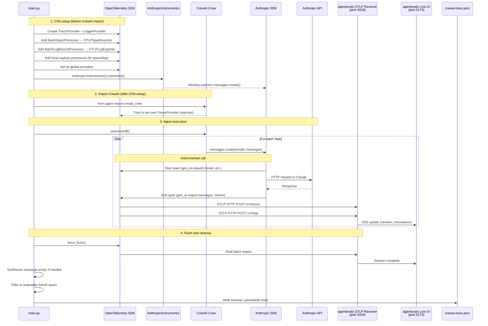

## Install and Run Agentevals

Run these commands from this directory:

```bash
cd /Users/michael/gitrepos/agentic-demo-repo/agentevals/live-session

python3.13 -m venv .venv
source .venv/bin/activate
uv pip install -r requirements.txt
pip install agentevals-cli
```

```bash
agentevals serve --dev --port 8001
```

You'll see a library in the `requirements.txt` called `wrapt`. `wrapt` is a Python function-wrapping/monkey-patching library. It is commonly used by instrumentation packages to patch SDK calls safely while preserving call signatures, bound methods, and decorator behavior. In this demo, it is present to support `opentelemetry-instrumentation-anthropic`, which patches Anthropic client calls when `agentevals/live-session/main.py:69` runs.

## 1. Run the CrewAI Agent

```bash
export ANTHROPIC_API_KEY=""
python main.py
```

When the run finishes, `main.py` writes `crewai-trace.json` in this directory. That file is intended for the agentevals browser upload flow.

## 2. Browser Evaluation Workflow

Upload these files in the agentevals evaluation UI:

1. `crewai-trace.json` as the **Trace File**
2. your own `eval_set.json` as the **Eval Set**

`eval_set.json` is not included in this directory right now. Use your own eval set file.

## 3. CLI Evaluation Workflow

If you still want to evaluate from the CLI, you can either use the generated `crewai-trace.json` in the UI path above, or export the live session directly from agentevals as OTLP JSONL and evaluate that file with `-f otlp-json`.

### 1. Find the session id

These commands use `jq`.

```bash
curl -s http://localhost:8001/api/streaming/sessions | jq
```

Copy the `sessionId` for the completed CrewAI run.

### 2. Export the session trace (optional)

```bash
curl -s -X POST http://localhost:8001/api/streaming/get-trace \
  -H 'Content-Type: application/json' \
  -d '{"session_id":"YOUR_SESSION_ID"}' \
  | jq -r '.data.traceContent' > crewai-trace.jsonl
```

This gives you a real **Trace File** in OTLP JSONL format.

### 3. Run the evaluation

```bash
agentevals run crewai-trace.jsonl \
  --eval-set eval_set.json \
  -m response_match_score \
  -f otlp-json
```

You can swap `response_match_score` for another metric such as `final_response_match_v2`.

## What's Happening

1. `main.py` sets up OpenTelemetry with standard OTLP HTTP exporters pointing at the agentevals receiver on port 4318.
2. `AnthropicInstrumentor` patches the Anthropic SDK so every LLM call CrewAI makes (via its native Anthropic provider) emits OTel spans with GenAI semantic convention attributes.
3. Those spans export via OTLP to agentevals, which auto-creates a session and extracts invocations, messages, and token usage for the live UI.
4. In parallel, `main.py` also captures spans and logs locally during the run.
5. After the run completes, `main.py` synthesizes `gen_ai.input.messages` / `gen_ai.output.messages` when needed, filters down to the evaluable GenAI spans, and writes `crewai-trace.json` for the agentevals browser upload flow.

In agentevals, the `GenAIExtractor` detection is model-agnostic. It looks for standard GenAI semconv attributes such as `gen_ai.request.model` and `gen_ai.input.messages`. CrewAI with `crewai[anthropic]` uses the Anthropic SDK directly (not LiteLLM), so `AnthropicInstrumentor` is what captures the LLM calls. For this demo, `main.py` also does a local compatibility step for the browser-upload file by translating Anthropic-style prompt/completion attributes into the message-array shape that agentevals expects during conversion.

## How It Works

`main.py` is acting as the CrewAI client, OTel trace producer, OTLP exporter, and local trace-file writer. No agentevals SDK is imported — just standard OpenTelemetry exporters plus local post-processing to write `crewai-trace.json`.

`main.py` is the bridge between the running CrewAI workflow, the agentevals live receiver, and the browser-uploadable trace artifact written to disk.


