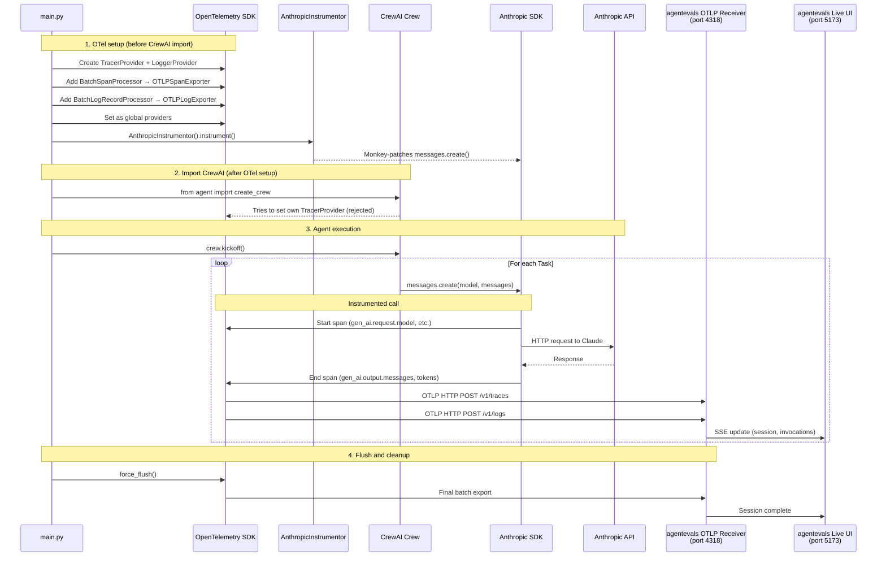

## Run agentevals

```
python3.13 -m venv .venv
source .venv/bin/activate
uv pip install -r requirements.txt
pip install agentevals-cli

pip install "agentevals-cli[live]"
```

```bash
agentevals serve --dev --port 8001
```

## Run the CrewAI Agent

```bash
export ANTHROPIC_API_KEY=""
python main.py
```

View the live session at http://localhost:5173

## What's Happening

1. `main.py` sets up OpenTelemetry with standard OTLP HTTP exporters
   pointing at the agentevals receiver on port 4318.
2. `AnthropicInstrumentor` patches the Anthropic SDK so every LLM call
   CrewAI makes (via its native Anthropic provider) emits OTel spans
   with GenAI semantic convention attributes.
3. Those spans export via OTLP to agentevals, which auto-creates a
   session and extracts invocations, messages, and token usage for the live UI.

In agentevals, the the `GenAIExtractor` detection is completely model-agnostic. It looks for `gen_ai.request.model` or `gen_ai.input.messages`. Same for all the extraction functions (`extract_user_text_from_attrs`, `extract_agent_response_from_attrs`, `extract_token_usage_from_attrs`). None of them check which provider or model is being used. They only read the standard GenAI semconv attributes. The only real question is: what generates the OTel spans? That's the instrumentor's job. CrewAI with `crewai[anthropic]` uses the Anthropic SDK directly (not LiteLLM), so `AnthropicInstrumentor` is what captures the LLM calls.

## How It Works

The `main.py` is acting as the CrewAI Agents client and OTel trace producer (creates the trace data) and exporter (exports the traces via OTLP HTTP to agentevals). No agentevals SDK is imported — just standard OpenTelemetry exporters.

`main.py` is the bridge between the CrewAI Agent running and agentevals.

