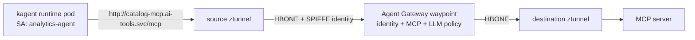

# Agent Mesh: Transparent Identity and AI Policy with Istio and Agentgateway

This demo shows that enrolling an AI agent into a mesh is the same as enrolling any other Kubernetes workload. Each agent is a kagent `Agent` with a model, instructions, and MCP tools. The kagent runtime runs in a pod, uses a dedicated Kubernetes service account, and receives a cryptographically verifiable SPIFFE workload identity from Istio.

## Demo Architecture



### Important Callout

The security and governance features exist without a mesh and you may be thinking "I can set up policies, guardrails, and governance without a mesh", but every agent must call the agentgateway address directly. In that model, agentgateway does not automatically receive the caller's Istio identity. Inbound authentication, such as JWT validation, must establish who the caller is.

## Demo scenario

| Workload | Namespace | Service account | Intended access |
|---|---|---|---|
| Platform agent | `ai-agents` | `platform-agent` | All tools and the configured LLM |
| Analytics agent | `ai-agents` | `analytics-agent` | Only `echo` and `get-sum` tools, plus the configured LLM |
| Rogue agent | `ai-agents` | `rogue-agent` | No MCP or LLM access |
| MCP server | `ai-tools` | `catalog-mcp` | Destination protected by the waypoint |

The three agents are declarative kagent agents. The kagent controller creates their runtime Deployments, while `spec.declarative.deployment.serviceAccountName` binds each runtime pod to the identity shown above. The agents call the MCP Service and virtual LLM hostname rather than an explicit gateway address.

## Prerequisites

- A Kubernetes cluster with Solo Enterprise for Istio 1.30 or later in ambient mode.
- Solo Enterprise for agentgateway installed.
- kagent installed with the `kagent.dev/v1alpha2` `Agent`, `ModelConfig`, and `RemoteMCPServer` APIs. The kagent controller must watch the `ai-agents` namespace; the default cluster-scoped installation watches all namespaces.
- `kubectl`, the Solo distribution of `istioctl`, the `kagent` CLI, and optional `jq`.
- Outbound access to pull container images and the MCP Inspector npm package.
- An OpenAI API key. The kagent agents send inference through agentgateway, which stores and injects the real provider credential.

Use the agentgateway version listed for your Solo Enterprise for Istio release. The installation shape is:

```bash
export AGENTGATEWAY_VERSION=
export AGENTGATEWAY_LICENSE_KEY=
```

```bash
helm upgrade --install agentgateway \
  oci://us-docker.pkg.dev/solo-public/enterprise-agentgateway/charts/enterprise-agentgateway \
  --version "${AGENTGATEWAY_VERSION}" \
  --namespace agentgateway-system \
  --set-string licensing.licenseKey="${AGENTGATEWAY_LICENSE_KEY}" \
  --set istio.autoEnabled=true
```

Verify the prerequisites before continuing:

```bash
kubectl get gatewayclass enterprise-agentgateway-waypoint
kubectl get pods -n istio-system -l app=ztunnel
kubectl get pods -n agentgateway-system
kubectl get crd agents.kagent.dev modelconfigs.kagent.dev remotemcpservers.kagent.dev
kubectl get pods -n kagent
kagent version
```

## 1. Enroll the agent workloads

Create two ambient namespaces. Labeling `ai-agents` enrolls every agent pod in that namespace just as it would enroll any other Kubernetes workload.

```bash
kubectl apply -f - <<'EOF'
apiVersion: v1
kind: Namespace
metadata:
  name: ai-agents
  labels:
    istio.io/dataplane-mode: ambient
---
apiVersion: v1
kind: Namespace
metadata:
  name: ai-tools
  labels:
    istio.io/dataplane-mode: ambient
EOF
```

Create the three agent identities. The kagent `Agent` resources are added after the protected MCP and LLM destinations exist.

```bash
kubectl apply -f - <<'EOF'
apiVersion: v1
kind: ServiceAccount
metadata:
  name: platform-agent
  namespace: ai-agents
---
apiVersion: v1
kind: ServiceAccount
metadata:
  name: analytics-agent
  namespace: ai-agents
---
apiVersion: v1
kind: ServiceAccount
metadata:
  name: rogue-agent
  namespace: ai-agents
EOF
```

When the kagent runtime pods start, each workload receives a distinct SPIFFE identity.

**How The SPIFEE Id Works** There is an istio-issued SPIFFE identity retrieved from the workload’s Kubernetes identity, not an identity supplied by SPIFFE itself. This is possible  because the Namespace where the service account exists is enrolled in the mesh (`istio.io/dataplane-mode: ambient`). Ztunnel then intercepts the Pods traffic, identifies its NS and SA, and uses the SPIFFE identity for mTLS. If the namespace wasn't enrolled in a mesh, there would be no SPIFFE ID.

```text
spiffe://<trust-domain>/ns/ai-agents/sa/platform-agent
spiffe://<trust-domain>/ns/ai-agents/sa/analytics-agent
spiffe://<trust-domain>/ns/ai-agents/sa/rogue-agent
```

## 2. Deploy an MCP server

Deploy the MCP "everything" test server. Its Service declares `appProtocol: agentgateway.dev/mcp`, which tells agentgateway to process the traffic as MCP. Streamable HTTP uses `/mcp` by default.

```bash
kubectl apply -f - <<'EOF'
apiVersion: v1
kind: ServiceAccount
metadata:
  name: catalog-mcp
  namespace: ai-tools
---
apiVersion: apps/v1
kind: Deployment
metadata:
  name: catalog-mcp
  namespace: ai-tools
spec:
  replicas: 1
  selector:
    matchLabels:
      app: catalog-mcp
  template:
    metadata:
      labels:
        app: catalog-mcp
    spec:
      serviceAccountName: catalog-mcp
      containers:
      - name: mcp
        image: node:22-alpine
        command: ["sh", "-c"]
        args:
        - PORT=3001 npx --yes @modelcontextprotocol/server-everything@2026.7.4 streamableHttp
        ports:
        - name: mcp
          containerPort: 3001
---
apiVersion: v1
kind: Service
metadata:
  name: catalog-mcp
  namespace: ai-tools
  annotations:
    agentgateway.dev/mcp-path: /mcp
spec:
  selector:
    app: catalog-mcp
  ports:
  - name: mcp
    port: 80
    targetPort: mcp
    appProtocol: agentgateway.dev/mcp
EOF

kubectl rollout status deployment/catalog-mcp -n ai-tools
```

Before adding a waypoint, use a short-lived protocol probe with the analytics service account to verify direct connectivity:

```bash
kubectl run direct-mcp-probe -n ai-agents \
  --rm -i --restart=Never \
  --image=node:22-alpine \
  --overrides='{"spec":{"serviceAccountName":"analytics-agent"}}' \
  -- \
  npx --yes @modelcontextprotocol/inspector@0.21.2 \
  --cli http://catalog-mcp.ai-tools.svc.cluster.local/mcp \
  --transport http \
  --method tools/list
```

At this point, a workload using any of the three agent identities can see every tool. Ambient mesh provides Layer 4 mTLS, but no Layer 7 MCP policy is in the path yet.

## 3. Add the Agentgateway waypoint

Deploy the waypoint in the destination namespace. The current 1.30.x API uses an HBONE listener on port `15008`.

```bash
kubectl apply -f - <<'EOF'
apiVersion: gateway.networking.k8s.io/v1
kind: Gateway
metadata:
  name: agw-waypoint
  namespace: ai-tools
  labels:
    istio.io/waypoint-for: all
spec:
  gatewayClassName: enterprise-agentgateway-waypoint
  listeners:
  - name: mesh
    port: 15008
    protocol: HBONE
EOF

kubectl wait -n ai-tools gateway/agw-waypoint \
  --for=condition=Programmed \
  --timeout=120s
```

Attach the MCP Service to the waypoint. This is the important transparent-enrollment step from the [waypoint gist](https://gist.github.com/rvennam/6cf84236bb56c1d2468f70cf035cd41b#label-the-mcp-service-to-use-the-waypoint):

```bash
kubectl label service catalog-mcp -n ai-tools \
  istio.io/use-waypoint=agw-waypoint \
  istio.io/ingress-use-waypoint=true
```

Run the same protocol probe against the same MCP Service address:

```bash
kubectl run waypoint-mcp-probe -n ai-agents \
  --rm -i --restart=Never \
  --image=node:22-alpine \
  --overrides='{"spec":{"serviceAccountName":"analytics-agent"}}' \
  -- \
  npx --yes @modelcontextprotocol/inspector@0.21.2 \
  --cli http://catalog-mcp.ai-tools.svc.cluster.local/mcp \
  --transport http \
  --method tools/list
```

The destination address did not change. Istio now captures the request and sends it through the waypoint.

Confirm that the traffic went through the waypont

```bash
kubectl logs -n ai-tools \
  -l gateway.networking.k8s.io/gateway-name=agw-waypoint
```

## 4. Enable MCP-aware routing

Create an MCP backend for the existing Service and attach an HTTPRoute to that Service. The parent is the destination Service, not the waypoint Gateway; the Service label determines which waypoint handles the route.

```bash
kubectl apply -f - <<'EOF'
apiVersion: enterpriseagentgateway.solo.io/v1alpha1
kind: EnterpriseAgentgatewayBackend
metadata:
  name: mcp-be
  namespace: ai-tools
spec:
  mcp:
    prefixMode: Never
    targets:
    - name: catalog
      static:
        host: catalog-mcp.ai-tools.svc.cluster.local
        port: 80
        path: /mcp
        protocol: StreamableHTTP
---
apiVersion: gateway.networking.k8s.io/v1
kind: HTTPRoute
metadata:
  name: catalog-mcp
  namespace: ai-tools
spec:
  parentRefs:
  - group: ""
    kind: Service
    name: catalog-mcp
  rules:
  - backendRefs:
    - group: enterpriseagentgateway.solo.io
      kind: EnterpriseAgentgatewayBackend
      name: mcp-be
EOF
```

```bash
kubectl get enterpriseagentgatewaybackend,httproute -n ai-tools
```

The request path remains:

```text
http://catalog-mcp.ai-tools.svc.cluster.local/mcp
```

The agent is unaware that the Service route now terminates on an MCP-aware agentgateway backend.

## 5. Deploy kagent agents with governed inference

The agents need an LLM to reason and decide when to call MCP tools. This step sends real requests to OpenAI and can incur usage charges. Agentgateway holds the real provider credential, while the kagent pods receive only a non-secret placeholder required by the OpenAI client library.

Create the provider secret without putting the API key in a manifest:

```bash
export OPENAI_API_KEY=<openai-api-key>

kubectl create secret generic openai-secret \
  --namespace ai-tools \
  --from-literal=Authorization="Bearer ${OPENAI_API_KEY}" \
  --dry-run=client -o yaml | kubectl apply -f -
```

Create the LLM backend, virtual mesh destination (the `ServiceEntry`) which is so the traffic routes through the agw waypoint, route, and workload-identity policy. In this case, what we're saying is the Platform Agent and Analytics Agent (specifically, the Agents Service Account) need inference via OpenAI using the `/openai` path because thats the approved path in the `enterpriseagentgatewaypolicy`. The Rogue Agent is intentionally excluded to show that it won't work as its not part of the "approved list in `enterpriseagentgatewaypolicy`"

```bash
kubectl apply -f - <<'EOF'
apiVersion: enterpriseagentgateway.solo.io/v1alpha1
kind: EnterpriseAgentgatewayBackend
metadata:
  name: openai
  namespace: ai-tools
spec:
  ai:
    provider:
      openai:
        model: gpt-4o-mini
  policies:
    auth:
      secretRef:
        name: openai-secret
---
apiVersion: networking.istio.io/v1
kind: ServiceEntry
metadata:
  name: llm
  namespace: ai-tools
  labels:
    istio.io/use-waypoint: agw-waypoint
spec:
  hosts:
  - llm.mesh.internal
  location: MESH_EXTERNAL
  ports:
  - number: 80
    name: http
    protocol: HTTP
  resolution: STATIC
  endpoints:
  - address: 0.0.0.1
---
apiVersion: gateway.networking.k8s.io/v1
kind: HTTPRoute
metadata:
  name: llm
  namespace: ai-tools
spec:
  parentRefs:
  - group: networking.istio.io
    kind: ServiceEntry
    name: llm
  rules:
  - matches:
    - path:
        type: PathPrefix
        value: /openai
    backendRefs:
    - group: enterpriseagentgateway.solo.io
      kind: EnterpriseAgentgatewayBackend
      name: openai
---
apiVersion: enterpriseagentgateway.solo.io/v1alpha1
kind: EnterpriseAgentgatewayPolicy
metadata:
  name: llm-agent-access
  namespace: ai-tools
spec:
  targetRefs:
  - group: networking.istio.io
    kind: ServiceEntry
    name: llm
  traffic:
    authorization:
      action: Allow
      policy:
        matchExpressions:
        - 'source.identity.namespace == "ai-agents" && source.identity.serviceAccount in ["platform-agent", "analytics-agent"] && request.path.startsWith("/openai")'
EOF
```

Create a kagent `ModelConfig` that uses the virtual mesh destination and a `RemoteMCPServer` that uses the original catalog Service address. The real OpenAI key is not copied into `ai-agents`.

```bash
kubectl create secret generic agentgateway-model-placeholder \
  --namespace ai-agents \
  --from-literal=api-key=not-used-by-agentgateway \
  --dry-run=client -o yaml | kubectl apply -f -

kubectl apply -f - <<'EOF'
apiVersion: kagent.dev/v1alpha2
kind: ModelConfig
metadata:
  name: mesh-openai
  namespace: ai-agents
spec:
  provider: OpenAI
  model: gpt-4o-mini
  apiKeySecret: agentgateway-model-placeholder
  apiKeySecretKey: api-key
  openAI:
    baseUrl: http://llm.mesh.internal/openai/v1
---
apiVersion: kagent.dev/v1alpha2
kind: RemoteMCPServer
metadata:
  name: catalog-mcp
  namespace: ai-agents
spec:
  description: Catalog MCP server reached transparently through the agentgateway waypoint
  protocol: STREAMABLE_HTTP
  url: http://catalog-mcp.ai-tools.svc.cluster.local/mcp
EOF
```

Wait for kagent to discover the MCP tools before applying the authorization policy:

```bash
kubectl wait remotemcpserver/catalog-mcp -n ai-agents \
  --for=jsonpath='{.status.discoveredTools[0].name}' \
  --timeout=120s

kubectl get remotemcpserver/catalog-mcp -n ai-agents \
  -o jsonpath='{range .status.discoveredTools[*]}{.name}{"\n"}{end}'
```

Deploy three real declarative agents. Each agent is initially configured with the same catalog tool set; agentgateway decides which tools each runtime can actually discover and call.

```bash
kubectl apply -f - <<'EOF'
apiVersion: kagent.dev/v1alpha2
kind: Agent
metadata:
  name: platform-agent
  namespace: ai-agents
spec:
  description: Platform agent with access to the complete catalog tool set
  type: Declarative
  declarative:
    modelConfig: mesh-openai
    stream: true
    systemMessage: |-
      You are a platform operations agent. Use the catalog MCP tools when the user asks you to perform a supported operation. Never claim that you called a tool unless you actually called it.
    deployment:
      serviceAccountName: platform-agent
    tools:
    - type: McpServer
      mcpServer:
        apiGroup: kagent.dev
        kind: RemoteMCPServer
        name: catalog-mcp
        toolNames:
        - echo
        - get-annotated-message
        - get-env
        - get-resource-links
        - get-resource-reference
        - get-roots-list
        - gzip-file-as-resource
        - get-structured-content
        - get-sum
        - get-tiny-image
        - trigger-long-running-operation
        - toggle-simulated-logging
        - toggle-subscriber-updates
        - trigger-elicitation-request
        - trigger-url-elicitation
        - trigger-sampling-request
        - simulate-research-query
        - trigger-sampling-request-async
        - trigger-elicitation-request-async
---
apiVersion: kagent.dev/v1alpha2
kind: Agent
metadata:
  name: analytics-agent
  namespace: ai-agents
spec:
  description: Analytics agent whose effective tools are filtered by agentgateway
  type: Declarative
  declarative:
    modelConfig: mesh-openai
    stream: true
    systemMessage: |-
      You are an analytics agent. Use the catalog MCP tools for calculations and echo operations. Never claim that you called a tool unless you actually called it.
    deployment:
      serviceAccountName: analytics-agent
    tools:
    - type: McpServer
      mcpServer:
        apiGroup: kagent.dev
        kind: RemoteMCPServer
        name: catalog-mcp
        toolNames:
        - echo
        - get-annotated-message
        - get-env
        - get-resource-links
        - get-resource-reference
        - get-roots-list
        - gzip-file-as-resource
        - get-structured-content
        - get-sum
        - get-tiny-image
        - trigger-long-running-operation
        - toggle-simulated-logging
        - toggle-subscriber-updates
        - trigger-elicitation-request
        - trigger-url-elicitation
        - trigger-sampling-request
        - simulate-research-query
        - trigger-sampling-request-async
        - trigger-elicitation-request-async
---
apiVersion: kagent.dev/v1alpha2
kind: Agent
metadata:
  name: rogue-agent
  namespace: ai-agents
spec:
  description: Untrusted agent used to verify default-deny behavior
  type: Declarative
  declarative:
    modelConfig: mesh-openai
    stream: true
    systemMessage: |-
      Use the catalog MCP tools when asked. Report any authorization failure accurately.
    deployment:
      serviceAccountName: rogue-agent
    tools:
    - type: McpServer
      mcpServer:
        apiGroup: kagent.dev
        kind: RemoteMCPServer
        name: catalog-mcp
        toolNames:
        - echo
        - get-annotated-message
        - get-env
        - get-resource-links
        - get-resource-reference
        - get-roots-list
        - gzip-file-as-resource
        - get-structured-content
        - get-sum
        - get-tiny-image
        - trigger-long-running-operation
        - toggle-simulated-logging
        - toggle-subscriber-updates
        - trigger-elicitation-request
        - trigger-url-elicitation
        - trigger-sampling-request
        - simulate-research-query
        - trigger-sampling-request-async
        - trigger-elicitation-request-async
EOF

kubectl wait agents.kagent.dev -n ai-agents \
  --all --for=condition=Ready --timeout=180s

kubectl get agents,pods -n ai-agents
kubectl get pods -n ai-agents \
  -l app.kubernetes.io/managed-by=kagent \
  -o custom-columns=NAME:.metadata.name,SERVICE_ACCOUNT:.spec.serviceAccountName
```

The three pods now run kagent's agent runtime rather than a sleeping test container. Their model and MCP calls originate from the service accounts shown in the final command.

## 6. Enforce and test identity-aware policy

Apply the MCP policy. The first layer admits only trusted agent service accounts. The second layer filters and authorizes tools using both the verified Istio identity and MCP protocol attributes.

```bash
kubectl apply -f - <<'EOF'
apiVersion: enterpriseagentgateway.solo.io/v1alpha1
kind: EnterpriseAgentgatewayPolicy
metadata:
  name: mcp-zero-trust-access
  namespace: ai-tools
spec:
  targetRefs:
  - group: agentgateway.dev
    kind: AgentgatewayBackend
    name: mcp-be
  traffic:
    authorization:
      action: Allow
      policy:
        matchExpressions:
        - 'source.identity.namespace == "ai-agents" && source.identity.serviceAccount in ["platform-agent", "analytics-agent"]'
  backend:
    mcp:
      authorization:
        action: Allow
        policy:
          matchExpressions:
          # Platform agents can use every tool on the catalog target.
          - 'source.identity.namespace == "ai-agents" && source.identity.serviceAccount == "platform-agent" && mcp.tool.target == "catalog"'
          # Analytics agents receive only the two tools they need.
          - 'source.identity.namespace == "ai-agents" && source.identity.serviceAccount == "analytics-agent" && mcp.tool.target == "catalog" && mcp.tool.name in ["echo", "get-sum"]'
EOF
```

The expressions in each `matchExpressions` list use OR logic. Because the action is `Allow`, traffic or tools that match no expression are denied.

### Test the Agents

Open the Solo Enterprise UI, select the `analytics-agent` agent and submit this task:

```text
Use the get-sum tool to add 2 and 3. Return the result.
```

Expected result: the agent calls `get-sum` and returns `5`. Its inference request and MCP call both pass through the waypoint as the `analytics-agent` identity.

Open the `platform-agent` and prompt it with:
```text
Use get-annotated-message with messageType success and no image. Summarize the result
```

Expected result: the platform agent successfully calls `get-annotated-message`. Agentgateway allows its service account to use the complete catalog target.

Open the `rogue-agent` and run any prompt you'd like.

Expected result: the waypoint returns `403 Forbidden` before the MCP request reaches the server. Specifically, you'll see `LLM error: STREAM_ERROR POST "http://llm.mesh.internal/openai/v1/chat/completions": 403 Forbidden

No agent supplied an identity header or JWT. Agentgateway evaluated `source.identity` from the SPIFFE identity on each authenticated mesh connection. To support multiple model providers, add another `AgentgatewayBackend` and HTTPRoute path, then authorize service accounts for only the paths and providers they need.

You can see the denial log:
```
kubectl logs -n ai-tools \
  -l gateway.networking.k8s.io/gateway-name=agw-waypoint |
  grep 'http.status=403'
```

## Cleanup

```bash
kubectl delete namespace ai-agents ai-tools
```

This removes the demo workloads, agents, waypoint, routes, policies, backend resources, and provider secret. It does not uninstall kagent, Solo Enterprise for Istio, or Solo Enterprise for agentgateway.

## Key takeaways

1. A kagent `Agent` produces a real model- and tool-using Kubernetes workload. Its service account becomes its mesh identity.
2. The protected destination is attached to an agentgateway waypoint; the agent continues to use the destination's original address.
3. Istio supplies transparent traffic capture, mTLS, and SPIFFE identity. Agentgateway supplies MCP/LLM-aware enforcement and observability.
4. `source.identity` lets CEL combine verified workload identity with `mcp.tool.name`, `mcp.tool.target`, request paths, models, and other Layer 7 attributes.
5. Agentgateway provides the governance layer without a mesh too, but clients must call it explicitly and inbound authentication must replace the mesh-derived caller identity.

## References

- [Solo Enterprise for Istio 1.30.x: Agentic mesh](https://docs.solo.io/istio/1.30.x/agentic-mesh/)
- [Install agentgateway as a waypoint](https://docs.solo.io/istio/1.30.x/agentic-mesh/install/)
- [Agentic mesh policies](https://docs.solo.io/istio/1.30.x/agentic-mesh/policies/)
- [AI and MCP backends](https://docs.solo.io/istio/1.30.x/agentic-mesh/backends/)
- [Control access to MCP tools](https://docs.solo.io/agentgateway/latest/mcp/tool-access/)
- [kagent documentation](https://kagent.dev/docs/kagent)
- [Agent Gateway as an Istio waypoint gist](https://gist.github.com/rvennam/6cf84236bb56c1d2468f70cf035cd41b)
