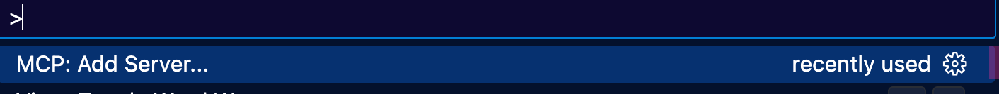
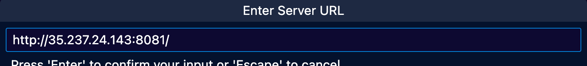
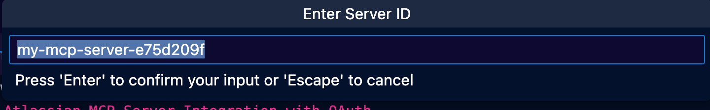
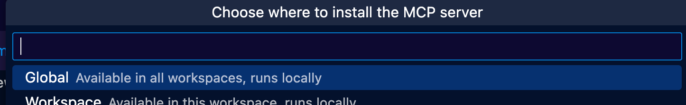
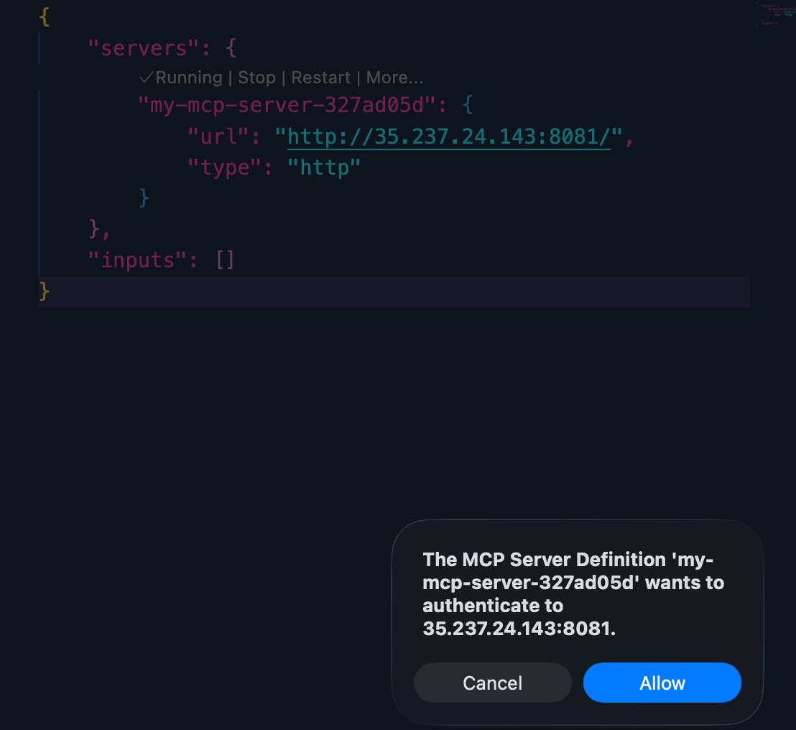
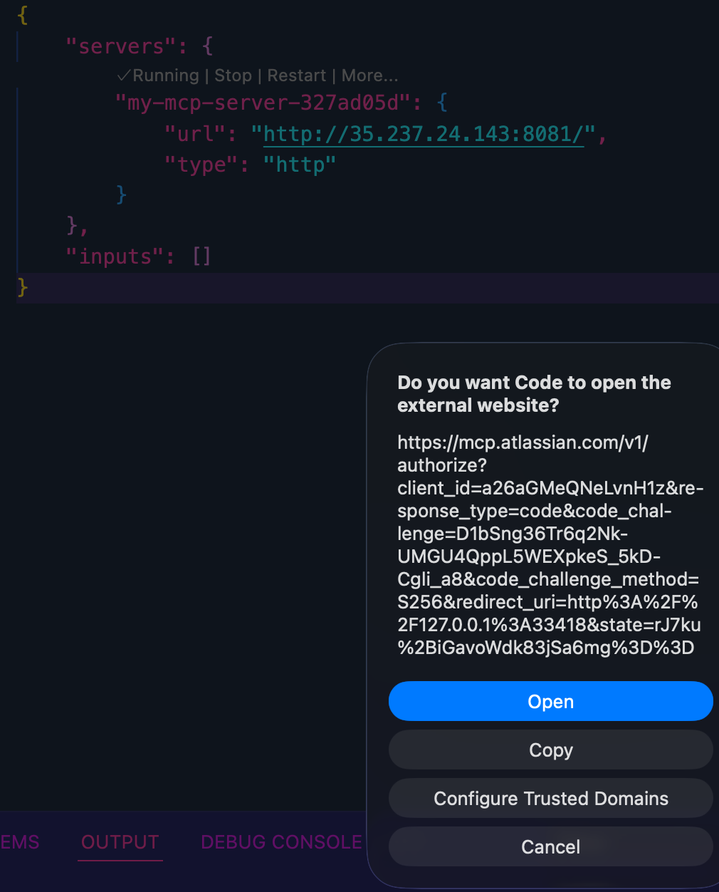
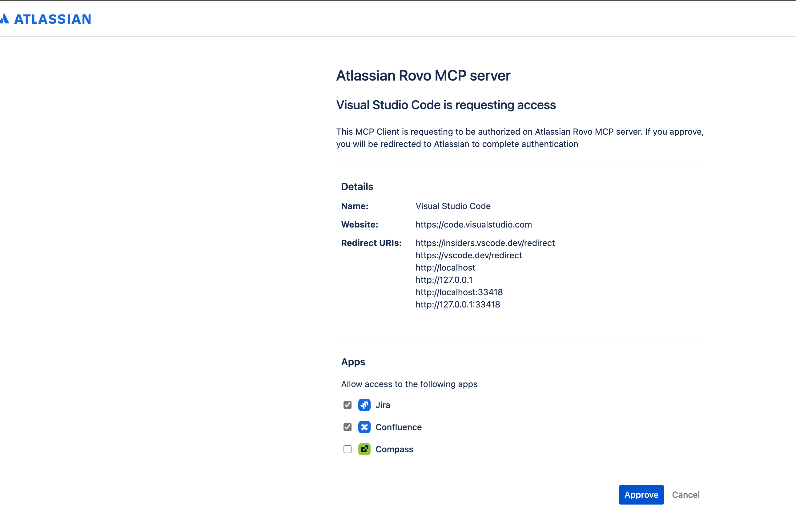

# Atlassian MCP Server Integration with OAuth

This guide configures the Agentgateway to reach Atlassians MCP Server using OIDC-based OAuth authentication (passing the token through) via Atlassian as the identity provider.

## Prerequisites

1. Create a Atlassian OAuth Application.
2. Have VS Code installed

## 1. Deploy Gateway, Backend, and HTTPRoute

```bash
kubectl apply -f - <<EOF
apiVersion: gateway.networking.k8s.io/v1
kind: Gateway
metadata:
  name: agentgateway-atlassian
  namespace: agentgateway-system
spec:
  gatewayClassName: enterprise-agentgateway
  listeners:
  - name: http
    port: 8081
    protocol: HTTP
    allowedRoutes:
      namespaces:
        from: Same
---
apiVersion: agentgateway.dev/v1alpha1
kind: AgentgatewayBackend
metadata:
  name: atlassian-mcp-backend
  namespace: agentgateway-system
spec:
  policies:
    http:
      requestTimeout: 10s
  mcp:
    targets:
      - name: atlassian
        static:
          host: mcp.atlassian.com
          port: 443
          path: /v1/mcp
          protocol: StreamableHTTP
          policies:
            tls: {}
---
apiVersion: gateway.networking.k8s.io/v1
kind: HTTPRoute
metadata:
  name: mcp-atlassian
  namespace: agentgateway-system
spec:
  parentRefs:
    - name: agentgateway-atlassian
      namespace: agentgateway-system
  rules:
    - matches:
        - path:
            type: PathPrefix
            value: /
      backendRefs:
        - name: atlassian-mcp-backend
          group: agentgateway.dev
          kind: AgentgatewayBackend
EOF
```

Outcome with VS Code



Choose HTTP


This session ID can be anything. You can keep it as the default.



This can be global or local




