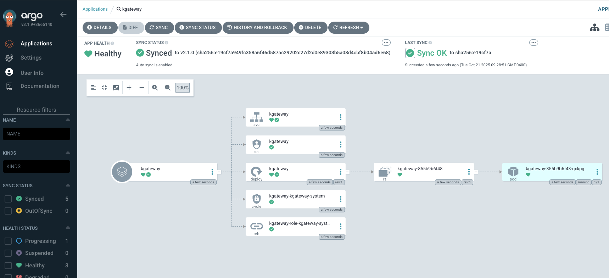

```
helm install argocd -n argocd argo/argo-cd \
--set redis-ha.enabled=true \
--set controller.replicas=1 \
--set server.autoscaling.enabled=true \
--set server.autoscaling.minReplicas=2 \
--set repoServer.autoscaling.enabled=true \
--set repoServer.autoscaling.minReplicas=2 \
--set applicationSet.replicaCount=2 \
--set server.service.type=LoadBalancer \
--create-namespace
```

```
kubectl get secret -n argocd argocd-initial-admin-secret -o jsonpath="{.data.password}" | base64 -d
```

```
kubectl get svc -n argocd
```

You'll see a service called `argocd-server`

Portal login:
- Username: admin
- Password: From secret above

```
argocd login lb_ip_address
```

```
kubectl apply -f- <<EOF
apiVersion: argoproj.io/v1alpha1
kind: Application
metadata:
  name: gateway-api-crds
  namespace: argocd
spec:
  destination:
    server: https://kubernetes.default.svc
    namespace: default
  project: default
  source:
    repoURL: https://github.com/kubernetes-sigs/gateway-api
    targetRevision: v1.4.0
    path: config/crd/standard
  syncPolicy:
    automated:
      prune: true
      selfHeal: true
    syncOptions:
      - CreateNamespace=true
EOF
```

```
kubectl apply -f- <<EOF
apiVersion: argoproj.io/v1alpha1
kind: Application
metadata:
  name: kgateway-crds
  namespace: argocd
spec:
  destination:
    server: https://kubernetes.default.svc
    namespace: kgateway-system
  project: default
  source:
    chart: kgateway-crds
    repoURL: oci://cr.kgateway.dev/kgateway-dev/charts/kgateway-crds
    targetRevision: v2.1.2
    helm:
      values: |
        controller:
          image:
            pullPolicy: Always
  syncPolicy:
    automated:
      prune: true
      selfHeal: true
    syncOptions:
      - CreateNamespace=true
EOF
```

```
kubectl apply -f- <<EOF
apiVersion: argoproj.io/v1alpha1
kind: Application
metadata:
  name: kgateway
  namespace: argocd
spec:
  destination:
    server: https://kubernetes.default.svc
    namespace: kgateway-system
  project: default
  source:
    chart: kgateway
    repoURL: oci://cr.kgateway.dev/kgateway-dev/charts/kgateway
    targetRevision: v2.1.2
    helm:
      values: |
        controller:
          image:
            pullPolicy: Always
        agentgateway:
          enabled: true
  syncPolicy:
    automated:
      prune: true
      selfHeal: true
    syncOptions:
      - CreateNamespace=true
EOF
```

