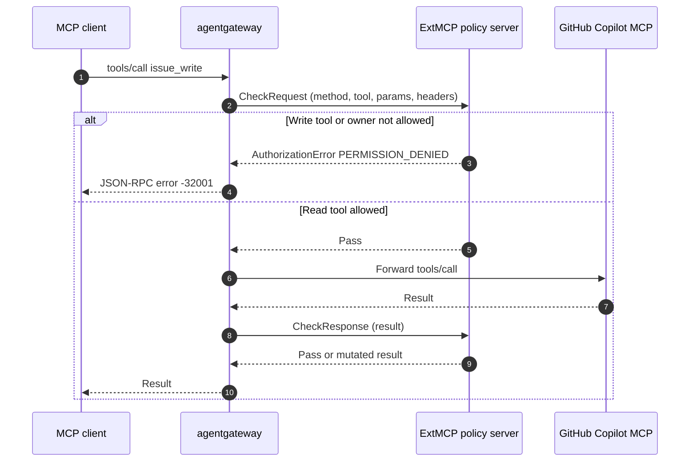

# MCP Guardrails (ExtMCP) with GitHub Copilot MCP

Tldr; MCP guardrails (ExtMCP) call an external gRPC policy server at the JSON-RPC method layer, not the HTTP layer. The server can pass, mutate, or deny individual MCP methods such as `tools/call` and `tools/list`. This demo fronts the GitHub Copilot MCP server (`api.githubcopilot.com`) and uses a small ExtMCP policy server to block GitHub write tools before they reach GitHub, hide those tools from `tools/list`, and optionally restrict `owner` arguments to an allowlist.

Docs:

- [About MCP guardrails](https://agentgateway.dev/docs/kubernetes/latest/documentation/mcp/guardrails/about/)
- [Set up MCP guardrails](https://agentgateway.dev/docs/kubernetes/latest/documentation/mcp/guardrails/setup/)
- Protocol: [`ext_mcp.proto`](https://github.com/agentgateway/agentgateway/blob/main/crates/protos/proto/ext_mcp.proto)

## Why ExtMCP

agentgateway already has HTTP ext_authz, HTTP ExtProc, and in-proxy CEL MCP authorization (`backend.mcp.authorization`). Those HTTP integrations see raw HTTP. To gate a tool call they would have to reassemble the body, parse the JSON-RPC envelope, and handle MCP framing.

ExtMCP receives a structured MCP payload instead:

- JSON-RPC method (`tools/call`, `tools/list`, …)
- Target backend name (`github-copilot` here — un-prefixed; the mux prefix is not in the tool name)
- JSON-RPC `params` (request) or `result` (response)
- Selected request headers

Each processor returns one of:

| Outcome | Request phase | Response phase |
| --- | --- | --- |
| **Pass** | Forward `params` unchanged | Return `result` unchanged |
| **Mutate** | Replace `params` before the MCP backend | Replace `result` before the client |
| **Deny** | JSON-RPC error, backend never called | JSON-RPC error, result dropped |

Request-phase denials are HTTP 200 with a JSON-RPC error body (not HTTP 403). That keeps MCP clients from tearing down the session.

Use ExtMCP when policy must live in an external service, mutate payloads, chain processors (authz then redaction), or inspect more than a CEL one-liner. For “only these tool names,” in-proxy [MCP authorization](https://agentgateway.dev/docs/kubernetes/latest/documentation/mcp/tool-access/) is enough.

## How it works



This demo attaches one processor to the GitHub Copilot backend:

- `tools/call: Request` — deny write tools (`issue_write`, `push_files`, `create_or_update_file`, …) and optional out-of-allowlist `owner` values
- `tools/list: Response` — drop those write tools from the list and append ` [guarded]` to remaining descriptions so mutation is visible

Policy source: `mcp/guardrails/extmcp-server/`.

## Prerequisites

- Kubernetes cluster with a LoadBalancer or the ability to port-forward
- `kubectl`, `curl`, `jq`
- agentgateway **v1.3.0+** (ExtMCP shipped in 1.3). Current charts:

```bash
helm upgrade -i agentgateway-crds oci://cr.agentgateway.dev/charts/agentgateway-crds \
  --create-namespace --namespace agentgateway-system \
  --version v1.5.0

helm upgrade -i agentgateway oci://cr.agentgateway.dev/charts/agentgateway \
  --namespace agentgateway-system \
  --version v1.5.0 --wait
```

The older `ghcr.io/kgateway-dev/charts/agentgateway` **v2.2.1** path in `install-on-k8s.md` does not include MCP guardrails.

- GitHub PAT that can call `https://api.githubcopilot.com/mcp/` (same token as the other MCP demos). `get_me` is enough for the allow path; write-tool denies happen in ExtMCP and never hit GitHub.

Run the commands from `agentgateway-oss-k8s/mcp/` so the ConfigMap `--from-file` paths resolve.

## 1. GitHub Copilot MCP through agentgateway

```bash
export GITHUB_PAT=

kubectl apply -f - <<EOF
apiVersion: v1
kind: Secret
metadata:
  name: github-pat
  namespace: agentgateway-system
type: Opaque
stringData:
  Authorization: "Bearer ${GITHUB_PAT}"
EOF
```

```bash
kubectl apply -f - <<EOF
apiVersion: gateway.networking.k8s.io/v1
kind: Gateway
metadata:
  name: mcp-gateway
  namespace: agentgateway-system
  labels:
    app: github-mcp-server
spec:
  gatewayClassName: agentgateway
  listeners:
    - name: mcp
      port: 3000
      protocol: HTTP
      allowedRoutes:
        namespaces:
          from: Same
EOF
```

```bash
kubectl apply -f - <<EOF
apiVersion: agentgateway.dev/v1alpha1
kind: AgentgatewayBackend
metadata:
  name: github-mcp-server
  namespace: agentgateway-system
spec:
  mcp:
    targets:
      - name: github-copilot
        static:
          host: api.githubcopilot.com
          port: 443
          path: /mcp/
          protocol: StreamableHTTP
          policies:
            tls: {}
            auth:
              secretRef:
                name: github-pat
EOF
```

```bash
kubectl apply -f - <<EOF
apiVersion: gateway.networking.k8s.io/v1
kind: HTTPRoute
metadata:
  name: mcp-route
  namespace: agentgateway-system
  labels:
    app: github-mcp-server
spec:
  parentRefs:
    - name: mcp-gateway
  rules:
    - matches:
        - path:
            type: PathPrefix
            value: /mcp
      backendRefs:
        - name: github-mcp-server
          namespace: agentgateway-system
          group: agentgateway.dev
          kind: AgentgatewayBackend
EOF
```

```bash
kubectl wait --for=condition=Programmed gateway/mcp-gateway -n agentgateway-system --timeout=180s
```

Address for later steps:

```bash
export GATEWAY_IP=$(kubectl get svc mcp-gateway -n agentgateway-system -o jsonpath='{.status.loadBalancer.ingress[0].ip}')
# Kind / no LB:
# kubectl -n agentgateway-system port-forward svc/mcp-gateway 3000:3000
# export GATEWAY_IP=127.0.0.1
export MCP_ADDR=http://${GATEWAY_IP}:3000/mcp
echo "$MCP_ADDR"
```

## 2. Baseline (no guardrails)

One `initialize` is enough to confirm the gateway can reach GitHub Copilot MCP.

```bash
curl -s "$MCP_ADDR" \
  -H 'Content-Type: application/json' \
  -H 'Accept: application/json, text/event-stream' \
  -H 'MCP-Protocol-Version: 2025-03-26' \
  -d '{"jsonrpc":"2.0","id":1,"method":"initialize","params":{"protocolVersion":"2025-03-26","capabilities":{},"clientInfo":{"name":"guardrails-demo","version":"1.0.0"}}}'
```

A JSON-RPC result (often SSE-framed as `data: {...}`) means the backend is reachable. Failures here are PAT, TLS, or routing — not guardrails.

## 3. Deploy the ExtMCP policy server

The sample server implements `CheckRequest` / `CheckResponse` from `ext_mcp.proto`. It listens on gRPC h2c `:9001` and HTTP health `:8080`.

```bash
kubectl -n agentgateway-system create configmap extmcp-github-policy \
  --from-file=server.py=guardrails/extmcp-server/server.py \
  --from-file=ext_mcp.proto=guardrails/extmcp-server/ext_mcp.proto \
  --from-file=requirements.txt=guardrails/extmcp-server/requirements.txt \
  --dry-run=client -o yaml | kubectl apply -f -

kubectl apply -f guardrails/extmcp-server/deploy.yaml
kubectl -n agentgateway-system rollout status deploy/ext-mcp --timeout=180s
```

First Ready can take a minute: the demo image is `python:3.12-slim` and compiles the proto on start. `appProtocol: kubernetes.io/h2c` on the Service is required so agentgateway dials cleartext HTTP/2.

Optional: pin GitHub `owner` values the policy server will allow on tools that take `owner` (`get_file_contents`, `issue_read`, …):

```bash
kubectl -n agentgateway-system set env deploy/ext-mcp ALLOWED_OWNERS='your-org,your-user'
```

Empty `ALLOWED_OWNERS` skips that check. Write tools are always denied.

## 4. Attach guardrails to the GitHub backend

```bash
kubectl apply -f - <<EOF
apiVersion: agentgateway.dev/v1alpha1
kind: AgentgatewayPolicy
metadata:
  name: mcp-guardrails
  namespace: agentgateway-system
spec:
  targetRefs:
    - group: agentgateway.dev
      kind: AgentgatewayBackend
      name: github-mcp-server
  backend:
    mcp:
      guardrails:
        processors:
        - remote:
            backendRef:
              name: ext-mcp
              port: 4445
            failureMode: FailClosed
          methods:
            tools/call: Request
            tools/list: Response
EOF
```

| Field | What it does |
| --- | --- |
| `remote.backendRef` | `ext-mcp` Service, port 4445 |
| `failureMode: FailClosed` | Deny the MCP call if the policy server is down or errors. `FailOpen` prefers availability |
| `tools/call: Request` | Gate or mutate before GitHub |
| `tools/list: Response` | Filter / annotate after GitHub returns the catalog |

Processors run in list order; the first deny short-circuits. MCP auth (if you add JWT later) runs before request-phase processors and is not re-run after mutation.

Bound the gRPC callout. Without a timeout a cold ExtMCP connection can hang instead of engaging `failureMode`:

```bash
kubectl apply -f - <<EOF
apiVersion: gateway.networking.k8s.io/v1
kind: HTTPRoute
metadata:
  name: ext-mcp-route
  namespace: agentgateway-system
spec:
  parentRefs:
    - name: mcp-gateway
  hostnames:
    - "ext-mcp.internal"
  rules:
    - backendRefs:
        - name: ext-mcp
          port: 4445
---
apiVersion: agentgateway.dev/v1alpha1
kind: AgentgatewayPolicy
metadata:
  name: ext-mcp-timeout
  namespace: agentgateway-system
spec:
  targetRefs:
    - group: ""
      kind: Service
      name: ext-mcp
  backend:
    http:
      requestTimeout: 5s
EOF
```

The `ext-mcp.internal` route exists only so the Service is in the proxy data plane and the timeout policy can attach. Clients keep calling `/mcp`.

## 5. Verify

Start a **new** MCP session after the policy is programmed. Streamable HTTP responses are SSE-framed; `sed -n 's/^data: //p'` unwraps them. Guardrail denials are plain JSON (no `data:` prefix).

```bash
HDRS=(-H 'Content-Type: application/json' -H 'Accept: application/json, text/event-stream' -H 'MCP-Protocol-Version: 2025-03-26')

export MCP_SESSION_ID=$(curl -s -D - "$MCP_ADDR" "${HDRS[@]}" \
  -d '{"jsonrpc":"2.0","id":1,"method":"initialize","params":{"protocolVersion":"2025-03-26","capabilities":{},"clientInfo":{"name":"guardrails-demo","version":"1.0.0"}}}' \
  | grep -i 'mcp-session-id:' | sed 's/.*: //' | tr -d '\r')
echo "session: $MCP_SESSION_ID"

curl -s "$MCP_ADDR" "${HDRS[@]}" -H "mcp-session-id: $MCP_SESSION_ID" \
  -d '{"jsonrpc":"2.0","method":"notifications/initialized"}' >/dev/null
```

### `tools/list` is filtered and annotated

```bash
curl -s "$MCP_ADDR" "${HDRS[@]}" -H "mcp-session-id: $MCP_SESSION_ID" \
  -d '{"jsonrpc":"2.0","id":2,"method":"tools/list","params":{}}' \
  | sed -n 's/^data: //p' | jq -r '.result.tools[] | "\(.name)\t\(.description)"'
```

Expect:

- No `issue_write`, `push_files`, `create_or_update_file`, `delete_file`, `create_pull_request`, …
- Remaining descriptions end with ` [guarded]`

### Allowed `tools/call` still hits GitHub

```bash
curl -s "$MCP_ADDR" "${HDRS[@]}" -H "mcp-session-id: $MCP_SESSION_ID" \
  -d '{"jsonrpc":"2.0","id":3,"method":"tools/call","params":{"name":"get_me","arguments":{}}}' \
  | sed -n 's/^data: //p' | jq
```

`get_me` is not in the denylist, so ExtMCP passes and GitHub returns the user.

### Denied `tools/call` never reaches GitHub

```bash
curl -s -D - "$MCP_ADDR" "${HDRS[@]}" -H "mcp-session-id: $MCP_SESSION_ID" \
  -d '{"jsonrpc":"2.0","id":4,"method":"tools/call","params":{"name":"issue_write","arguments":{"method":"create","owner":"octocat","repo":"hello-world","title":"should be blocked"}}}'
```

HTTP status is **200**. Body is a JSON-RPC error (not SSE):

```json
{
  "jsonrpc": "2.0",
  "id": 4,
  "error": {
    "code": -32001,
    "message": "tool issue_write is not allowed"
  }
}
```

`-32001` is ExtMCP `PERMISSION_DENIED`. Confirm the policy server saw the deny and GitHub was not called:

```bash
kubectl -n agentgateway-system logs deploy/ext-mcp --tail=20
```

Look for `CheckRequest method=tools/call ... tool=issue_write deny=tool issue_write is not allowed`.

### Optional owner allowlist

If you set `ALLOWED_OWNERS`, a read tool whose `arguments.owner` is outside that set is also denied in the request phase:

```bash
curl -s "$MCP_ADDR" "${HDRS[@]}" -H "mcp-session-id: $MCP_SESSION_ID" \
  -d '{"jsonrpc":"2.0","id":5,"method":"tools/call","params":{"name":"get_file_contents","arguments":{"owner":"octocat","repo":"hello-world","path":"README.md"}}}'
```

```json
{
  "jsonrpc": "2.0",
  "id": 5,
  "error": {
    "code": -32001,
    "message": "owner octocat is not in ALLOWED_OWNERS"
  }
}
```

## MCP Inspector

```bash
npx modelcontextprotocol/inspector#0.18.0
```

Connect to `http://$GATEWAY_IP:3000/mcp` (Streamable HTTP). List Tools: write tools gone, descriptions tagged `[guarded]`. Call `get_me`: success. Call `issue_write`: JSON-RPC error from the gateway, not from GitHub.

## ExtMCP vs CEL MCP authorization

| | `backend.mcp.authorization` | MCP guardrails (ExtMCP) |
| --- | --- | --- |
| Where | In-proxy CEL | External gRPC `ExtMcp` service |
| `tools/list` | Drop items that fail the rule | Mutate or drop in `CheckResponse` |
| `tools/call` | Allow / deny | Pass / mutate `params` / deny |
| Arguments | CEL on `mcp.tool.name` (and JWT). `mcp.tool.arguments` is for post-request logs/traces, not RBAC | Full JSON `params` in `CheckRequest` |
| Mutation | No | Yes (`params` or `result`) |
| Failure mode | N/A | `FailClosed` / `FailOpen` |

This GitHub Copilot path is ExtMCP because the policy server both **denies** write tools and **rewrites** `tools/list`. A name-only allowlist can stay in CEL; see `cost/token-cost-opt-demos/demo4-mcp-savings/mcp-savings.md`.

## Troubleshooting

**`tools/call` hangs**

No callout deadline, or ExtMCP is still installing pip/proto. Confirm `ext-mcp` is Ready and `ext-mcp-timeout` is applied. First call can be slow while the gRPC connection warms.

**Every call denied after the policy is attached**

`FailClosed` plus an unreachable ExtMCP server. Check:

```bash
kubectl -n agentgateway-system get deploy,svc,po -l app=ext-mcp
kubectl -n agentgateway-system logs deploy/ext-mcp
kubectl -n agentgateway-system get agentgatewaypolicy mcp-guardrails -o yaml
```

The Service must use `appProtocol: kubernetes.io/h2c`.

**Write tools still appear in `tools/list`**

Policy not attached to this backend, or `tools/list` is not in `methods` as `Response` / `Full`. Agentgateway calls ExtMCP once per backend for fanout list methods.

**Deny returns HTTP 403 / non-200**

On agentgateway 1.4+, request-phase ExtMCP denials are HTTP 200 + JSON-RPC error. Upgrade if the client drops the session on a non-2xx.

**NACKs / policy ignored**

```bash
agctl proxy config all
kubectl get agentgatewaypolicy -n agentgateway-system
```

`backend.mcp.guardrails` only targets MCP backends (`AgentgatewayBackend` with `spec.mcp`).

## Cleanup

```bash
kubectl -n agentgateway-system delete agentgatewaypolicy mcp-guardrails ext-mcp-timeout --ignore-not-found
kubectl -n agentgateway-system delete httproute mcp-route ext-mcp-route --ignore-not-found
kubectl -n agentgateway-system delete agentgatewaybackend github-mcp-server --ignore-not-found
kubectl -n agentgateway-system delete gateway mcp-gateway --ignore-not-found
kubectl -n agentgateway-system delete deploy,svc -l app=ext-mcp --ignore-not-found
kubectl -n agentgateway-system delete configmap extmcp-github-policy --ignore-not-found
kubectl -n agentgateway-system delete secret github-pat --ignore-not-found
```
