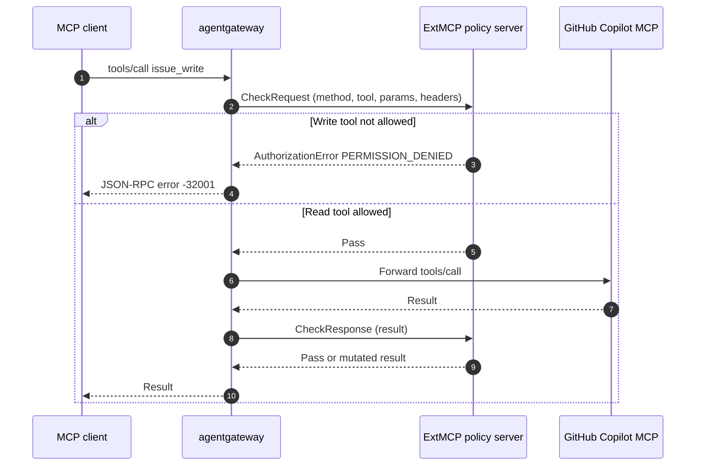

# MCP Guardrails (ExtMCP) with GitHub Copilot MCP

Tldr; MCP guardrails (ExtMCP) call an external gRPC policy server at the JSON-RPC method layer, not the HTTP layer. The server can pass, mutate, or deny individual MCP methods such as `tools/call` and `tools/list`. This demo fronts the GitHub Copilot MCP server (`api.githubcopilot.com`) and uses a small ExtMCP policy server to block GitHub write tools before they reach GitHub and hide those tools from `tools/list`.

Docs:

- [About MCP guardrails](https://agentgateway.dev/docs/kubernetes/latest/documentation/mcp/guardrails/about/)
- [Set up MCP guardrails](https://agentgateway.dev/docs/kubernetes/latest/documentation/mcp/guardrails/setup/)
- Protocol: [`ext_mcp.proto`](https://github.com/agentgateway/agentgateway/blob/main/crates/protos/proto/ext_mcp.proto)

## Why ExtMCP

agentgateway already has HTTP ext_authz, HTTP ExtProc, and in-proxy CEL MCP authorization (`backend.mcp.authorization`). Those HTTP integrations see raw HTTP. To gate a tool call they would have to reassemble the body, parse the JSON-RPC envelope, and handle MCP framing.

ExtMCP receives a structured MCP payload instead:

- JSON-RPC method (`tools/call`, `tools/list`, …)
- Target backend name (`github-copilot` here — un-prefixed; the mux prefix is not in the tool name)
- JSON-RPC `params` (request) or `result` (response)
- Selected request headers

Each processor returns one of:

| Outcome | Request phase | Response phase |
| --- | --- | --- |
| **Pass** | Forward `params` unchanged | Return `result` unchanged |
| **Mutate** | Replace `params` before the MCP backend | Replace `result` before the client |
| **Deny** | JSON-RPC error, backend never called | JSON-RPC error, result dropped |

Request-phase denials are HTTP 200 with a JSON-RPC error body (not HTTP 403). That keeps MCP clients from tearing down the session.

Use ExtMCP when policy must live in an external service, mutate payloads, chain processors (authz then redaction), or inspect more than a CEL one-liner. For “only these tool names,” in-proxy [MCP authorization](https://agentgateway.dev/docs/kubernetes/latest/documentation/mcp/tool-access/) is enough.

## How it works



This demo attaches one processor to the GitHub Copilot backend:

- `tools/call: Request` — deny write tools (`issue_write`, `push_files`, `create_or_update_file`, …)
- `tools/list: Response` — drop those write tools from the list and append ` [guarded]` to remaining descriptions so mutation is visible

Policy source: `mcp/guardrails/extmcp-server/`.

## Prerequisites

- Kubernetes cluster with a LoadBalancer or the ability to port-forward
- `kubectl`, `curl`
- agentgateway **v1.3.0+** (ExtMCP shipped in 1.3). Current charts:

```bash
helm upgrade -i agentgateway-crds oci://cr.agentgateway.dev/charts/agentgateway-crds \
  --create-namespace --namespace agentgateway-system \
  --version v1.5.0

helm upgrade -i agentgateway oci://cr.agentgateway.dev/charts/agentgateway \
  --namespace agentgateway-system \
  --version v1.5.0 --wait
```

The older `ghcr.io/kgateway-dev/charts/agentgateway` **v2.2.1** path in `install-on-k8s.md` does not include MCP guardrails.

- GitHub PAT that can call `https://api.githubcopilot.com/mcp/` (same token as the other MCP demos). `get_me` is enough for the allow path; write-tool denies happen in ExtMCP and never hit GitHub.

Run the commands from `agentgateway-oss-k8s/mcp/` so the ConfigMap `--from-file` paths resolve.

## 1. GitHub Copilot MCP through agentgateway

```bash
export GITHUB_PAT=

kubectl apply -f - <<EOF
apiVersion: v1
kind: Secret
metadata:
  name: github-pat
  namespace: agentgateway-system
type: Opaque
stringData:
  Authorization: "Bearer ${GITHUB_PAT}"
EOF
```

```bash
kubectl apply -f - <<EOF
apiVersion: gateway.networking.k8s.io/v1
kind: Gateway
metadata:
  name: mcp-gateway
  namespace: agentgateway-system
  labels:
    app: github-mcp-server
spec:
  gatewayClassName: agentgateway
  listeners:
    - name: mcp
      port: 3000
      protocol: HTTP
      allowedRoutes:
        namespaces:
          from: Same
EOF
```

```bash
kubectl apply -f - <<EOF
apiVersion: agentgateway.dev/v1alpha1
kind: AgentgatewayBackend
metadata:
  name: github-mcp-server
  namespace: agentgateway-system
spec:
  mcp:
    targets:
      - name: github-copilot
        static:
          host: api.githubcopilot.com
          port: 443
          path: /mcp/
          protocol: StreamableHTTP
          policies:
            tls: {}
            auth:
              secretRef:
                name: github-pat
EOF
```

```bash
kubectl apply -f - <<EOF
apiVersion: gateway.networking.k8s.io/v1
kind: HTTPRoute
metadata:
  name: mcp-route
  namespace: agentgateway-system
  labels:
    app: github-mcp-server
spec:
  parentRefs:
    - name: mcp-gateway
  rules:
    - matches:
        - path:
            type: PathPrefix
            value: /mcp
      backendRefs:
        - name: github-mcp-server
          namespace: agentgateway-system
          group: agentgateway.dev
          kind: AgentgatewayBackend
EOF
```

```bash
kubectl wait --for=condition=Programmed gateway/mcp-gateway -n agentgateway-system --timeout=180s
```

Address for later steps:

```bash
export GATEWAY_IP=$(kubectl get svc mcp-gateway -n agentgateway-system -o jsonpath='{.status.loadBalancer.ingress[0].ip}')
# Kind / no LB:
# kubectl -n agentgateway-system port-forward svc/mcp-gateway 3000:3000
# export GATEWAY_IP=127.0.0.1
export MCP_ADDR=http://${GATEWAY_IP}:3000/mcp
echo "$MCP_ADDR"
```

## 2. Baseline (no guardrails)

One `initialize` is enough to confirm the gateway can reach GitHub Copilot MCP.

```bash
curl -s "$MCP_ADDR" \
  -H 'Content-Type: application/json' \
  -H 'Accept: application/json, text/event-stream' \
  -H 'MCP-Protocol-Version: 2025-03-26' \
  -d '{"jsonrpc":"2.0","id":1,"method":"initialize","params":{"protocolVersion":"2025-03-26","capabilities":{},"clientInfo":{"name":"guardrails-demo","version":"1.0.0"}}}'
```

A JSON-RPC result (often SSE-framed as `data: {...}`) means the backend is reachable. Failures here are PAT, TLS, or routing — not guardrails.

## 3. Deploy the ExtMCP policy server

`server.py` is the policy process. `deploy.yaml` is the Kubernetes wrapper that runs it in the cluster: a **Deployment** (pod on `python:3.12-slim` that installs deps, compiles `ext_mcp.proto`, and execs `server.py`) and a **Service** named `ext-mcp` on port `4445` with `appProtocol: kubernetes.io/h2c`. Agentgateway calls that Service; without it the later `AgentgatewayPolicy` has no policy server to dial.

The ConfigMap is the source the pod mounts (`server.py`, proto, `requirements.txt`). Apply the ConfigMap first, then `deploy.yaml`.

```bash
kubectl -n agentgateway-system create configmap extmcp-github-policy \
  --from-file=server.py=guardrails/extmcp-server/server.py \
  --from-file=ext_mcp.proto=guardrails/extmcp-server/ext_mcp.proto \
  --from-file=requirements.txt=guardrails/extmcp-server/requirements.txt \
  --dry-run=client -o yaml | kubectl apply -f -

kubectl apply -f guardrails/extmcp-server/deploy.yaml
kubectl -n agentgateway-system rollout status deploy/ext-mcp --timeout=180s
```

First Ready can take a minute while pip and `protoc` run. `kubernetes.io/h2c` is required so agentgateway dials cleartext HTTP/2 (gRPC), not HTTP/1.1.

## 4. Attach guardrails to the GitHub backend

```bash
kubectl apply -f - <<EOF
apiVersion: agentgateway.dev/v1alpha1
kind: AgentgatewayPolicy
metadata:
  name: mcp-guardrails
  namespace: agentgateway-system
spec:
  targetRefs:
    - group: agentgateway.dev
      kind: AgentgatewayBackend
      name: github-mcp-server
  backend:
    mcp:
      guardrails:
        processors:
        - remote:
            backendRef:
              name: ext-mcp
              port: 4445
            failureMode: FailClosed
          methods:
            tools/call: Request
            tools/list: Response
EOF
```

| Field | What it does |
| --- | --- |
| `remote.backendRef` | `ext-mcp` Service, port 4445 |
| `failureMode: FailClosed` | Deny the MCP call if the policy server is down or errors. `FailOpen` prefers availability |
| `tools/call: Request` | Gate or mutate before GitHub |
| `tools/list: Response` | Filter / annotate after GitHub returns the catalog |

`processors` is an ordered list. This demo has one. If you add more, they run top to bottom and the first **Deny** stops the rest.

MCP authentication (JWT / OAuth on the MCP route), if you add it later, runs **before** request-phase ExtMCP. A processor that mutates `params` does not make agentgateway re-check that auth.

### Timeout on the ExtMCP callout

The guardrails policy above tells agentgateway *who* to call (`ext-mcp:4445`). It does **not** set a deadline. By default the gRPC call to the policy server waits forever. A cold or stuck ExtMCP pod then hangs `tools/call` / `tools/list` instead of failing closed after a few seconds.

These two objects add that deadline:

1. **`AgentgatewayPolicy` `ext-mcp-timeout`** — `backend.http.requestTimeout: 5s` on the `ext-mcp` **Service**. After 5s the callout is treated as a failure, and `failureMode: FailClosed` on the guardrails processor denies the MCP method.
2. **`HTTPRoute` `ext-mcp-route`** — a dummy route so the `ext-mcp` Service is actually in this proxy’s data plane. A Service-targeted policy only attaches after some route on the Gateway references that Service. The hostname `ext-mcp.internal` is a placeholder; nothing should send MCP traffic there.

Clients still call `http://$GATEWAY_IP:3000/mcp`. This route is not the GitHub MCP path.

```bash
kubectl apply -f - <<EOF
apiVersion: gateway.networking.k8s.io/v1
kind: HTTPRoute
metadata:
  name: ext-mcp-route
  namespace: agentgateway-system
spec:
  parentRefs:
    - name: mcp-gateway
  hostnames:
    - "ext-mcp.internal"
  rules:
    - backendRefs:
        - name: ext-mcp
          port: 4445
---
apiVersion: agentgateway.dev/v1alpha1
kind: AgentgatewayPolicy
metadata:
  name: ext-mcp-timeout
  namespace: agentgateway-system
spec:
  targetRefs:
    - group: ""
      kind: Service
      name: ext-mcp
  backend:
    http:
      requestTimeout: 5s
EOF
```

## 5. Verify

The write-tool list is **not** in the `AgentgatewayPolicy`. That YAML only sends `tools/call` / `tools/list` to ExtMCP. The names are in `DENIED_TOOLS` in `guardrails/extmcp-server/server.py` (`issue_write`, `push_files`, anything ending in `_write`, …). `CheckRequest` denies those calls; `CheckResponse` drops them from `tools/list` and appends ` [guarded]` to the rest.

```bash
npx modelcontextprotocol/inspector#0.18.0
```

Connect to `http://$GATEWAY_IP:3000/mcp` (Streamable HTTP).

- **List Tools** — names in `DENIED_TOOLS` are gone. Remaining descriptions end with `[guarded]`.
- **Call `get_me`** — succeeds (GitHub user for the PAT).
- **Call `issue_write`** — JSON-RPC error `-32001` / `tool issue_write is not allowed`. GitHub is not called.

If List Tools is unchanged and nothing says `[guarded]`, ExtMCP is not on the path: policy not attached, `ext-mcp` not Ready, or Inspector is not using the gateway URL.

## Cleanup

```bash
kubectl -n agentgateway-system delete agentgatewaypolicy mcp-guardrails ext-mcp-timeout --ignore-not-found
kubectl -n agentgateway-system delete httproute mcp-route ext-mcp-route --ignore-not-found
kubectl -n agentgateway-system delete agentgatewaybackend github-mcp-server --ignore-not-found
kubectl -n agentgateway-system delete gateway mcp-gateway --ignore-not-found
kubectl -n agentgateway-system delete deploy,svc -l app=ext-mcp --ignore-not-found
kubectl -n agentgateway-system delete configmap extmcp-github-policy --ignore-not-found
kubectl -n agentgateway-system delete secret github-pat --ignore-not-found
```
