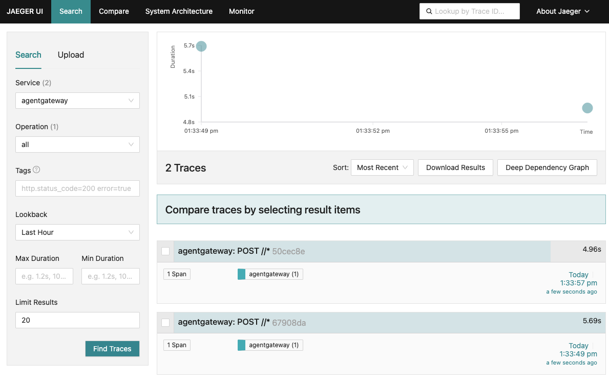
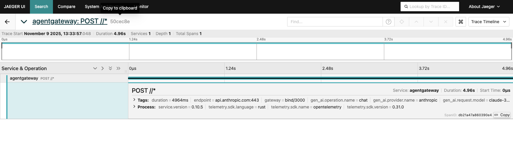
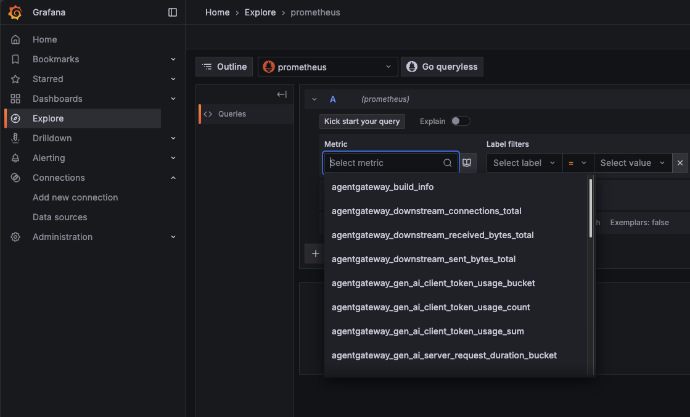
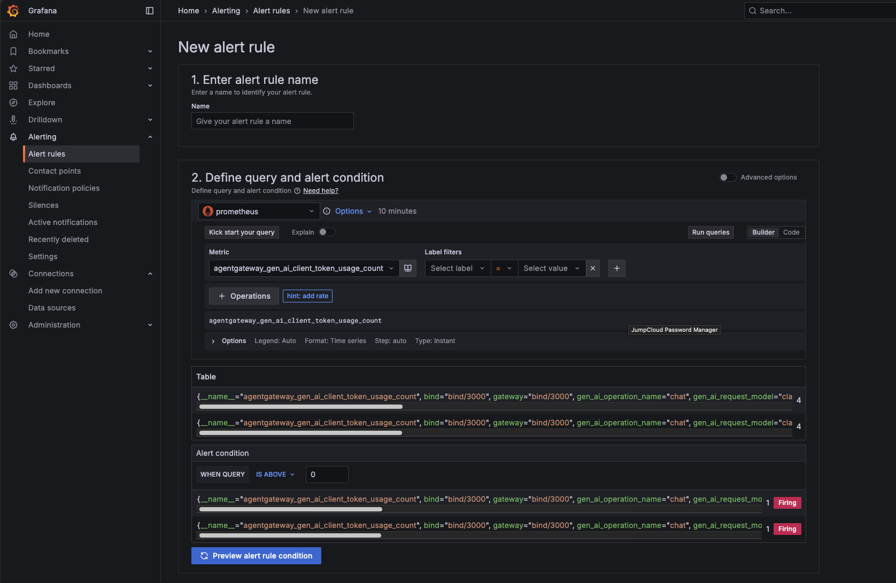
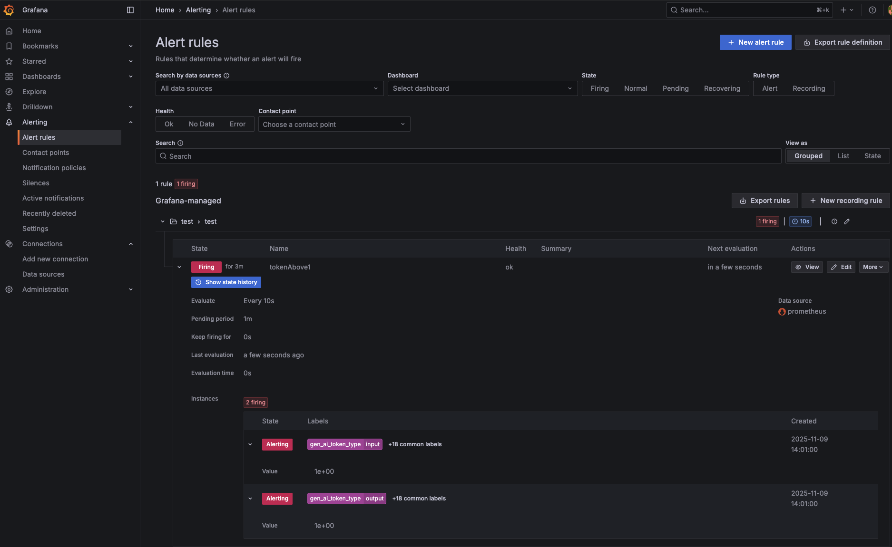

# Provider Rate Limiting Blog Demo

Ensure to set your environment variables for API keys.

```
export ANTHROPIC_API_KEY=
export OPENAI_API_KEY=
```

## Local Rate Limiting

1. Save the below as `local-rate-limit.yaml` (you can also find it in the same directory as this readme)

```
binds:
- port: 3000
  listeners:
  - routes:
    - backends:
      - ai:
          name: openai
          provider:
            openAI:
              model: gpt-3.5-turbo
          routes:
            /v1/chat/completions: completions
            /v1/models: passthrough
            '*': passthrough
      policies:
        cors:
          allowOrigins:
          - "*"
          allowHeaders:
          - "*"
        backendAuth:
          key: $OPENAI_API_KEY
        localRateLimit:
          - maxTokens: 1
            tokensPerFill: 1
            fillInterval: 100s
            type: tokens
```

2. Run the following:
```
agentgateway -f local-rate-limiting.yaml
```

3. Test the route

```
curl http://localhost:3000/v1/chat/completions \
  -H "Content-Type: application/json" \
  -d '{
    "model": "gpt-3.5-turbo",
    "messages": [{"role": "user", "content": "Hello!"}]
  }'
```

4. Run it again immediately after and you'll see an out similar to the below:
```
rate limit exceeded%
```

You can try out the same thing with Anthropic
```
binds:
 - port: 3000
   listeners:
   - routes:
     - backends:
       - ai:
           name: anthropic
           provider:
             anthropic:
               model: claude-haiku-4-5-20251001
           routes:
             /v1/messages: messages
             /v1/chat/completions: completions
             /v1/models: passthrough
             '*': passthrough
       policies:
         backendAuth:
           key: $ANTHROPIC_API_KEY
        localRateLimit:
          - maxTokens: 1
            tokensPerFill: 1
            fillInterval: 100s
            type: tokens
```

## Metrics

1. Run the `mcp-endpoint.yaml` (you can find it in the same directory as this readme) with the `agentgateway` CLI

```
binds:
- port: 3001
  listeners:
  - routes:
    - backends:
      - mcp:
          targets:
          - name: kubernetes
            stdio:
              cmd: uvx
              args: ["cloud-native-architecture-mcp@latest"]
      policies:
        cors:
          allowOrigins:
          - '*'
          allowHeaders:
          - mcp-protocol-version
          - content-type
          - cache-control
          - accept
          allowMethods:
          - GET
          - POST
          - OPTIONS
```

2. Go to the agentgateway metrics endpoint in a browser
```
http://localhost:15020/metrics
```

3. Go to the Playground and run the connection to the MCP Server

4. Refresh the `/metrics` endpoint page in the web browser and you'll see the new metrics exposed

## Model Failover

1. Run the `model-failover.yaml` (you can find it in the same directory as this readme) with the `agentgateway` CLI

```
binds:
- port: 3000
  listeners:
  - routes:
    - name: failover-ai
      matches:
      - path:
          pathPrefix: /failover/ai
      policies:
        retry:
          attempts: 2        # Retry once (2 total attempts)
          codes: [400, 401, 403, 404, 429, 500, 502, 503, 504]  # Retry on auth, rate limit, and server errors
        urlRewrite:
          path:
            prefix: ""
      backends:
      - ai:
          groups:
          - providers:
              - name: primary-model
                provider:
                  anthropic:
                    model: "claude-3-5-haiku-latest"
                routes:
                  "/v1/chat/completions": completions
                backendAuth:
                  key: "$ANTHROPIC_API_KEY"
              - name: second-model
                provider:
                  openAI:
                    model: "gpt-5"
                routes:
                  "/v1/chat/completions": completions
                backendAuth:
                  key: "$OPENAI_API_KEY"

```

2. Export your Anthropic API key and make it incorrect
```
export ANTHROPIC_API_KEY=fdsfdsfsd
```

3. Run the `curl`
```
curl -X POST http://localhost:3000/failover/ai/v1/chat/completions \
  -H "Content-Type: application/json" \
  -d '{
    "messages": [{"role": "user", "content": "Testing failover"}]
  }'
```

You should see the output fail over to ChatGPT.
```
curl -X POST http://localhost:3000/failover/ai/v1/chat/completions \
  -H "Content-Type: application/json" \
  -d '{
    "messages": [{"role": "user", "content": "Testing failover"}]
  }'
{"model":"gpt-5-2025-08-07","usage"
```

## Observability Dashboard (Traces and Metrics)

### Deploy Jaeger
1. Deploy Jaeger locally (no k8s needes)
```
docker compose -f - up -d <<EOF
services:
  jaeger:
    container_name: jaeger
    restart: unless-stopped
    image: jaegertracing/all-in-one:latest
    ports:
    - "127.0.0.1:16686:16686"
    - "127.0.0.1:14268:14268"
    - "127.0.0.1:4317:4317"
    environment:
    - COLLECTOR_OTLP_ENABLED=true
EOF
```

2. Ensure that it is up and running
```
docker container ls
```

You should see an output similar to the below:

```
CONTAINER ID   IMAGE                              COMMAND                  CREATED          STATUS          PORTS                                                                                                                                  NAMES
ed45f5333d85   jaegertracing/all-in-one:latest    "/go/bin/all-in-one-…"   28 seconds ago   Up 28 seconds   127.0.0.1:4317->4317/tcp, 127.0.0.1:14268->14268/tcp, 127.0.0.1:16686->16686/tcp 
```

### Run the agentgateway config
1. Run the `metrics-testing.yaml` (you can find it in the same directory as this readme) with the `agentgateway` CLI
```
config:
  tracing:
    otlpEndpoint: "http://127.0.0.1:4317"
    randomSampling: 'true'
    fields:
      add:
        authenticated: 'jwt.sub != null'
        gen_ai.system: 'llm.provider'
        gen_ai.request.model: 'llm.request_model'
        gen_ai.response.model: 'llm.response_model'
        gen_ai.usage.input_tokens: 'llm.input_tokens'
        gen_ai.usage.output_tokens: 'llm.output_tokens'
        gen_ai.operation.name: '"chat"'        
  metrics:
    fields:
      add:
        user_id: "jwt.sub" 
        user_name: 'jwt.preferred_username'
  logging:
    fields:
      add:
        user_id: "jwt.sub" 
        user_name: 'jwt.name'
        authenticated: 'jwt.sub != null'
        jwt_act: "jwt.act"
        token_issuer: 'jwt.iss'
        token_audience: 'jwt.aud'       
        model: 'llm.requestModel'
        provider: 'llm.provider'        
        prompt: 'llm.prompt' 
binds:
- port: 3000
  listeners:
  - routes:
    - backends:
      - ai:
          name: anthropic
          provider:
            anthropic:
              model: "claude-3-5-haiku-latest"
          routes:
            /v1/chat/completions: completions
            /v1/models: passthrough
            '*': passthrough
      policies:
        cors:
          allowOrigins:
          - "*"
          allowHeaders:
          - "*"
        backendAuth:
          key: "$ANTHROPIC_API_KEY"
```

### Test Tracing
1. Run a `curl` to create some traces
```
curl "http://localhost:3000/v1/chat/completions" -v \
  -H "content-type: application/json" \
  -H "anthropic-version: 2023-06-01" \
  -H "x-api-key: $ANTHROPIC_API_KEY" \
  -d '{
  "model": "claude-sonnet-4-5",
  "messages": [
    {
      "role": "system",
      "content": "You are a skilled cloud-native network engineer."
    },
    {
      "role": "user",
      "content": "Write me a paragraph containing the best way to think about Istio Ambient Mesh"
    }
  ]
}' | jq
```

2. Open the Jaeger UI
```
http://localhost:16686/search
```

You should now see traces from agentgateway to Anthropic.



### Metrics Dashboard with Prometheus and Grafana

1. First, create a `prometheus.yml` configuration file in this directory (it already exists but here is the code if you want to do it on your own machine)
```
global:
  scrape_interval: 15s
  evaluation_interval: 15s

scrape_configs:
  - job_name: 'agentgateway'
    static_configs:
      - targets: ['host.docker.internal:15020']
    metrics_path: '/metrics'
```

2. Deploy Prometheus and Grafana locally with Docker (run from the same directory as `prometheus.yml`)
```
docker compose -f - up -d <<EOF
services:
  prometheus:
    container_name: prometheus
    image: prom/prometheus:latest
    restart: unless-stopped
    ports:
      - "127.0.0.1:9090:9090"
    command:
      - '--config.file=/etc/prometheus/prometheus.yml'
      - '--storage.tsdb.path=/prometheus'
    volumes:
      - /Users/michaellevan/gitrepos/agentic-demo-repo/agentgateway-oss-local/agw-local-rate-limiting-blog/prometheus.yml:/etc/prometheus/prometheus.yml
      - prometheus-data:/prometheus

  grafana:
    container_name: grafana
    image: grafana/grafana:latest
    restart: unless-stopped
    ports:
      - "127.0.0.1:3005:3000"
    environment:
      - GF_SECURITY_ADMIN_USER=admin
      - GF_SECURITY_ADMIN_PASSWORD=admin
      - GF_USERS_ALLOW_SIGN_UP=false
    volumes:
      - grafana-data:/var/lib/grafana

volumes:
  prometheus-data:
  grafana-data:
EOF
```

3. Ensure the containers are up and running
```
docker container ls
```

You should see an output similar to:
```
CONTAINER ID   IMAGE                     COMMAND                  CREATED          STATUS          PORTS                          NAMES
abc123def456   grafana/grafana:latest    "/run.sh"               10 seconds ago   Up 9 seconds    127.0.0.1:3005->3000/tcp      grafana
def456abc123   prom/prometheus:latest    "/bin/prometheus --c…"   10 seconds ago   Up 9 seconds    127.0.0.1:9090->9090/tcp      prometheus
```

4. Run agentgateway with your configuration (e.g., `metrics-testing.yaml`)

5. Run some curl requests to generate metrics
```
curl "http://localhost:3000/v1/chat/completions" -v \
  -H "content-type: application/json" \
  -H "anthropic-version: 2023-06-01" \
  -H "x-api-key: $ANTHROPIC_API_KEY" \
  -d '{
  "model": "claude-sonnet-4-5",
  "messages": [
    {
      "role": "system",
      "content": "You are a skilled cloud-native network engineer."
    },
    {
      "role": "user",
      "content": "Write me a paragraph containing the best way to think about Istio Ambient Mesh"
    }
  ]
}' | jq
```

6. Open Prometheus UI to verify metrics are being scraped
```
http://localhost:9090
```

Go to Status > Targets to verify the agentgateway target is UP.

7. Open Grafana UI
```
http://localhost:3005
```

Login with:
- Username: `admin`
- Password: `admin`

8. Add Prometheus as a data source in Grafana
   - Click "Add your first data source"
   - Select "Prometheus"
   - Set URL to: `http://prometheus:9090`
   - Click "Save & Test"

9. Go to **Explore** and choose Prometheus as the data source. You'll now be able to see agentgateway metrics.



### Alerts

1. Go to **Alerting > Alert rules**
2. Create a new rule under the `agentgateway_gen_ai_client_token_usage_sum` metric and the alert will go off if more than 1 token is used



3. Save the rule

4. Run a `curl` a few times
```
curl "http://localhost:3000/v1/chat/completions" -v \
  -H "content-type: application/json" \
  -H "anthropic-version: 2023-06-01" \
  -H "x-api-key: $ANTHROPIC_API_KEY" \
  -d '{
  "model": "claude-sonnet-4-5",
  "messages": [
    {
      "role": "system",
      "content": "You are a skilled cloud-native network engineer."
    },
    {
      "role": "user",
      "content": "Write me a paragraph containing the best way to think about Istio Ambient Mesh"
    }
  ]
}' | jq
```

5. You should now see the alert triggering



To stop the monitoring stack
```
docker compose down
```