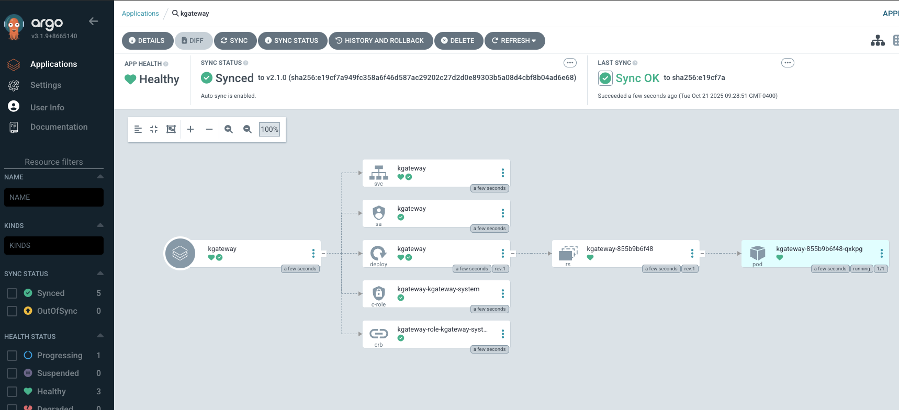

```
kubectl apply -f- <<EOF
apiVersion: argoproj.io/v1alpha1
kind: Application
metadata:
  name: kgateway-crds
  namespace: argocd
spec:
  destination:
    server: https://kubernetes.default.svc
    namespace: kgateway-system
  project: default
  source:
    chart: kgateway-crds
    repoURL: oci://cr.kgateway.dev/kgateway-dev/charts/kgateway-crds
    targetRevision: v2.1.0
    helm:
      values: |
        controller:
          image:
            pullPolicy: Always
  syncPolicy:
    automated:
      prune: true
      selfHeal: true
    syncOptions:
      - CreateNamespace=true
EOF
```

```
kubectl apply -f- <<EOF
apiVersion: argoproj.io/v1alpha1
kind: Application
metadata:
  name: kgateway
  namespace: argocd
spec:
  destination:
    server: https://kubernetes.default.svc
    namespace: kgateway-system
  project: default
  source:
    chart: kgateway
    repoURL: oci://cr.kgateway.dev/kgateway-dev/charts/kgateway
    targetRevision: v2.1.0
    helm:
      values: |
        controller:
          image:
            pullPolicy: Always
        agentgateway:
          enabled: true
  syncPolicy:
    automated:
      prune: true
      selfHeal: true
    syncOptions:
      - CreateNamespace=true
EOF
```

