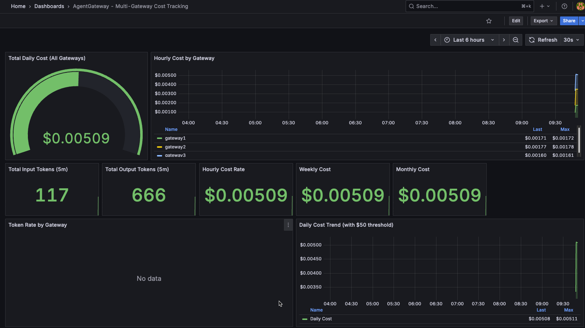

# AgentGateway Multi-Data Plane Cost Tracking

This solution provides centralized cost monitoring and alerting across three agentgateway data planes using kube-prometheus-stack.

## Overview

This implementation collects metrics from all three agentgateway instances and aggregates their costs to provide:
- Real-time cost tracking across all gateways
- Alerts when collective costs exceed thresholds
- Per-gateway and total cost breakdowns
- Token usage metrics and trends

## Architecture

```
┌─────────────────┐     ┌─────────────────┐     ┌─────────────────┐
│  AgentGateway1  │     │  AgentGateway2  │     │  AgentGateway3  │
│   :15020/metrics│     │   :15020/metrics│     │   :15020/metrics│
└────────┬────────┘     └────────┬────────┘     └────────┬────────┘
         │                       │                       │
         │    ServiceMonitors    │                       │
         └───────────┬───────────┴───────────────────────┘
                     │
                     ▼
         ┌───────────────────────┐
         │   Prometheus Server   │
         │  - Scrapes metrics    │
         │  - Calculates costs   │
         │  - Evaluates alerts   │
         └───────────┬───────────┘
                     │
         ┌───────────┴───────────┐
         │                       │
         ▼                       ▼
┌─────────────────┐     ┌─────────────────┐
│  Alertmanager   │     │     Grafana     │
│  - Slack alerts │     │  - Dashboards   │
│  - PagerDuty    │     │  - Visualization│
└─────────────────┘     └─────────────────┘
```

## How It works

The metric agentgateway_gen_ai_client_token_usage_sum with the label gateway shows which gateway it came from.

When you use `sum(increase(agentgateway_gen_ai_client_token_usage_sum{gen_ai_token_type="input"}[24h]))` without any by clause, it will:

✅ Sum across all three gateways (agentgateway1, agentgateway2, agentgateway3)
✅ Give you the collective total input tokens from all gateways combined
✅ The cost calculation will be for all gateways collectively

And when the alert triggers with agentgateway:cost_usd:total_daily >= 50, it will fire when all three gateways combined hit $50, not individually. The by (gateway_instance) queries are just for the breakdown to show you which gateway contributed how much, but the main alerts use the total without by clause.

## Cost Calculation

Prometheus recording rules calculate costs at different time intervals:
- Hourly cost rate (to detect high spend velocity)
- Daily cumulative cost (primary threshold: $50)
- Weekly cumulative cost (threshold: $200)
- Monthly cumulative cost (threshold: $500)

## Installation

### Step 1: Deploy the gateways

Follow the instructions in [setup-agentgateway.md](setup-agentgateway.md) to deploy the three agentgateway instances.

### Step 2: Install kube-prometheus-stack

Follow the instructions in [kube-prometheus-install.md](kube-prometheus-install.md) to deploy kube-prometheus.

### Step 3: Deploy monitoring resources

Apply ServiceMonitors, PrometheusRules, and AlertmanagerConfig

```
kubectl apply -f monitoring.yaml
```

### Step 4: Import Grafana dashboard

1. Access Grafana
```
kubectl port-forward -n monitoring svc/kube-prometheus-stack-grafana 3000:80
```

2. Open http://localhost:3000 in your browser (username: `admin`)

3. Navigate to: **Dashboards → Import**

4. Upload `grafana-dashboard.json` or paste its contents

5. Select "Prometheus" as the data source and click **Import**

### Test the metrics

1. Send some test requests to your gateways (see [setup.md](setup.md) for curl examples)

2. Check Token usage
```
curl -s 'http://localhost:9090/api/v1/query?query=agentgateway:input_tokens:total' | jq '.data.result[0].value'
```

3. Check cost
```
curl -s 'http://localhost:9090/api/v1/query?query=agentgateway:cost_usd:total_daily' | jq '.data.result[0].value'
```

Example output showing 38.89 tokens used and roughly $0.34 cents USD in cost
```
[
  1762004864.188,
  "38.88888888888889"
]
[
  1762004864.268,
  "0.0033364842833333336"
]
```

3. Open the Grafana Dashboard and you should see an output similar to the below


## Alerts

The solution includes the following alerts:

### AgentGatewayDailyCostExceeded
- **Threshold**: $50 in 24 hours across all gateways
- **Severity**: Warning
- **For**: 5 minutes (prevents flapping)
- **Description**: Shows total cost and per-gateway breakdown

### AgentGatewayWeeklyCostExceeded
- **Threshold**: $200 in 7 days
- **Severity**: Warning
- **For**: 5 minutes

### AgentGatewayMonthlyCostExceeded
- **Threshold**: $500 in 30 days
- **Severity**: Critical
- **For**: 5 minutes

### AgentGatewayHighCostRate
- **Threshold**: Hourly rate projecting to >$50/day
- **Severity**: Warning
- **For**: 15 minutes
- **Description**: Early warning when spend velocity is high

## Customization

### Adjusting Cost Thresholds

Edit the alert expressions in `monitoring.yaml`:

```yaml
# Change daily threshold from $50 to $100
- alert: AgentGatewayDailyCostExceeded
  expr: agentgateway:cost_usd:total_daily >= 100  # Changed from 50
```

Then reapply:
```
kubectl apply -f agentgateway-oss/cost-cost-across-dataplanes/monitoring.yaml
```

### Updating Token Pricing

If Claude pricing changes, update the recording rules in `monitoring.yaml`:

```yaml
# Example: New pricing of $1.00/1M input, $5.00/1M output
- record: agentgateway:cost_usd:by_gateway
  expr: |
    (
      sum by (gateway_instance) (increase(agentgateway_ai_tokens_input_total[1h])) * 1.00 / 1000000
    ) + (
      sum by (gateway_instance) (increase(agentgateway_ai_tokens_output_total[1h])) * 5.00 / 1000000
    )
```