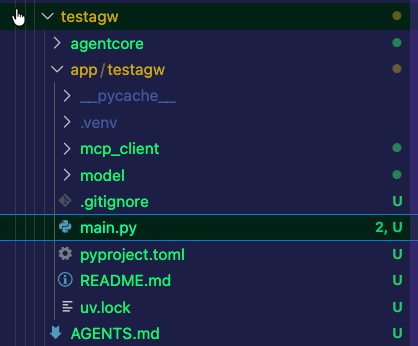
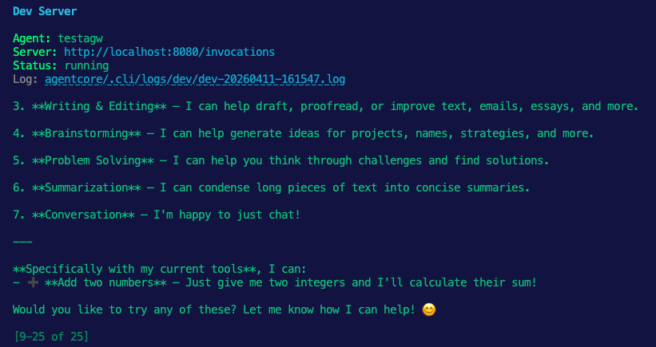

## Agentcore Setup

1. Configure the agentcore CLI
```bash
npm install -g @aws/agentcore
```

2. Create a Python virtual environment to configure your agentcore Agent
```bash
python3.13 -m venv .venv
source .venv/bin/activate
```

3. Install strands (the framework for agentcore)
```bash
pip install openai bedrock-agentcore strands-agents bedrock-agentcore-starter-toolkit
```

4. Create an Agent. This will bring you through a step-by-step guide on creating an Agent. The only needed configuration here is to ensure that you use the Strands framework.
```bash
agentcore create
```

You'll see an agent created with a templated file/folder structure like in the screenshots below:




## Gateway Setup

```
kubectl apply -f https://github.com/kubernetes-sigs/gateway-api/releases/download/v1.5.0/standard-install.yaml 
```

```
export ANTHROPIC_API_KEY=
```

```
kubectl apply -f- <<EOF
kind: Gateway
apiVersion: gateway.networking.k8s.io/v1
metadata:
  name: agentgateway-route
  namespace: agentgateway-system
  labels:
    app: agentgateway-route
spec:
  gatewayClassName: agentgateway
  listeners:
  - protocol: HTTP
    port: 8082
    name: http
    allowedRoutes:
      namespaces:
        from: All
EOF
```

```
kubectl apply -f- <<EOF
apiVersion: v1
kind: Secret
metadata:
  name: anthropic-secret
  namespace: agentgateway-system
  labels:
    app: agentgateway-route
type: Opaque
stringData:
  Authorization: $ANTHROPIC_API_KEY
EOF
```

```
kubectl apply -f- <<EOF
apiVersion: agentgateway.dev/v1alpha1
kind: AgentgatewayBackend
metadata:
  labels:
    app: agentgateway-route
  name: anthropic
  namespace: agentgateway-system
spec:
  ai:
    provider:
        anthropic:
          model: "claude-sonnet-4-6"
  policies:
    auth:
      secretRef:
        name: anthropic-secret
EOF
```

```
kubectl get agentgatewaybackend -n agentgateway-system
```

```
kubectl apply -f- <<EOF
apiVersion: gateway.networking.k8s.io/v1
kind: HTTPRoute
metadata:
  name: claude
  namespace: agentgateway-system
  labels:
    app: agentgateway-route
spec:
  parentRefs:
    - name: agentgateway-route
      namespace: agentgateway-system
  rules:
  - matches:
    - path:
        type: PathPrefix
        value: /anthropic
    filters:
    - type: URLRewrite
      urlRewrite:
        path:
          type: ReplaceFullPath
          replaceFullPath: /v1/chat/completions
    backendRefs:
    - name: anthropic
      namespace: agentgateway-system
      group: agentgateway.dev
      kind: AgentgatewayBackend
EOF
```

```
export INGRESS_GW_ADDRESS=$(kubectl get svc -n agentgateway-system agentgateway-route -o jsonpath="{.status.loadBalancer.ingress[0]['hostname','ip']}")
echo $INGRESS_GW_ADDRESS
```

```
curl "$INGRESS_GW_ADDRESS:8082/anthropic" -H content-type:application/json -H "anthropic-version: 2023-06-01" -d '{
  "model": "claude-sonnet-4-5-20250929",
  "messages": [
    {
      "role": "system",
      "content": "You are a skilled cloud-native network engineer."
    },
    {
      "role": "user",
      "content": "Write me a paragraph containing the best way to think about Istio Ambient Mesh"
    }
  ]
}' | jq
```

## Configure Your Agent With Agentgateway

1. Test your Agent
```
agentcore dev
```

2. Open your agent in `testagw/app/testagw/main.py` and remove the MCP client registration. The top of the file should look like this:

```
from strands import Agent, tool
from bedrock_agentcore.runtime import BedrockAgentCoreApp
from model.load import load_model

app = BedrockAgentCoreApp()
log = app.logger

# Agent Gateway is used as the model endpoint, so no MCP client is registered here.
mcp_clients = []
```

3. Open `testagw/app/testagw/mcp_client/client.py` and replace it with a no-op compatibility stub:

```
"""Compatibility stub for MCP client wiring.

This project uses agentgateway as the Anthropic model endpoint in model/load.py,
so no MCP client is configured here.
"""

def get_streamable_http_mcp_client():
    """Return no MCP client for the LLM-endpoint integration path."""
    return None
```

4. Open `testagw/app/testagw/pyproject.toml` and add the OpenAI SDK dependency. Even if you installed `openai` earlier with `pip`, the generated app still needs this dependency declared in its own project file:

```
"openai >= 1.0.0",
```

5. Open your agent in `testagw/app/testagw/model/load.py` and update the model client to use agentgateway through Strands' OpenAI-compatible model:

```
import os

from strands.models.openai import OpenAIModel
from bedrock_agentcore.identity.auth import requires_api_key

IDENTITY_PROVIDER_NAME = "testagwAnthropic"
IDENTITY_ENV_VAR = "AGENTCORE_CREDENTIAL_TESTAGWANTHROPIC"
GATEWAY_URL = "http://YOUR_GATEWAY_ALB_IP:8082/anthropic"


@requires_api_key(provider_name=IDENTITY_PROVIDER_NAME)
def _agentcore_identity_api_key_provider(api_key: str) -> str:
    """Fetch API key from AgentCore Identity."""
    return api_key


def _get_api_key() -> str:
    """
    Uses AgentCore Identity for API key management in deployed environments.
    For local development, run via 'agentcore dev' which loads agentcore/.env.
    """
    if os.getenv("LOCAL_DEV") == "1":
        api_key = os.getenv(IDENTITY_ENV_VAR)
        if not api_key:
            raise RuntimeError(
                f"{IDENTITY_ENV_VAR} not found. Add {IDENTITY_ENV_VAR}=your-key to .env.local"
            )
        return api_key
    return _agentcore_identity_api_key_provider()


def load_model() -> OpenAIModel:
    """Get an OpenAI-compatible model client routed through Agent Gateway."""
    return OpenAIModel(
        client_args={
            "api_key": _get_api_key(),
            "base_url": GATEWAY_URL,
            "default_headers": {
                "anthropic-version": "2023-06-01",
            },
        },
        model_id="claude-sonnet-4-5-20250929",
        params={"max_tokens": 5000},
    )
```

6. Sync the dependency changes for the generated app:

```
cd testagw/app/testagw
uv sync
```

7. Take a live look at the agentgateway Pod logs:

```
kubectl logs -n agentgateway-system  agentgateway-route-YOUR_AGW_POD -f
```

8. Run your agent:
```
agentcore dev
```

9. Prompt your agentcore Agent. For example, `What can you do?`

You should now see traffic routing through agentgateway.

```
2026-04-11T20:15:55.696819Z     info    request gateway=agentgateway-system/agentgateway-route listener=http route=agentgateway-system/claude endpoint=api.anthropic.com:443 src.addr=10.224.0.62:23692 http.method=POST http.host=13.83.164.82 http.path=/anthropic/chat/completions http.version=HTTP/1.1 http.status=200 protocol=llm gen_ai.operation.name=chat gen_ai.provider.name=anthropic gen_ai.request.model=claude-sonnet-4-6 gen_ai.response.model=claude-sonnet-4-6 gen_ai.usage.input_tokens=605 gen_ai.usage.cache_creation.input_tokens=0 gen_ai.usage.cache_read.input_tokens=0 gen_ai.usage.output_tokens=243 gen_ai.request.max_tokens=5000 duration=5107ms
```