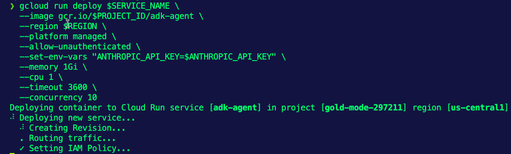
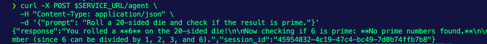

Serverless is a great place to run short-lived Agents, but for anything long-running (e.g - autonomous Agents), it may be an issue because of the timeouts.

AWS Lambda timeouts for Serverless runs are 15 minutes. GCP Cloud Run timeouts for Serverless runs are 60 minutes.

For long-running Agents, you'd move to:

- Persistent compute (EC2, GCE, Pods with kagent on ECS/EKS/GKE)
- Orchestration services (Step Functions, GCP Workflows) that checkpoint state between serverless invocations
- Hybrid approach: Serverless for individual agent "steps", durable orchestrator managing the overall flow


### 1. Initialize Agent with kagent

Use the `kagent init` command to scaffold your ADK agent project:

```
kagent init adk python serverlessagent \
  --model-provider Anthropic \
  --model-name claude-sonnet-4-20250514
```

```
cd serverlessagent
```

### 2. Add Cloud Run Dependencies

The generated `pyproject.toml` includes the ADK dependencies. Add Flask and Gunicorn for serving HTTP on Cloud Run:

```toml
[project]
name = "serverlessagent"
version = "0.1"
description = "serverlessagent agent"
readme = "README.md"
dependencies = [
  "google-adk>=1.8.0",
  "flask>=3.0.0",
  "gunicorn>=21.0.0",
]
```

### 3. Create Flask HTTP Server

The kagent scaffolding creates the agent but not an HTTP server. An HTTP server is not "technically" needed for a Serverless app, but in this case, it is used as a trigger mechanism. Create `main.py` in the **serverlessagent** directory to wrap the agent with Flask endpoints:

```python
import os
from flask import Flask, request, jsonify
from google.adk.runners import Runner
from google.adk.sessions import InMemorySessionService
from google.genai import types
from serverlessagent.agent import root_agent

app = Flask(__name__)

session_service = InMemorySessionService()
runner = Runner(
    agent=root_agent,
    app_name="serverlessagent",
    session_service=session_service,
)


@app.route("/health", methods=["GET"])
def health():
    return jsonify({"status": "healthy"})


@app.route("/agent", methods=["POST"])
def run_agent():
    data = request.get_json()
    prompt = data.get("prompt")

    if not prompt:
        return jsonify({"error": "prompt is required"}), 400

    session = session_service.create_session(
        app_name="serverlessagent",
        user_id="cloud-run-user",
    )

    content = types.Content(
        role="user",
        parts=[types.Part.from_text(prompt)],
    )

    response_text = ""
    for event in runner.run(
        user_id="cloud-run-user",
        session_id=session.id,
        new_message=content,
    ):
        if event.is_final_response() and event.content:
            for part in event.content.parts:
                if part.text:
                    response_text += part.text

    return jsonify({
        "response": response_text,
        "session_id": session.id,
    })


if __name__ == "__main__":
    port = int(os.environ.get("PORT", 8080))
    app.run(host="0.0.0.0", port=port)
```

### 4. Create Cloud Run Dockerfile and Cloud Build file

The generated `Dockerfile` is for kagent on Kubernetes.

1. Create a `Dockerfile.cloudrun` in the **serverlessagent** directory for Cloud Run:

```dockerfile
FROM python:3.11-slim

WORKDIR /app

COPY . .
RUN pip install --no-cache-dir .

CMD exec gunicorn --bind :$PORT --workers 1 --threads 8 --timeout 0 main:app
```

2. Set the appropriate env vars to access Cloud run in your GCP account
```
export PROJECT_ID=your-gcp-project
export REGION=us-central1
export SERVICE_NAME=adk-agent
```

3. Create a `cloudbuild.yaml` file in the **serverlessagent** directory
```
steps:
  - name: 'gcr.io/cloud-builders/docker'
    args: ['build', '-f', 'Dockerfile.cloudrun', '-t', 'gcr.io/$PROJECT_ID/adk-agent', '.']
images:
  - 'gcr.io/$PROJECT_ID/adk-agent'
```

4. Run the build 
```
gcloud builds submit --config cloudbuild.yaml
```

You should now be able to see the build in Container Registry

### 5. Deploy to Cloud Run

```
export ANTHROPIC_API_KEY=
```

```
gcloud run deploy $SERVICE_NAME \
  --image gcr.io/$PROJECT_ID/adk-agent \
  --region $REGION \
  --platform managed \
  --allow-unauthenticated \
  --set-env-vars "ANTHROPIC_API_KEY=$ANTHROPIC_API_KEY" \
  --memory 1Gi \
  --cpu 1 \
  --timeout 3600 \
  --concurrency 10
```

You should see the deployment begin.


Once finished, you should see the below:
```
Done.                                                                                                                                                                                   
Service [adk-agent] revision [adk-agent-00001-hd9] has been deployed and is serving 100 percent of traffic.
Service URL: https://adk-agent-10077854408.us-central1.run.app
```

### 6. Test the Deployed Agent

1. Put the URL for the Agent endpoint into an environment variable
```
SERVICE_URL=$(gcloud run services describe $SERVICE_NAME --region $REGION --format 'value(status.url)')
```

2. Check the health of the Agent running in Cloud Run
```
curl $SERVICE_URL/health
```

You'll see an output similar to the below
```
{"status":"healthy"}
```

3. Test the Agent
```
curl -X POST $SERVICE_URL/agent \
  -H "Content-Type: application/json" \
  -d '{"prompt": "Roll a 20-sided die and check if the result is prime."}'
```

You'll see an output similar to the below



## Cleanup

To delete all resources created in this tutorial:

1. Delete the Cloud Run service
```
gcloud run services delete $SERVICE_NAME --region $REGION --quiet
```

2. Delete the container image from Container Registry
```
gcloud container images delete gcr.io/$PROJECT_ID/adk-agent --force-delete-tags --quiet
```

---

## Appendix

### Using Secret Manager for API Key (Production)

```
echo -n "YOUR_ANTHROPIC_KEY" | gcloud secrets create anthropic-api-key --data-file=-
```

```
gcloud secrets add-iam-policy-binding anthropic-api-key \
  --member="serviceAccount:$PROJECT_ID-compute@developer.gserviceaccount.com" \
  --role="roles/secretmanager.secretAccessor"
```

```
gcloud run deploy $SERVICE_NAME \
  --source . \
  --region $REGION \
  --set-secrets "ANTHROPIC_API_KEY=anthropic-api-key:latest"
```

Cleanup

```
gcloud secrets delete anthropic-api-key --quiet
```