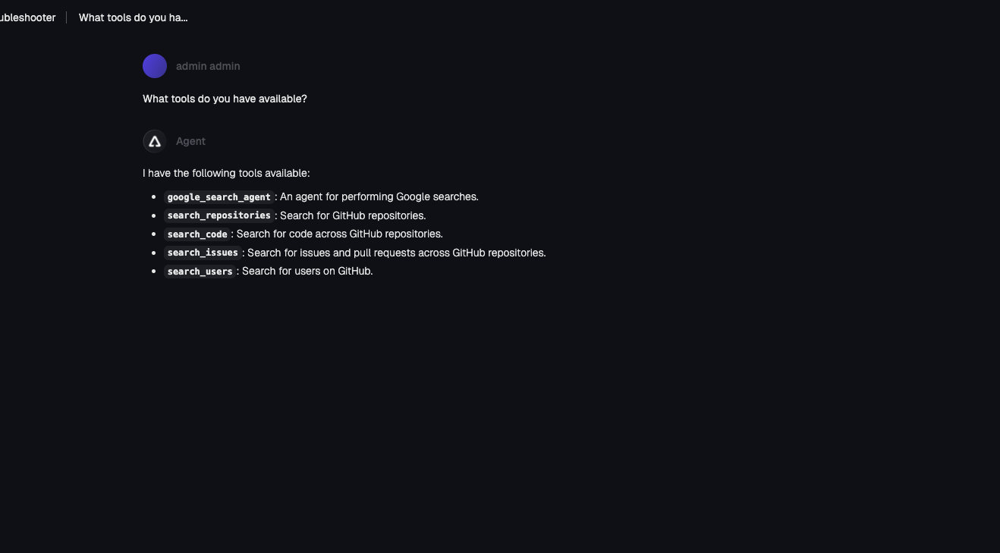

## k8s Agent

1. Create an MCP Server object
```
kubectl apply -f - <<EOF
apiVersion: kagent.dev/v1alpha1
kind: MCPServer
metadata:
  name: test-mcp-server
  namespace: kagent
  labels:
    kagent.solo.io/waypoint: "true"
spec:
  deployment:
    image: mcp/everything
    port: 3000
    cmd: npx
    args:
      - "-y"
      - "@modelcontextprotocol/server-github"
  transportType: stdio
EOF
```

2. Create an Agent
```
kubectl apply -f - <<EOF
apiVersion: kagent.dev/v1alpha2
kind: Agent
metadata:
  name: test-access-policy
  namespace: kagent
spec:
  description: This agent can use a single tool to expand it's Kubernetes knowledge for troubleshooting and deployment
  type: Declarative
  declarative:
    modelConfig: default-model-config
    systemMessage: |-
      You're a friendly and helpful agent that uses the Kubernetes tool to help troubleshooting and deploy environments
  
      # Instructions
  
      - If user question is unclear, ask for clarification before running any tools
      - Always be helpful and friendly
      - If you don't know how to answer the question DO NOT make things up
        respond with "Sorry, I don't know how to answer that" and ask the user to further clarify the question
  
      # Response format
      - ALWAYS format your response as Markdown
      - Your response will include a summary of actions you took and an explanation of the result
    tools:
    - type: McpServer
      mcpServer:
        name: test-mcp-server
        kind: MCPServer
        toolNames:
        - search_repositories
        - search_issues
        - search_code
        - search_users
EOF
```

3. Open the Agent in kagent and ask `What tools do you have available?`

You should see four tools:
        - search_repositories
        - search_issues
        - search_code
        - search_users

4. Apply an access policy that specifies only access to one of the tools
```
kubectl apply -f - <<EOF
apiVersion: policy.kagent-enterprise.solo.io/v1alpha1
kind: AccessPolicy
metadata:
  name: deny-kagent-tool-server-dec
  namespace: kagent
spec:
  from:
    subjects:
    - kind: Agent
      name: test-access-policy
      namespace: kagent
  targetRef:
    kind: MCPServer
    name: test-mcp-server
    # if you comment out the tools parameter, the agent will say it has to tools
    tools: ["search_code"]
  action: ALLOW
EOF
```

5. Prompt again
```
`What tools do you have available?`
```

You should now only see access to the `search_repositories` tool

## BYO Agent

1. Deploy the MCP Server:
```
kubectl apply -f - <<EOF
apiVersion: kagent.dev/v1alpha1
kind: MCPServer
metadata:
  name: test-mcp-server
  namespace: kagent
  labels:
    kagent.solo.io/waypoint: "true"
spec:
  deployment:
    image: mcp/everything
    port: 3000
    cmd: npx
    args:
      - "-y"
      - "@modelcontextprotocol/server-github"
  transportType: stdio
EOF
```

2. `cd` into the directory where your BYO agent exists. You can use the ADK agent found [here](https://github.com/AdminTurnedDevOps/agentic-demo-repo/blob/main/adk/troubleshoot-agent/troubleshootagent/agent.py) if you don't have one:
`cd adk/troubleshoot-agent/`

3. Open your Agent and ensure that the MCP Server and toolset are set The server URL, in this case, the server url will be the `test-mcp-server` that you created in step 2 and the path to the k8s service that gets deployed.

```
tools=[
    google_search,
    MCPToolset(
        connection_params=StreamableHTTPConnectionParams(
            url=os.getenv("MCP_SERVER_URL", "http://test-mcp-server.kagent.svc.cluster.local:3000"),
        ),
        tool_filter=[
            'search_repositories',
            'search_issues',
            'search_code',
            'search_users'
        ]
    ),
```

4. Build the ADK Docker image
```
docker build . -t troubleshoot:latest \
  --platform linux/amd64 \
  --build-arg DOCKER_REGISTRY=ghcr.io \
  --build-arg VERSION=$VERSION
```

5. Tag the image with your container registry
```
docker tag troubleshoot:latest adminturneddevops/troubleshoot:v0.5
```

6. Push the container image to your container registry
```
docker push adminturneddevops/troubleshoot:v0.5
```

7. Specify the Google API key
```
export GOOGLE_API_KEY=
```

8. Create a k8s secret
```
kubectl create secret generic kagent-google -n kagent  --from-literal=GOOGLE_API_KEY=$GOOGLE_API_KEY   --dry-run=client -oyaml | kubectl apply -f -
```

9. Build the BYO Agent
```
kubectl apply -f - <<EOF
apiVersion: kagent.dev/v1alpha2
kind: Agent
metadata:
  name: troubleshooter
  namespace: kagent
spec:
  description: k8s specialist
  type: BYO
  byo:
    deployment:
      image: adminturneddevops/troubleshoot:v0.5
      env:
        - name: GOOGLE_API_KEY
          valueFrom:
            secretKeyRef:
              name: kagent-google
              key: GOOGLE_API_KEY
EOF
```

10. Go into kagent, find the **troubleshooter** Agent, and prompt it with "What tools do you have available?"

You should see the below:




11. Apply an access policy that specifies only access to one of the tools
```
kubectl apply -f - <<EOF
apiVersion: policy.kagent-enterprise.solo.io/v1alpha1
kind: AccessPolicy
metadata:
  name: deny-kagent-tool-server
  namespace: kagent
spec:
  from:
    subjects:
    - kind: Agent
      name: troubleshooter
      namespace: kagent
  targetRef:
    kind: MCPServer
    name: test-mcp-server
    # if you comment out the tools parameter, the agent will say it has to tools
    tools: ["search_repositories"]
  action: ALLOW
EOF
```

12. Ask the agent again: `What tools do you have available?`

You should now see only `search_repositories` in the tool list

