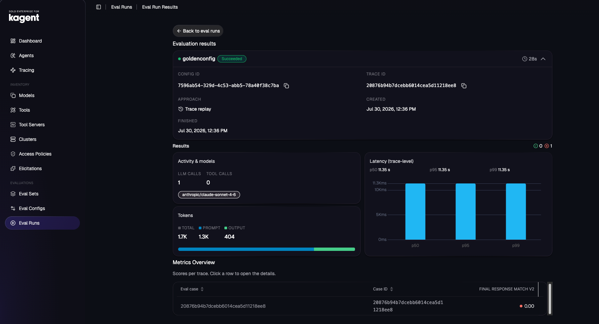

Agentevals are managed in three ways:

1. kagent / Solo Enterprise UI — create/run evals, view results
2. agentevals HTTP API — e.g. POST /api/runs, streaming/trace APIs
3. Files + CLI — `eval_set.json`, custom evaluators, agentevals run style flows (as in your agentevals/ demos)

## Eval Set

Eval sets provide a repeatable way to organize the inputs and metadata used during evaluation.

An eval set typically describes:
1. The items or examples being evaluated
2. Metadata associated with those items
3. Expected outputs, labels, or references when available
4. Which evaluators or metrics should be applied

You can pull an Eval Set from JSON (for example a Golden Eval Set) or from a trace (e.g. an agent ran successfully and you want that run as the "source of truth").

### Demo golden eval set

A ready-to-use golden set lives next to this doc:

[`golden-eval-set.json`](./golden-eval-set.json) has 4 cases:
- CrashLoop probe
- ImagePullBackOff
- Service with no endpoints
- Agentgateway 401 auth debug

Each case includes:
- `user_content` — the prompt to send the agent
- `final_response` — golden expected answer (LLM judges score semantic match)
- `intermediate_data.tool_uses` — expected tool trajectory (optional trajectory evaluators)

1. Upload this file in the Solo Enterprise UI as an **Eval Set**
2. You can see all four cases when you upload the JSON

## Eval Config

Eval Configs is the scoring plan (which evaluators run, thresholds, models, custom judge code).

There are five out of the box:
1. `final_response_match_v2`: LLM judge: does the agent’s final answer match the expected /golden answer (semantic, not exact string)?
2. `response_match_score`: Similar “matches expected answer” idea (usually stricter / different scoring path)
3. `tool_trajectory_avg_score`: Compares expected vs actual tool-call sequence
4. `hallucinations_v1: LLM judge`: unsupported / false claims
5. `per_turn_user_simulator _quality_v1`: Quality of user-simulator turns

You can create your own as well. Example:
```
kagent-enterprise/agent-evals/eval_config.yaml

evaluators:
  # --- shipped / builtin ---
  - name: final_response_match_v2
    type: builtin
    threshold: 0.7

  - name: tool_trajectory_avg_score
    type: builtin
    trajectory_match_type: IN_ORDER
    threshold: 0.5

  # --- your own ---
  - name: mentions_root_cause
    type: code
    path: kagent-enterprise/agent-evals/evaluators/mentions_root_cause.py
    threshold: 0.8
    config:
      min_hits: 1
```

You can also create a Custom Evaluator via something like thr Python `evaluator` SDK

### Demo eval config

## Eval Run

Eval Runs take your Eval Config, Eval Set, and tests against the target (e.g - your Agent) to show how well your Agent performs

### Demo eval run

1. Go to **Eval Runs** in kagent
2. click **+ New Eval Run**
3. Choose your Eval config and Eval set
4. Choose the trace/agent that you want to test against




## How They Work Together

Eval set == What to test (cases + goldens)
Eval config == How to score (evaluators + thresholds)
Eval run == One execution: agent (or traces) × set × config → results
