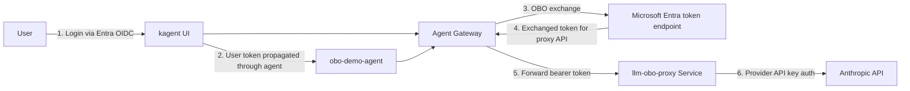

# On-Behalf-Of (OBO) Token Exchange with Microsoft Entra ID

This guide walks through configuring On-Behalf-Of token exchange using Microsoft Entra ID (Azure AD) with kagent-enterprise and agentgateway-enterprise. OBO lets a user authenticate to the kagent UI, and when agents call downstream services or MCP servers, the gateway exchanges the user's token for a new token scoped to that backend — preserving the user's identity chain.

## How Entra OBO Differs from RFC 8693

Microsoft Entra does **not** implement RFC 8693. Instead, it uses a proprietary OBO flow:

| Field | RFC 8693 (Keycloak, Okta) | Entra ID |
|-------|--------------------------|----------|
| `grant_type` | `urn:ietf:params:oauth:grant-type:token-exchange` | `urn:ietf:params:oauth:grant-type:jwt-bearer` |
| Subject token parameter | `subject_token` | `assertion` |
| Token use indicator | N/A | `requested_token_use=on_behalf_of` |
| Client auth | Basic Auth (standard) | Form-encoded `client_id` + `client_secret` |
| Response | Includes `issued_token_type` | Omits `issued_token_type`, adds `ext_expires_in` |

The agentgateway-enterprise controller handles this difference natively via the `entra` field on `EnterpriseAgentgatewayPolicy`.

## Architecture



1. User authenticates to the kagent UI via Entra OIDC
2. The user's token is propagated through the agent (via `KAGENT_PROPAGATE_TOKEN`)
3. When the agent calls the `/llm` route, Agent Gateway performs OBO token exchange with Entra
4. Agent Gateway forwards the exchanged bearer token to the in-cluster `llm-obo-proxy` Service
5. The proxy validates the Entra token audience and then calls Anthropic with the provider API key

## Prerequisites

- Kubernetes cluster (GKE, AKS, or similar) with `kubectl` access
- Helm 3.x
- Enterprise license keys for both kagent-enterprise and agentgateway-enterprise
- A Microsoft Entra ID (Azure AD) tenant with admin access
- An LLM API key (Anthropic, OpenAI, etc.)

## Step 1: Register Entra App Registrations

You need a backend app registration for kagent. If your browser-facing UI uses a separate Entra client for interactive login, create a second frontend app registration for that flow.

### 1a. Backend App Registration (kagent-backend)

1. Go to [Azure Portal - App registrations](https://portal.azure.com/#view/Microsoft_AAD_RegisteredApps/ApplicationsListBlade)
2. Click **New registration**
3. Configure:
   - **Name**: `kagent-backend`
   - **Supported account types**: Single tenant
4. Click **Register**
5. Note the **Application (client) ID** — this is `KAGENT_BACKEND_CLIENT_ID`
6. Go to **Certificates & secrets** > **New client secret**
7. Copy the **Value** — this is `KAGENT_BACKEND_CLIENT_SECRET`
8. Go to **Expose an API**:
   - Set the Application ID URI (e.g., `api://<KAGENT_BACKEND_CLIENT_ID>`)
   - Add a delegated scope such as `kagent-backend`

### 1b. Frontend App Registration (kagent-ui)

1. Click **New registration**
2. Configure:
   - **Name**: `kagent-ui`
   - **Supported account types**: Single tenant
   - **Redirect URI**: Select **Single-page application (SPA)** (configure in Step 5 after you know the external IP)
3. Click **Register**
4. Note the **Application (client) ID** — this is `KAGENT_FRONTEND_CLIENT_ID`
5. Go to **API permissions** > **Add a permission** > **My APIs** > select `kagent-backend`
   - Add the delegated scope you exposed on `kagent-backend`
   - Click **Grant admin consent**

### 1c. Note Your Tenant ID

From the Azure Portal:
- **Directory (tenant) ID** — this is `TENANT_ID`

## Step 2: Collect Required Values

```bash
# Enterprise license keys
KAGENT_LICENSE_KEY=<enterprise kagent license key>
KAGENT_FRONTEND_CLIENT_ID=72714acf-cb3e-4a6c-9134-bddfbc73512f
AGW_LICENSE_KEY=<enterprise AGW license key>
ANTHROPIC_API_KEY=<api key for kagent>
KAGENT_BACKEND_CLIENT_ID=<uuid of Entra kagent-backend app>
KAGENT_BACKEND_CLIENT_SECRET=<client secret for Entra kagent-backend app>
# Azure
TENANT_ID=<Entra tenant id>
# Optional group-to-role mapping
K8S_TOKEN_PASSTHROUGH_GROUP_ID=<Entra group object ID for the UI login group, for example 966e120a-237f-44fd-9b86-049da1106a93>
# Enterprise chart version and management cluster name
KAGENT_ENT_VERSION=0.3.12
MGMT_CLUSTER=<your-cluster-name>
```

`KAGENT_FRONTEND_CLIENT_ID` should be the browser-facing Entra app registration. For quick testing, you can reuse `KAGENT_BACKEND_CLIENT_ID`, but only if that app registration is configured to allow browser-based PKCE login with the callback URI from Step 5.

## Step 3: Create Kubernetes Secrets

```bash
# Create the namespace
kubectl create namespace kagent

# Shared Entra OIDC client secret for the management UI backend and the runtime controller.
kubectl create secret generic kagent-enterprise-oidc-secret \
  -n kagent \
  --from-literal=clientSecret="${KAGENT_BACKEND_CLIENT_SECRET}"

# LLM API key
kubectl create secret generic kagent-anthropic \
  -n kagent \
  --from-literal=ANTHROPIC_API_KEY="${ANTHROPIC_API_KEY}"
```

## Step 4: Install Solo Enterprise for kagent and the kagent Runtime with Entra OIDC

Create `management.yaml`:

```yaml
cluster: "${MGMT_CLUSTER}"

products:
  kagent:
    enabled: true
  agentgateway:
    enabled: true
    namespace: "agentgateway-system"

oidc:
  issuer: "https://login.microsoftonline.com/${TENANT_ID}/v2.0"
  additionalScopes:
    - "offline_access"
    - "api://${KAGENT_BACKEND_CLIENT_ID}/kagent-backend"

ui:
  backend:
    oidc:
      clientId: "${KAGENT_BACKEND_CLIENT_ID}"
      secretRef: "kagent-enterprise-oidc-secret"
      secretKey: "clientSecret"
  frontend:
    oidc:
      clientId: "${KAGENT_FRONTEND_CLIENT_ID}"

rbac:
  roleMapping:
    roleMapper: "claims.groups.transformList(i, v, v in rolesMap, rolesMap[v])"
    roleMappings:
      "${K8S_TOKEN_PASSTHROUGH_GROUP_ID}": "global.Admin"

service:
  type: LoadBalancer
```

Create `kagent-values.yaml`:

```yaml
oidc:
  issuer: "https://login.microsoftonline.com/${TENANT_ID}/v2.0"
  clientId: "${KAGENT_BACKEND_CLIENT_ID}"
  secretRef: "kagent-enterprise-oidc-secret"
  secretKey: "clientSecret"
  # Claims from the Entra token to propagate into OBO tokens
  # oboClaimsToPropagate only applies when skipOBO is false (kagent mints its own JWT).
  # Kept here for reference but has no effect when skipOBO is true.
  oboClaimsToPropagate:
    - email
    - groups
    - oid
    - tid
    - upn
  # skipOBO must be true when Agent Gateway handles OBO instead of kagent.
  # When false, the kagent controller mints its own JWT (signed with its own key)
  # and passes that to the agent instead of the raw Entra access token.
  # Agent Gateway's STS cannot validate that kagent-issued token against the
  # Entra JWKS, so the token exchange fails.
  skipOBO: true

rbac:
  roleMapping:
    roleMapper: "claims.groups.transformList(i, v, v in rolesMap, rolesMap[v])"
    roleMappings:
      "${K8S_TOKEN_PASSTHROUGH_GROUP_ID}": "global.Admin"

providers:
  default: anthropic
  anthropic:
    provider: Anthropic
    model: "claude-haiku-4-5-20251001"
    apiKeySecretRef: kagent-anthropic
    apiKeySecretKey: ANTHROPIC_API_KEY

ui:
  enabled: false

licensing:
  createSecret: false
  secretName: "enterprise-kagent-license"
```

`management.yaml` installs the Solo Enterprise management plane with Microsoft Entra as the OIDC issuer. The UI frontend uses `KAGENT_FRONTEND_CLIENT_ID` for browser login, the UI backend validates tokens with `KAGENT_BACKEND_CLIENT_ID`, and `oidc.additionalScopes` requests both the delegated backend scope and `offline_access`. `kagent-values.yaml` installs the Solo-built kagent runtime, disables the standalone `kagent-ui`, and points the runtime controller at the same Entra issuer with the backend client ID.

Replace the `${...}` placeholders with your actual values, then install:

```bash
helm upgrade --install kagent-mgmt \
  oci://us-docker.pkg.dev/solo-public/solo-enterprise-helm/charts/management \
  --version ${KAGENT_ENT_VERSION} \
  -n kagent \
  --create-namespace \
  -f management.yaml

helm upgrade --install kagent-crds \
  oci://us-docker.pkg.dev/solo-public/kagent-enterprise-helm/charts/kagent-enterprise-crds \
  --version ${KAGENT_ENT_VERSION} \
  -n kagent

helm upgrade --install kagent \
  oci://us-docker.pkg.dev/solo-public/kagent-enterprise-helm/charts/kagent-enterprise \
  --version ${KAGENT_ENT_VERSION} \
  -n kagent \
  -f kagent-values.yaml
```

## Step 5: Expose the UI and Configure Redirect URIs

After the Solo Enterprise UI Service is up, get the external IP:

```bash
kubectl get svc solo-enterprise-ui -n kagent
```

The `solo-enterprise-ui` Service is HTTP-only. Microsoft Entra SPA redirect URIs require HTTPS on non-localhost addresses, so do **not** register the `solo-enterprise-ui` external IP as your callback URI. Instead, complete Step 7a to expose the UI through Agent Gateway over HTTPS, then register that HTTPS callback URI on the Entra frontend app registration from Step 1b.

The callback URI you ultimately need looks like:

```text
https://<AGW_HTTPS_EXTERNAL_IP>/callback
```

Do not use `/auth` as the OIDC callback. In the current enterprise UI codebase, `/auth` is a setup route, while `/callback` is the login callback path. If you reused the backend app registration for browser login, add the same callback URI there and make sure the app is configured for browser-based PKCE login.

## Step 6: Install agentgateway-enterprise with Token Exchange

Before installing the agentgateway controller, make sure the required Gateway API and enterprise CRDs are present:

```bash
# Install the Kubernetes Gateway API CRDs
kubectl apply -f https://github.com/kubernetes-sigs/gateway-api/releases/download/v1.5.0/standard-install.yaml

# Install the enterprise agentgateway CRDs chart
helm install agentgateway-crds \
  oci://us-docker.pkg.dev/solo-public/enterprise-agentgateway/charts/enterprise-agentgateway-crds \
  --version v2.2.0 \
  --namespace agentgateway-system \
  --create-namespace
```

If your cluster already has the standard Gateway API CRDs or the enterprise agentgateway CRDs installed, you can skip the corresponding command.

Create the Agent Gateway enterprise license secret in the namespace that the controller will run in:

```bash
kubectl create secret generic enterprise-agentgateway-license \
  -n agentgateway-system \
  --from-literal=enterprise-agentgateway-license-key="${AGW_LICENSE_KEY}"
```

Create `agw-values.yaml`:

```yaml
tokenExchange:
  enabled: true
  issuer: "http://enterprise-agentgateway.agentgateway-system.svc.cluster.local:7777"
  subjectValidator:
    validatorType: "remote"
    remoteConfig:
      url: "https://login.microsoftonline.com/${TENANT_ID}/discovery/v2.0/keys"
  apiValidator:
    validatorType: "k8s"
  actorValidator:
    validatorType: "k8s"

controller:
  service:
    ports:
      tokenExchange: 7777

licensing:
  createSecret: false
  secretName: "enterprise-agentgateway-license"
```

The current `enterprise-agentgateway` chart requires more than `tokenExchange.enabled: true`. At minimum, the token exchange server also needs an `issuer` plus validator configuration for the subject, API, and actor tokens. For Entra OBO, the subject token is the user's Entra access token, so the subject validator must use the Entra JWKS endpoint rather than the Kubernetes API server JWKS. The in-cluster service URL above matches the default service name that the chart creates in the `agentgateway-system` namespace.

```bash
helm install agentgateway \
  oci://us-docker.pkg.dev/solo-public/enterprise-agentgateway/charts/enterprise-agentgateway \
  --version v2.2.0 \
  --namespace agentgateway-system \
  --create-namespace \
  -f agw-values.yaml
```

After the controller is installed, configure the Agent Gateway dataplane with the STS endpoint so proxy instances can call the token exchange server:

```bash
kubectl apply -f - <<EOF
apiVersion: enterpriseagentgateway.solo.io/v1alpha1
kind: EnterpriseAgentgatewayParameters
metadata:
  name: agentgateway-entra-testing-enterprise
  namespace: agentgateway-system
spec:
  logging:
    level: debug
  env:
    - name: STS_URI
      value: "http://enterprise-agentgateway.agentgateway-system.svc.cluster.local:7777/token"
    - name: STS_AUTH_TOKEN
      value: "/var/run/secrets/xds-tokens/xds-token"
EOF
```

When you create the Gateway in Step 7, set `spec.infrastructure.parametersRef` to that `EnterpriseAgentgatewayParameters` object so the dataplane pods receive `STS_URI` and `STS_AUTH_TOKEN`.

## Step 7: Create the Gateway, Deploy an In-Cluster LLM Proxy, and Attach the Entra OBO Policy

```
kubectl apply -f- <<EOF
apiVersion: v1
kind: Secret
metadata:
  name: anthropic-secret
  namespace: agentgateway-system
  labels:
    app: agentgateway-entra-testing
type: Opaque
stringData:
  Authorization: $ANTHROPIC_API_KEY
EOF
```

```
kubectl apply -f - <<EOF
apiVersion: gateway.networking.k8s.io/v1
kind: Gateway
metadata:
  name: agentgateway-entra-testing
  namespace: agentgateway-system
  labels:
    app: agentgateway-entra-testing
spec:
  gatewayClassName: enterprise-agentgateway
  infrastructure:
    parametersRef:
      group: enterpriseagentgateway.solo.io
      kind: EnterpriseAgentgatewayParameters
      name: agentgateway-entra-testing-enterprise
  listeners:
    - name: http
      port: 8080
      protocol: HTTP
      allowedRoutes:
        namespaces:
          from: Same
EOF
```

### 7a. Add HTTPS for the enterprise UI login flow

To use Microsoft Entra SPA login on a non-localhost address, terminate TLS on the Agent Gateway and route the UI through that HTTPS listener.

First, wait for the Gateway to get an external IP:

```bash
kubectl get gateway agentgateway-entra-testing -n agentgateway-system
```

Then generate a self-signed certificate for that IP and create the TLS Secret:

```bash
AGW_HTTPS_EXTERNAL_IP=$(kubectl get gateway agentgateway-entra-testing -n agentgateway-system -o jsonpath='{.status.addresses[0].value}')

openssl req -x509 -nodes -newkey rsa:2048 -days 365 \
  -keyout /tmp/kagent-ui-https.key \
  -out /tmp/kagent-ui-https.crt \
  -subj "/CN=${AGW_HTTPS_EXTERNAL_IP}" \
  -addext "subjectAltName = IP:${AGW_HTTPS_EXTERNAL_IP}"

kubectl create secret tls kagent-ui-https-tls \
  -n agentgateway-system \
  --cert=/tmp/kagent-ui-https.crt \
  --key=/tmp/kagent-ui-https.key \
  --dry-run=client -o yaml | kubectl apply -f -
```

Apply the companion Gateway API manifest that adds an HTTPS listener, a `ReferenceGrant`, and an `HTTPRoute` for the UI:

```bash
kubectl apply -f ui-https-gateway.yaml
```

That manifest is stored next to this guide and updates the existing `agentgateway-entra-testing` Gateway to expose the UI over HTTPS through the Agent Gateway load balancer.

After it is applied, verify the HTTPS endpoint:

```bash
kubectl get svc agentgateway-entra-testing -n agentgateway-system
curl -k -I "https://${AGW_HTTPS_EXTERNAL_IP}/"
curl -k -I "https://${AGW_HTTPS_EXTERNAL_IP}/callback"
```

Register this callback URI on the Entra frontend app registration:

```text
https://<AGW_HTTPS_EXTERNAL_IP>/callback
```

### 7b. Deploy the in-cluster LLM proxy Service

Direct OBO to `api.anthropic.com` is not the right architecture because the public Anthropic API expects provider-native API key authentication, not an Entra bearer token. Instead, route OBO to an in-cluster proxy `Service` that validates the exchanged Entra token and then calls Anthropic with the API key.

For this demo, the proxy reuses the existing `kagent-backend` Entra app registration as the protected audience. For a production setup, use a dedicated Entra app registration and delegated scope for the proxy service.

Create a `ConfigMap` from the proxy source that lives next to this guide:

```bash
kubectl create configmap llm-obo-proxy-code \
  -n agentgateway-system \
  --from-file=app.py=llm-obo-proxy/app.py \
  --from-file=requirements.txt=llm-obo-proxy/requirements.txt \
  --dry-run=client -o yaml | kubectl apply -f -
```

Deploy the proxy `Deployment` and `Service`:

```bash
cat llm-obo-proxy/deployment.yaml \
  | sed "s/\${TENANT_ID}/${TENANT_ID}/g; s/\${KAGENT_BACKEND_CLIENT_ID}/${KAGENT_BACKEND_CLIENT_ID}/g" \
  | kubectl apply -f -
```

Verify the proxy is up:

```bash
kubectl rollout status deployment/llm-obo-proxy -n agentgateway-system
kubectl get svc llm-obo-proxy -n agentgateway-system
kubectl logs deployment/llm-obo-proxy -n agentgateway-system
```

Create an `HTTPRoute` that sends `/llm` traffic from Agent Gateway to the proxy `Service`:

```bash
kubectl apply -f - <<EOF
apiVersion: gateway.networking.k8s.io/v1
kind: HTTPRoute
metadata:
  name: llm-obo-proxy
  namespace: agentgateway-system
  labels:
    app: agentgateway-entra-testing
spec:
  parentRefs:
    - name: agentgateway-entra-testing
      namespace: agentgateway-system
  rules:
  - matches:
    - path:
        type: PathPrefix
        value: /llm
    filters:
    - type: URLRewrite
      urlRewrite:
        path:
          type: ReplacePrefixMatch
          replacePrefixMatch: /v1
    backendRefs:
    - group: ""
      kind: Service
      name: llm-obo-proxy
      port: 8080
EOF
```

Create the Entra OBO client secret in the same namespace as the `Service` and `EnterpriseAgentgatewayPolicy`:

```bash
kubectl create secret generic entra-obo-client-secret \
  -n agentgateway-system \
  --from-literal=client_secret="${KAGENT_BACKEND_CLIENT_SECRET}" \
  --dry-run=client -o yaml | kubectl apply -f -
```

Attach an `EnterpriseAgentgatewayPolicy` to the proxy `Service` so Agent Gateway performs Entra OBO before forwarding to the service:

```bash
kubectl apply -f - <<EOF
apiVersion: enterpriseagentgateway.solo.io/v1alpha1
kind: EnterpriseAgentgatewayPolicy
metadata:
  name: entra-obo-token-exchange
  namespace: agentgateway-system
spec:
  targetRefs:
    - kind: Service
      name: llm-obo-proxy
      group: ""
  backend:
    tokenExchange:
      mode: ExchangeOnly
      entra:
        tenantId: "${TENANT_ID}"
        clientId: "${KAGENT_BACKEND_CLIENT_ID}"
        scope: "api://${KAGENT_BACKEND_CLIENT_ID}/kagent-backend"
        clientSecretRef:
          name: entra-obo-client-secret
          key: client_secret
EOF
```

At this point the OBO target is the `llm-obo-proxy` Kubernetes `Service`, not Anthropic directly. Agent Gateway exchanges the incoming user token for a new token scoped to the Entra audience configured above, forwards that bearer token to the proxy, and the proxy calls Anthropic with the provider API key.

### 7c. Reference: direct-to-provider path (not suitable for OBO)

> **Do not apply this section for the OBO demo.** These manifests are included only as a reference for the non-OBO pattern (plain API key auth through Agent Gateway). If you apply the `EnterpriseAgentgatewayPolicy` below, it will **overwrite** the working policy from Step 7b because Kubernetes resource names must be unique within a namespace, and the OBO flow will break.

The previous pattern of targeting an `AgentgatewayBackend` for Anthropic with `policies.auth.secretRef` is still fine for plain provider API key auth through Agent Gateway, but it is not a valid end-to-end Entra OBO backend because the public provider API does not consume the exchanged Entra token.

```yaml
# Reference only — do not apply for OBO
apiVersion: agentgateway.dev/v1alpha1
kind: AgentgatewayBackend
metadata:
  labels:
    app: agentgateway-entra-testing
  name: anthropic
  namespace: agentgateway-system
spec:
  ai:
    provider:
        anthropic:
          model: "claude-sonnet-4-6"
  policies:
    auth:
      secretRef:
        name: anthropic-secret
---
apiVersion: gateway.networking.k8s.io/v1
kind: HTTPRoute
metadata:
  name: claude
  namespace: agentgateway-system
  labels:
    app: agentgateway-entra-testing
spec:
  parentRefs:
    - name: agentgateway-entra-testing
      namespace: agentgateway-system
  rules:
  - matches:
    - path:
        type: PathPrefix
        value: /anthropic
    filters:
    - type: URLRewrite
      urlRewrite:
        path:
          type: ReplaceFullPath
          replaceFullPath: /v1/chat/completions
    backendRefs:
    - name: anthropic
      namespace: agentgateway-system
      group: agentgateway.dev
      kind: AgentgatewayBackend
```

If you wanted to attach an OBO policy to a direct backend instead of the proxy `Service`, the policy would look like the example below. Note the different name (`entra-obo-direct-backend`) to avoid colliding with the proxy policy from Step 7b:

```yaml
# Reference only — do not apply for OBO
apiVersion: enterpriseagentgateway.solo.io/v1alpha1
kind: EnterpriseAgentgatewayPolicy
metadata:
  name: entra-obo-direct-backend
  namespace: agentgateway-system
spec:
  targetRefs:
    - kind: AgentgatewayBackend
      name: anthropic
      group: agentgateway.dev
  backend:
    tokenExchange:
      mode: ExchangeOnly
      entra:
        tenantId: "${TENANT_ID}"
        clientId: "${KAGENT_BACKEND_CLIENT_ID}"
        scope: "api://${KAGENT_BACKEND_CLIENT_ID}/.default"
        clientSecretRef:
          name: entra-obo-client-secret
          key: client_secret
```

The `EnterpriseAgentgatewayPolicy`, its `targetRefs`, and the `clientSecretRef` Secret must all line up in the same namespace when you target an `AgentgatewayBackend`. This pattern does not work end-to-end for Entra OBO because the public Anthropic API does not accept Entra bearer tokens.

## Step 8: Configure the Agent for Token Propagation

Set `KAGENT_PROPAGATE_TOKEN=true` on any agent that must forward the user's token to the gateway for OBO exchange.

```
kubectl apply -f - <<EOF
apiVersion: kagent.dev/v1alpha2
kind: ModelConfig
metadata:
  name: anthropic-model-config
  namespace: kagent
spec:
  apiKeyPassthrough: true
  model: "claude-haiku-4-5-20251001"
  provider: OpenAI
  openAI:
    baseUrl: http://agentgateway-entra-testing.agentgateway-system.svc.cluster.local:8080/llm
---
apiVersion: kagent.dev/v1alpha2
kind: Agent
metadata:
  name: obo-demo-agent
  namespace: kagent
  labels:
    app.kubernetes.io/name: obo-demo-agent
spec:
  type: Declarative
  description: "Demo agent with Entra OBO token propagation"
  declarative:
    modelConfig: anthropic-model-config
    systemMessage: |
      You are a helpful assistant. When users ask you to interact with
      backend services, use the available tools. Your requests will
      automatically carry the user's identity via OBO token exchange.
    deployment:
      env:
        - name: KAGENT_PROPAGATE_TOKEN
          value: "true"
EOF
```

## Verification

### Check kagent OIDC config

```bash
kubectl get configmap kagent-enterprise-config -n kagent -o yaml
```

Confirm `OIDC_ISSUER`, `OIDC_CLIENT_ID`, `OBO_CLAIMS_TO_PROPAGATE`, and `SKIP_OBO` are set correctly.

### Check the agentgateway token exchange service

```bash
# Verify the token exchange port is listening
kubectl get svc enterprise-agentgateway -n agentgateway-system

# Check the controller logs for token exchange startup
kubectl logs deployment/enterprise-agentgateway -n agentgateway-system | grep -Ei "token exchange|AGW server"

# Confirm the dataplane received the STS settings
kubectl get deployment agentgateway-entra-testing -n agentgateway-system -o jsonpath='{range .spec.template.spec.containers[0].env[*]}{.name}={.value}{"\n"}{end}' | grep -E "STS_URI|STS_AUTH_TOKEN"
```

You'll see an output similar to the below:
```
kubectl logs deployment/enterprise-agentgateway -n agentgateway-system

{"time":"2026-04-07T20:11:52.471505653Z","level":"info","msg":"push response","component":"krtxds","type":"WDS","reason":"","node":"agentgateway~10.124.2.29~agentgateway-entra-testing-79dc988b58-ntg7t.agentgateway-system~agentgateway-system.svc.cluster.local","resources":0,"removed":1,"size":"0B"}
{"time":"2026-04-07T20:12:02.158470916Z","level":"info","msg":"request","component":"request","method":"POST","path":"/token","StatusCode":200,"latency":499350291,"clientIP":"10.124.2.29"

kubectl logs deployment/llm-obo-proxy -n agentgateway-system

INFO:llm-obo-proxy:validated token for oid=9716f8d3-e182-4f39-aa9a-bcbe8f1488d8 aud=d6957938-c281-4312-97d2-eefbfc44f468 scp=kagent-backend
INFO:     10.124.2.1:43056 - "GET /healthz HTTP/1.1" 200 OK
INFO:httpx:HTTP Request: POST https://api.anthropic.com/v1/messages "HTTP/1.1 200 OK"
INFO:     10.124.2.29:58228 - "POST /v1/chat/completions HTTP/1.1" 200 OK
```

### Check the policy status

```bash
kubectl get enterpriseagentgatewaypolicy -n agentgateway-system
kubectl describe enterpriseagentgatewaypolicy entra-obo-token-exchange -n agentgateway-system
```

### Test the flow

1. Open the kagent UI at `https://<AGW_HTTPS_EXTERNAL_IP>`
2. Log in with your Microsoft account (must be a member of the Entra group whose object ID is set in `K8S_TOKEN_PASSTHROUGH_GROUP_ID`)
3. Select the `obo-demo-agent`
4. Send a prompt to the agent so it triggers a model call through Agent Gateway to `/llm/chat/completions`
5. In the Agent Gateway dataplane logs, confirm both the token exchange debug path and the proxied LLM request:
   ```bash
   kubectl logs deployment/agentgateway-entra-testing -n agentgateway-system | grep -E "exchanging token|calling token exchange service|token exchange response|/llm/chat/completions"
   ```
6. In the proxy logs, confirm the exchanged token was accepted and the provider call completed:
   ```bash
   kubectl logs deployment/llm-obo-proxy -n agentgateway-system
   ```
