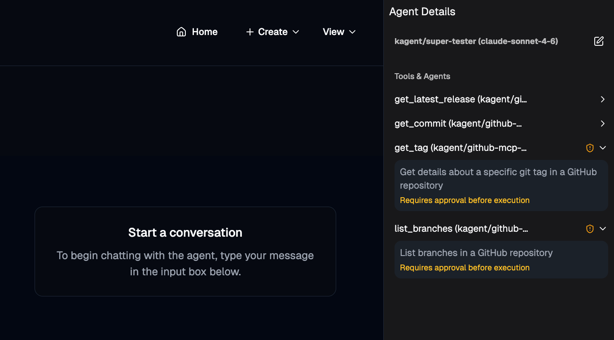

```
export GITHUB_PERSONAL_ACCESS_TOKEN=
export ANTHROPIC_API_KEY=
```

```
kubectl apply -f - <<EOF
apiVersion: v1
kind: Secret
metadata:
  name: github-pat
  namespace: kagent
type: Opaque
stringData:
  GITHUB_PERSONAL_ACCESS_TOKEN: $GITHUB_PERSONAL_ACCESS_TOKEN
EOF
```

```
kubectl apply -f - <<EOF
apiVersion: kagent.dev/v1alpha2
kind: RemoteMCPServer
metadata:
  name: github-mcp-remote
  namespace: kagent
spec:
  description: GitHub Copilot MCP Server
  url: https://api.githubcopilot.com/mcp/
  protocol: STREAMABLE_HTTP
  headersFrom:
    - name: Authorization
      valueFrom:
        type: Secret
        name: github-pat
        key: GITHUB_PERSONAL_ACCESS_TOKEN
  timeout: 5s
  terminateOnClose: true
EOF
```

```
kubectl apply -f - <<EOF
apiVersion: kagent.dev/v1alpha2
kind: ModelConfig
metadata:
  name: anthropic-model-config
  namespace: kagent
spec:
  apiKeySecret: kagent-anthropic
  apiKeySecretKey: ANTHROPIC_API_KEY
  model: claude-sonnet-4-6
  provider: Anthropic
  anthropic: {}
EOF
```

```
kubectl apply -f - <<EOF
apiVersion: kagent.dev/v1alpha2
kind: Agent
metadata:
  name: super-tester
  namespace: kagent
spec:
  type: Declarative
  declarative:
    modelConfig: anthropic-model-config
    systemMessage: |-
      You're a friendly and helpful agent that is an agentgateway expert. You know all things about agentgateway open source and agentgateway enterprise

      # Instructions

      - If user question is unclear, ask for clarification before running any tools
      - Always be helpful and friendly
      - If you don't know how to answer the question DO NOT make things up
        respond with "Sorry, I don't know how to answer that" and ask the user to further clarify the question

      # Response format
      - ALWAYS format your response as Markdown
      - Your response will include a summary of actions you took and an explanation of the result
    tools:
    - type: McpServer
      mcpServer:
        name: github-mcp-remote
        kind: RemoteMCPServer
        toolNames:
        - get_latest_release
        - get_commit
        - get_tag
        - list_branches
        requireApproval:
        - list_branches
        - get_tag
EOF
```

