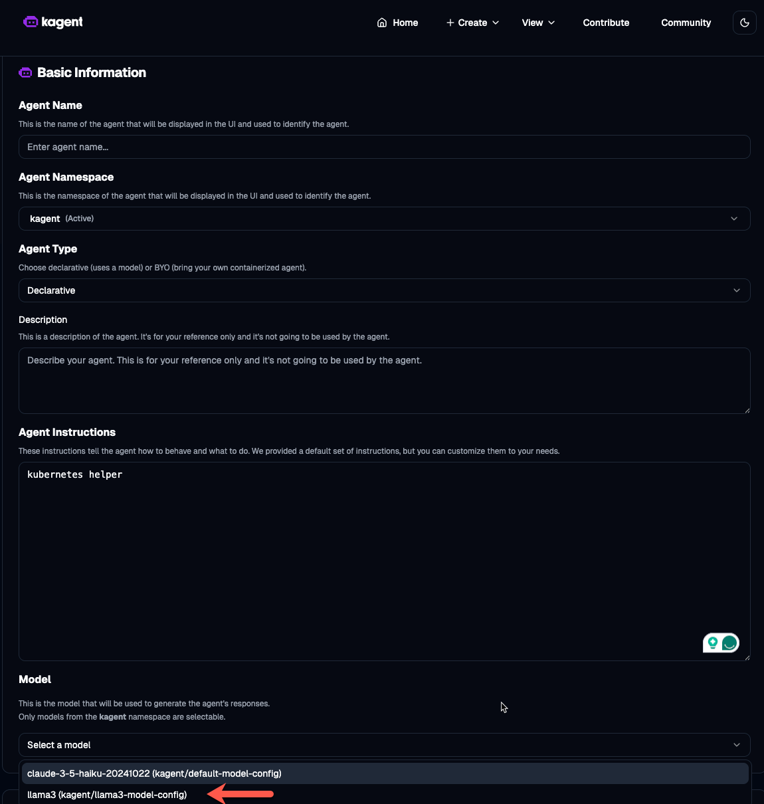
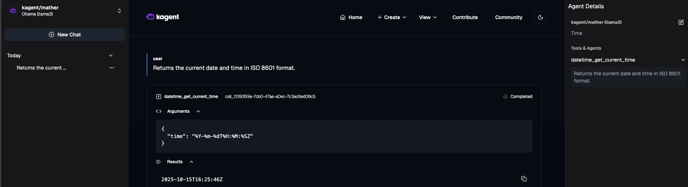

## Llama Config

1. Ensure that you configured kagent on your cluster. You can find the how-to here: https://github.com/AdminTurnedDevOps/agentic-demo-repo/blob/main/kagent-oss/setup.md

2. Create a Namespace for a Llama Model config
```
kubectl create ns ollama
```

3. Deploy Ollama on your k8s cluster. This step could take a few minutes as the init container downloads the Llama3 Model.
```
kubectl apply -f - <<EOF
apiVersion: apps/v1
kind: Deployment
metadata:
  name: ollama
  namespace: ollama
spec:
  selector:
    matchLabels:
      name: ollama
  template:
    metadata:
      labels:
        name: ollama
    spec:
      initContainers:
      - name: model-puller
        image: ollama/ollama:latest
        command: ["/bin/sh", "-c"]
        args:
          - |
            ollama serve &
            sleep 10
            ollama pull llama3
            pkill ollama
        volumeMounts:
        - name: ollama-data
          mountPath: /root/.ollama
        resources:
          requests:
            memory: "8Gi"
          limits:
            memory: "12Gi"
      containers:
      - name: ollama
        image: ollama/ollama:latest
        ports:
        - name: http
          containerPort: 11434
          protocol: TCP
        volumeMounts:
        - name: ollama-data
          mountPath: /root/.ollama
        resources:
          requests:
            memory: "8Gi"
          limits:
            memory: "12Gi"
      volumes:
      - name: ollama-data
        emptyDir: {}
---
apiVersion: v1
kind: Service
metadata:
  name: ollama
  namespace: ollama
spec:
  type: ClusterIP
  selector:
    name: ollama
  ports:
  - port: 80
    name: http
    targetPort: http
    protocol: TCP
EOF
```

4. Confirm that the Model was downloaded:
```
kubectl exec -n ollama deployment/ollama -- ollama list
```

You should see an output similar to the one below:
```
Defaulted container "ollama" out of: ollama, model-puller (init)
NAME             ID              SIZE      MODIFIED           
llama3:latest    365c0bd3c000    4.7 GB    About a minute ago
```

5. Ensure that everything was deployed as expected
```
kubectl get all -n ollama
```

5. Create a `ModelConfig` that will add the Llama Model to the list of Models in kagent
```
kubectl apply -f - <<EOF
apiVersion: kagent.dev/v1alpha2
kind: ModelConfig
metadata:
  name: llama3-model-config
  namespace: kagent
spec:
  model: llama3
  provider: Ollama
  ollama:
    host: http://ollama.ollama.svc.cluster.local:80
EOF
```

6. You should be able to see the Model connected
```
kubectl get modelconfig -n kagent
NAME                   PROVIDER    MODEL
default-model-config   Anthropic   claude-3-5-haiku-20241022
llama3-model-config    Ollama      llama3
```

7. If you go into kagent, you'll now see Llama as an option.



8. Check to confirm that the Agent is in a ready status.
```
kubectl get agent -n kagent
```

You can now create a new Agent with Llama3 as the Model

Once you do, you can test it out. Please note that to get a response, it might be a little slow depending on how large your Worker Nodes are.

