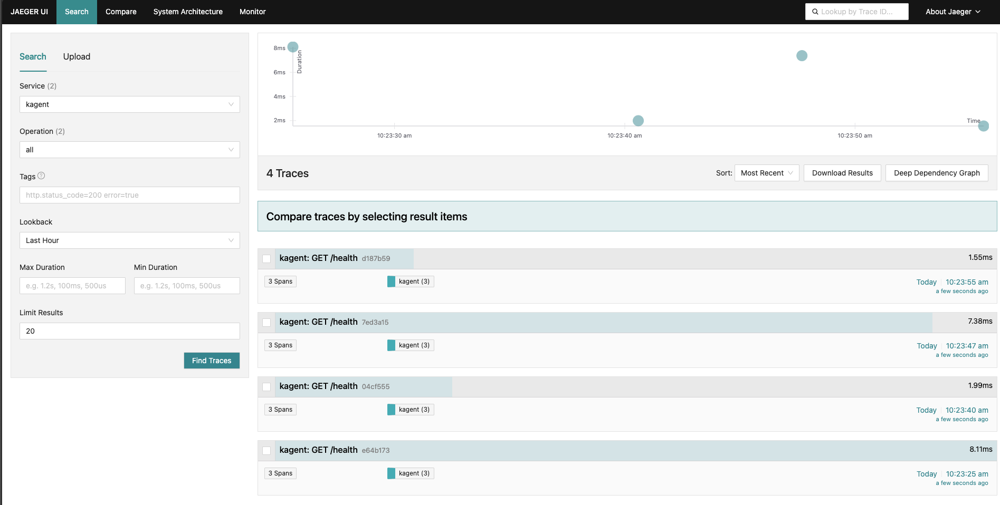
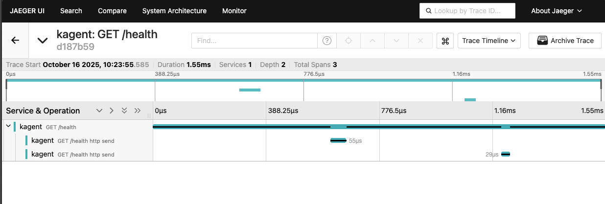

1. Add the Jaeger repo
```
helm repo add jaegertracing https://jaegertracing.github.io/helm-charts
```

2. Install Jaeger
```
helm upgrade --install jaeger jaegertracing/jaeger \
  --namespace jaeger \
  --create-namespace \
  --history-max 3 \
  -f - <<EOF
  provisionDataStore:
    cassandra: false
  allInOne:
    enabled: true
  storage:
    type: memory
  agent:
    enabled: false
  collector:
    enabled: false
  query:
    enabled: false
EOF
```

3. Upgrade your existing kagent installation to use Jaeger
```
helm upgrade --install kagent oci://ghcr.io/kagent-dev/kagent/helm/kagent \
    --namespace kagent \
    --set providers.default=anthropic \
    --set providers.anthropic.apiKey=$ANTHROPIC_API_KEY \
    --set ui.service.type=LoadBalancer \
    -f - <<EOF
    otel:
      tracing:
        enabled: true
        exporter:
          otlp:
            endpoint: http://jaeger-collector.jaeger.svc.cluster.local:4317
EOF
```

4. Go into kagent and run one of your Agents. For eample, go into the `k8s-agent` and just ask "How many Pods are running in the kube-system Namespace?". It can be a simple question like that just to test the tracing

5. Access the Jaeger dashboard
```
kubectl port-forward svc/jaeger-query -n jaeger 16686:16686
```

6. From the search bar, click on **Service** and then choose **kagent**

7. Click the green **Find Traces** button

You'll see outputs similar to the below.


