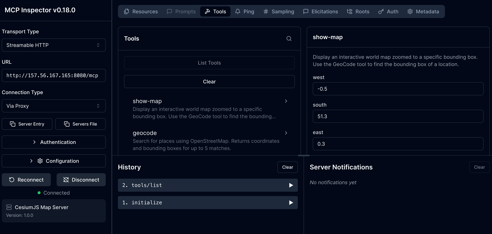
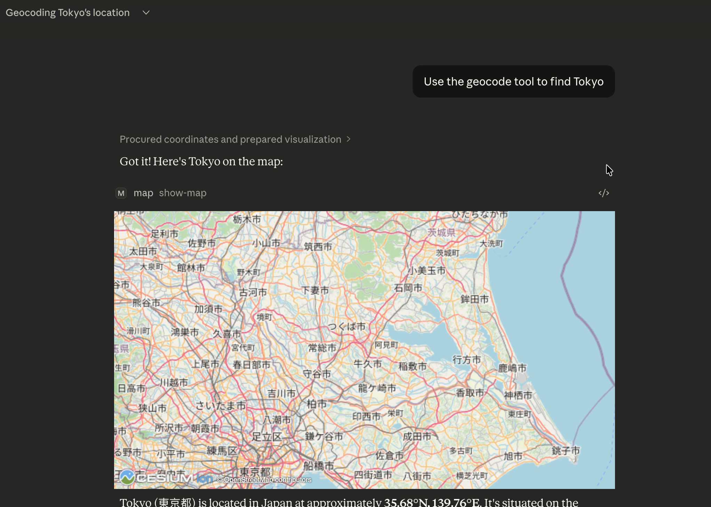
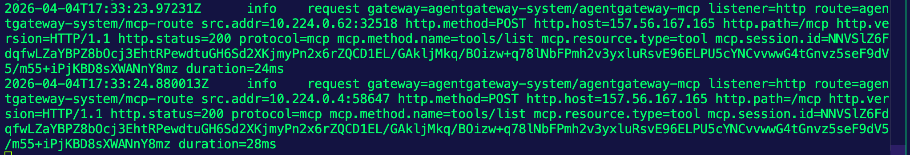

## Build The Interactive MCP Server

For testing purposes, there are a ton of awesome MCP Apps already built. You can use the map server for an interactive map server.

```
git clone https://github.com/modelcontextprotocol/ext-apps.git
```

The container image is built with `node-slim` as the base image.

```
docker build --platform linux/amd64 -f examples/map-server/Dockerfile -t mcp-map-server:latest .
```

```
docker tag mcp-map-server:latest adminturneddevops/mcp-map-server:latest
```

```
docker push adminturneddevops/mcp-map-server:latest
```

## Kubernetes Setup

1. Create the Deployment
```yaml
kubectl apply -f - <<EOF
apiVersion: apps/v1
kind: Deployment
metadata:
  name: mcp-map-server
  namespace: default
spec:
  replicas: 1
  selector:
    matchLabels:
      app: mcp-map-server
  template:
    metadata:
      labels:
        app: mcp-map-server
    spec:
      containers:
      - name: mcp-map-server
        image: adminturneddevops/mcp-map-server:latest
        ports:
        - containerPort: 3001
        env:
        - name: PORT
          value: "3001"
        readinessProbe:
          tcpSocket:
            port: 3001
          initialDelaySeconds: 5
          periodSeconds: 10
        livenessProbe:
          tcpSocket:
            port: 3001
          initialDelaySeconds: 10
          periodSeconds: 15
---
apiVersion: v1
kind: Service
metadata:
  name: mcp-map-server
  namespace: default
spec:
  selector:
    app: mcp-map-server
  ports:
  - port: 80
    targetPort: 3001
    protocol: TCP
EOF
```

## Gateway/Backend Setup

1. Create a Gateway
```
kubectl apply -f - <<EOF
apiVersion: gateway.networking.k8s.io/v1
kind: Gateway
metadata:
  name: agentgateway-mcp
  namespace: agentgateway-system
spec:
  gatewayClassName: agentgateway
  listeners:
  - name: http
    port: 8080
    protocol: HTTP
    allowedRoutes:
      namespaces:
        from: Same
EOF
```

2. Create a Backend targeting the map server
```
kubectl apply -f - <<EOF
apiVersion: agentgateway.dev/v1alpha1
kind: AgentgatewayBackend
metadata:
  name: mcp-map-server
  namespace: agentgateway-system
spec:
  mcp:
    targets:
      - name: mcp-map-server
        static:
          host: mcp-map-server.default.svc.cluster.local
          port: 80
          path: /mcp
          protocol: StreamableHTTP
EOF
```

3. Create the HTTPRoute
```
kubectl apply -f - <<EOF
apiVersion: gateway.networking.k8s.io/v1
kind: HTTPRoute
metadata:
  name: mcp-route
  namespace: agentgateway-system
spec:
  parentRefs:
  - name: agentgateway-mcp
  rules:
  - backendRefs:
    - name: mcp-map-server
      namespace: agentgateway-system
      group: agentgateway.dev
      kind: AgentgatewayBackend
EOF
```

5. Test the Gateway/route
```
export GATEWAY_IP=$(kubectl get svc agentgateway-mcp -n agentgateway-system -o jsonpath='{.status.loadBalancer.ingress[0].ip}')
echo $GATEWAY_IP
```

```
npx modelcontextprotocol/inspector#0.18.0
```

URL to put into Inspector: `http://YOUR_ALB_LB_IP:8080/mcp`



## Configure Claude Desktop

The Claude Desktop config file location:

**macOS**: `~/Library/Application Support/Claude/claude_desktop_config.json`

**Windows**: `%APPDATA%\Claude\claude_desktop_config.json`

### Basic Configuration (No Auth)

If the config file doesn't exist, create it:

**macOS**:
```bash
mkdir -p ~/Library/Application\ Support/Claude
cat > ~/Library/Application\ Support/Claude/claude_desktop_config.json << 'EOF'
{
  "mcpServers": {
    "map": {
      "command": "/opt/homebrew/bin/npx",
      "args": [
        "-y",
        "supergateway",
        "--streamableHttp",
        "http://YOUR_GATEWAY_IP:8080/mcp"
      ]
    }
  }
}
EOF
```

Replace `YOUR_GATEWAY_IP` with your actual gateway IP.

After saving the config, restart Claude Desktop for changes to take effect.

## Verify Connection

1. Open Claude Desktop
2. Check that the MCP server tools are available
3. Test a tool call to verify traffic flows through the gateway

## Use The Tools

1. Open Claude Desktop
2. Ask it the following:
```
Use the geocode tool to find Tokyo
```

You'll see the interactive map pop up.



3. Open your agentgateway logs:
```
kubectl logs agentgateway-mcp-YOUR_POD -n agentgateway-system -f
```

And you'll see that the traffic is flowing through agentgateway.
