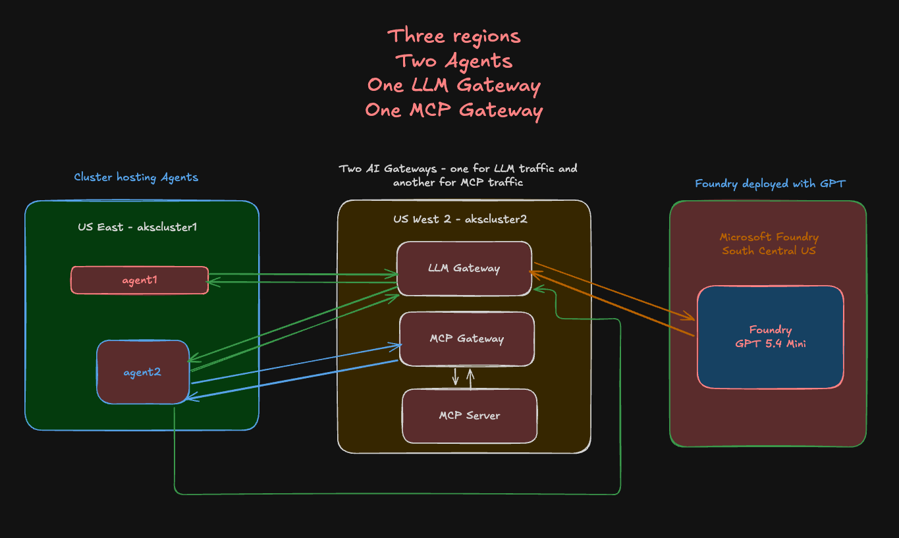

Use the following files in order:

3. `aks-westus1-llm-gatewaysetp.md`: Deploys LLM Gateway (agentgateway) in `westus1`, and points to GPT 5.4 running in Microsoft Foundry, which is in `South Central US`.
4. `aks-westus1-mcpserver-gateway-setp.md`: Deploys an MCP Gateway and MCP Server in `westus1`
5. `aks-useast1-agent1setup.md`: Creates Agent1 (`kagent-direct-test`) in `eastus1` referencing the LLM Gateway in `westus1`, which points to GPT 5.4 running in Microsoft Foundry, which is in `South Central US`.
6. `aksuseast1-agent2setup.md`: Creates Agent2 (`test-math`) in `eastus1` pointing to the MCP Gateway in `westus1`
7. `observability/kube-prometheus.md`: Installs Prometheus + Grafana with remote write receiver so k6 results are captured
8. `run-tests.md`: Runs k6 benchmark pushing metrics to Prometheus
