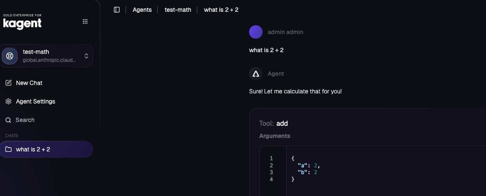
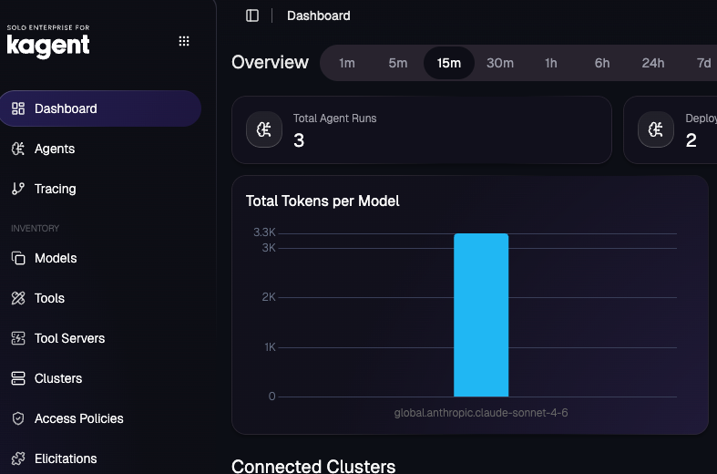

## Part 1: Bedrock Setup

### Important Notes

- Bedrock's `/openai/v1` endpoint only supports OpenAI-oss and Titan models, **not Claude**
- To use Claude via Bedrock, we use litellm's native Bedrock provider which uses boto3/AWS SDK
- This requires injecting AWS credentials as environment variables into the Agent deployment
- Newer Claude models require **inference profile IDs** (e.g., `us.anthropic.claude-...`) instead of direct model IDs

### Step 1: Get AWS Credentials

You'll need AWS credentials with Bedrock access. For temporary credentials:

```bash
aws sts get-session-token
```

Or if using IAM user with permanent credentials

```
export AWS_ACCESS_KEY_ID=
export AWS_SECRET_ACCESS_KEY=
export AWS_REGION=ca-central-1
```

### Step 2: Find Available Claude Models

List inference profiles for Claude in your region:

```bash
aws bedrock list-inference-profiles --region ca-central-1 \
  --query "inferenceProfileSummaries[?contains(inferenceProfileId, 'claude')].{id:inferenceProfileId,name:inferenceProfileName}" \
  --output table
```

Example output:
```
--------------------------------------------------------------------------------------------
|                                   ListInferenceProfiles                                  |
+---------------------------------------------------+--------------------------------------+
|                        id                         |                name                  |
+---------------------------------------------------+--------------------------------------+
|  us.anthropic.claude-haiku-4-5-20251001-v1:0      |  US Anthropic Claude Haiku 4.5       |
|  global.anthropic.claude-haiku-4-5-20251001-v1:0  |  Global Anthropic Claude Haiku 4.5   |
|  us.anthropic.claude-opus-4-5-20251101-v1:0       |  US Anthropic Claude Opus 4.5        |
|  global.anthropic.claude-opus-4-5-20251101-v1:0   |  GLOBAL Anthropic Claude Opus 4.5    |
|  us.anthropic.claude-sonnet-4-5-20250929-v1:0     |  US Anthropic Claude Sonnet 4.5      |
|  us.anthropic.claude-opus-4-6-v1                  |  US Anthropic Claude Opus 4.6        |
|  us.anthropic.claude-sonnet-4-6                   |  US Anthropic Claude Sonnet 4.6      |
|  global.anthropic.claude-sonnet-4-6               |  Global Anthropic Claude Sonnet 4.6  |
|  global.anthropic.claude-sonnet-4-5-20250929-v1:0 |  Global Claude Sonnet 4.5            |
|  global.anthropic.claude-opus-4-6-v1              |  Global Anthropic Claude Opus 4.6    |
+---------------------------------------------------+--------------------------------------+
```

### Step 3: Create Kubernetes Secret with AWS Credentials and OpenAI API key

```
export BEDROCK_API_KEY=
```

```
kubectl create secret generic kagent-bedrock-aws -n kagent \
  --from-literal=accessKey="" \
  --from-literal=secretKey=""
```

## Part 2: MCP Setup

1. Create an MCP Server running in k8s (math-server) and put agentgateway in front of it. This should be running in the EKS cluster that is in us-west-1

2. Create a `RemotMCPServer` and use the URL of the gateway (this would be a hostname or ALB public IP) in step one within the object.

```
kubectl apply -f - <<EOF
apiVersion: kagent.dev/v1alpha2
kind: RemoteMCPServer
metadata:
  name: math-server
  namespace: kagent
spec:
  description: Math server on eks2
  url: http://a5404a2420706455cbe360275176fe95-229395782.us-west-1.elb.amazonaws.com:8080/mcp
  protocol: STREAMABLE_HTTP
  timeout: 5s
  terminateOnClose: true
EOF
```

## Part 3: Agent Setup

1. Create a ModelConfig. This is pointing your LLM Gateway (which is agentgateway) and agentgateways `AgentgatewayBackend` is using Bedrock (in `us-central-1`) as a static host
```
kubectl apply -f - <<EOF
apiVersion: kagent.dev/v1alpha2
kind: ModelConfig
metadata:
  name: llm-bedrock-model-config
  namespace: kagent
spec:
  apiKeySecret: anthropic-secret
  apiKeySecretKey: Authorization
  model: global.anthropic.claude-sonnet-4-6
  provider: OpenAI
  openAI:
    baseUrl: http://a7f86628aa9c146df83e4f80986e4156-1288186659.us-east-1.elb.amazonaws.com:8082/anthropic
EOF
```

2. Create an Agent. This Agent hits the Bedrock via your LLM Gateway (Bedrock in `ca-central-1`) and the `math-server` MCP Server via the MCP Gateway, both of which live in the EKS cluster running in `us-west-1`. This shows your Agent going through not only one, but two separate regions as the Agent is deployed in `us-east-1`.
```
kubectl apply -f - <<EOF
apiVersion: kagent.dev/v1alpha2
kind: Agent
metadata:
  name: test-math
  namespace: kagent
spec:
  description: This agent can use a single tool to expand it's Kubernetes knowledge for troubleshooting and deployment
  type: Declarative
  declarative:
    modelConfig: llm-bedrock-model-config
    systemMessage: |-
      You're a friendly math wiz
    tools:
    - type: McpServer
      mcpServer:
        name: math-server
        kind: RemoteMCPServer
        toolNames:
        - add
        - multiply
EOF
```

After running the Agent, you'll see outputs similar to the below:




### Important kagent Enterprise Note

If you are running `kagent-enterprise` on EKS, the Agent may look healthy and sessions may get created in the UI, but the Agent can still fail at runtime with no response.

Why:
- The Agent pod uses its projected Kubernetes service account token for internal calls back to `kagent-controller`
- On EKS, `kagent-enterprise` may fail to initialize Kubernetes token validation through the JWKS endpoint
- When that happens, the Agent's internal calls to `/api/sessions` and `/api/tasks` get `401 Unauthorized`, so the session is created but no output is produced

Fix:

```bash
kubectl patch configmap kagent-enterprise-config -n kagent --type merge \
  -p '{"data":{"K8S_TOKEN_REVIEW":"true"}}'

kubectl rollout restart deployment/kagent-controller -n kagent
kubectl rollout status deployment/kagent-controller -n kagent
```

Why this fixes it:
- `K8S_TOKEN_REVIEW=true` tells `kagent-enterprise` to validate projected service account tokens with the Kubernetes `TokenReview` API instead of trying to fetch/verify JWKS directly
- This is the safer path for EKS, where direct JWKS access can fail or time out