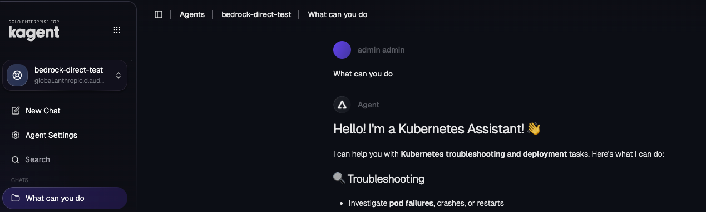

## Part 1: Bedrock Setup

### Important Notes

- Bedrock's `/openai/v1` endpoint only supports OpenAI-oss and Titan models, **not Claude**
- To use Claude via Bedrock, we use litellm's native Bedrock provider which uses boto3/AWS SDK
- This requires injecting AWS credentials as environment variables into the Agent deployment
- Newer Claude models require **inference profile IDs** (e.g., `us.anthropic.claude-...`) instead of direct model IDs

### Step 1: Create Kubernetes Secret with Bedrock credentials

```
kubectl create secret generic kagent-bedrock-apikey -n kagent \
  --from-literal=AWS_ACCESS_KEY_ID="" \
  --from-literal=AWS_SECRET_ACCESS_KEY=""
```

### Step 2: Find Available Claude Models

List inference profiles for Claude in your region:

```bash
aws bedrock list-inference-profiles --region ca-central-1 \
  --query "inferenceProfileSummaries[?contains(inferenceProfileId, 'claude')].{id:inferenceProfileId,name:inferenceProfileName}" \
  --output table
```

Example output:
```
--------------------------------------------------------------------------------------------
|                                   ListInferenceProfiles                                  |
+---------------------------------------------------+--------------------------------------+
|                        id                         |                name                  |
+---------------------------------------------------+--------------------------------------+
|  us.anthropic.claude-haiku-4-5-20251001-v1:0      |  US Anthropic Claude Haiku 4.5       |
|  global.anthropic.claude-haiku-4-5-20251001-v1:0  |  Global Anthropic Claude Haiku 4.5   |
|  us.anthropic.claude-opus-4-5-20251101-v1:0       |  US Anthropic Claude Opus 4.5        |
|  global.anthropic.claude-opus-4-5-20251101-v1:0   |  GLOBAL Anthropic Claude Opus 4.5    |
|  us.anthropic.claude-sonnet-4-5-20250929-v1:0     |  US Anthropic Claude Sonnet 4.5      |
|  us.anthropic.claude-opus-4-6-v1                  |  US Anthropic Claude Opus 4.6        |
|  us.anthropic.claude-sonnet-4-6                   |  US Anthropic Claude Sonnet 4.6      |
|  global.anthropic.claude-sonnet-4-6               |  Global Anthropic Claude Sonnet 4.6  |
|  global.anthropic.claude-sonnet-4-5-20250929-v1:0 |  Global Claude Sonnet 4.5            |
|  global.anthropic.claude-opus-4-6-v1              |  Global Anthropic Claude Opus 4.6    |
+---------------------------------------------------+--------------------------------------+
```

## Part 2: Agent Setup

1. Create a ModelConfig. This is pointing your LLM Gateway (which is agentgateway) and agentgateways `AgentgatewayBackend` is using Bedrock (in `us-central-1`) as a static host
```
kubectl apply -f - <<EOF
apiVersion: kagent.dev/v1alpha2
kind: ModelConfig
metadata:
  name: bedrock-direct-modelconfig
  namespace: kagent
spec:
  apiKeySecret: kagent-bedrock-apikey
  apiKeySecretKey: BEDROCK_API_KEY
  model: global.anthropic.claude-sonnet-4-6
  provider: Bedrock
  bedrock:
    region: "ca-central-1"
EOF
```

2. Create an Agent that uses the `ModelConfig` above for calling out to Bedrock via Agentgateway within `us-central-1`.
```
kubectl apply -f - <<EOF
apiVersion: kagent.dev/v1alpha2
kind: Agent
metadata:
  name: bedrock-direct-test
  namespace: kagent
spec:
  description: This agent can use a single tool to expand it's Kubernetes knowledge for troubleshooting and deployment
  type: Declarative
  declarative:
    modelConfig: bedrock-direct-modelconfig
    systemMessage: |-
      You're a friendly and helpful agent that uses the Kubernetes tool to help troubleshooting and deploy environments
EOF
```

