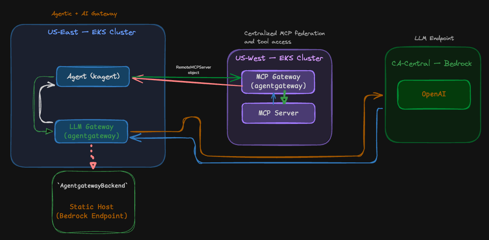

Use the following files in order:

1. `terraform/eks-terraform-useast1`: Spins up an EKS cluster in `us-east-1`
2. `terraform/eks-terraform-uswest1`: Spins up an EKS cluster in `us-west-1`
3. `eks-west1-gatewaysetup.md`: Deploys MCP math-server + MCP Gateway (agentgateway) and MCP route (us-west-1)
4. `eks-east1-gatewaysetup.md`: Deploys LLM gateway (agentgateway) and HTTPRoute + Bedrock backend (`ca-central-1`)
5. `eks-east1-agent1setup.md`: Creates Agent1 (test-math) referencing LLM Gateway in `us-east-1`, which is pointing to Bedrock in `ca-central-1` and the MCP Server sitting in `us-west-1`
6. `eks-east1-agent2setup.md`: Creates Agent2 (bedrock-direct-test) in `us-east-1` pointing to Bedrock in `ca-central-1`
7. `observability/kube-prometheus.md`: Installs Prometheus + Grafana with remote write receiver so k6 results are captured
8. `run-tests.md`: Runs k6 benchmark pushing metrics to Prometheus
