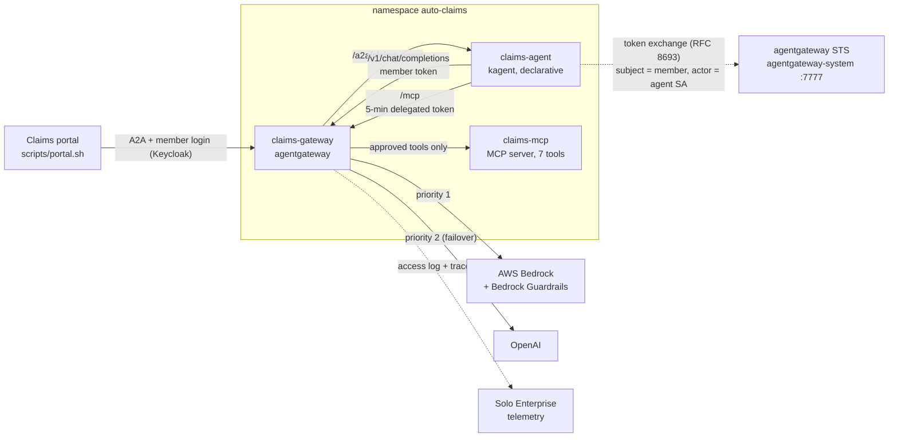

# Auto-claim demo: "Is the agent allowed?"

A recorded demo of Solo Enterprise for agentgateway governing an insurance claims agent. A member files an auto claim; a kagent agent reads the policy, checks the rules, assesses the photos, opens the claim (a write), and drafts a reply. Each scene turns on one control at the gateway and shows something being stopped, caught, or proven: identity and on-behalf-of access, a tool registry with permission tiers, prompt-injection and PII guardrails (including AWS Bedrock Guardrails), per-member token limits with model failover, and an audit record of every call.

The driver is `./demo.sh`: it prints each scene's narration, shows the policy being applied, and runs the moment the scene is about. A companion animated walkthrough is in [walkthrough/auto-claim-replay.html](walkthrough/auto-claim-replay.html).

## Architecture



Every call the agent makes, inbound and outbound, passes through one gateway, so one policy set and one access log cover the whole claim.

| Path | Who calls | Identity the gateway requires (scene 2) |
|---|---|---|
| `/a2a/claims-agent` | the claims portal | the member's Keycloak login |
| `/mcp` | claims-agent | an STS token with `act.sub = claims-agent`, valid 5 minutes |
| `/v1/chat/completions` | claims-agent | the member's identity (Keycloak or STS token) |

## Prerequisites

- A Kubernetes cluster with:
  - Solo Enterprise for agentgateway (tested with **v2026.8.2**) installed as Helm release `agentgateway` in `agentgateway-system`, plus the Gateway API CRDs
  - Solo Enterprise for kagent (tested with 0.5.5, agent runtime `app:0.8.0`) in namespace `kagent`
  - Optional: Solo Enterprise management/telemetry, to see the traces in the UI
- An OIDC realm (Keycloak) with two users, `reader` and `writer`, and a client that allows the password grant (default client ID `kagent-ui`, override with `KEYCLOAK_CLIENT_ID`)
- A container registry you can push to
- `kubectl`, `helm`, `jq`, `curl`, `python3`, and either `gcloud` (Cloud Build) or `docker buildx`; `aws` only to create the guardrail
- AWS credentials with Bedrock access, a Bedrock Guardrail (see [platform/bedrock-guardrail.sh](platform/bedrock-guardrail.sh)), an OpenAI key

### Credentials and settings

Kept outside the repo in `~/.config/auto-claim-demo/env` (create it with mode 600). Every script loads it.

```bash
# Your environment
KEYCLOAK_REALM_URL=https://keycloak.example.com/realms/kagent-dev
REGISTRY=us-docker.pkg.dev/my-project/my-repo   # where the MCP server image is pushed
GCP_PROJECT=my-project                           # optional: build with Cloud Build instead of docker buildx
PULL_SECRET_NAMESPACE=kagent                     # optional: copy a pull secret named regcred from here

# Models and guardrail
AWS_ACCESS_KEY_ID=...
AWS_SECRET_ACCESS_KEY=...
AWS_SESSION_TOKEN=...            # if using SSO/session credentials (they expire; re-run make secrets)
BEDROCK_REGION=us-east-1
BEDROCK_MODEL=us.anthropic.claude-sonnet-4-6
BEDROCK_GUARDRAIL_ID=...
BEDROCK_GUARDRAIL_VERSION=1
OPENAI_API_KEY='sk-...'

# Personas (Keycloak passwords)
READER_PASSWORD='...'            # reader: member-services tier
WRITER_PASSWORD='...'            # writer: adjuster tier
```

## Quickstart

```bash
cd production-demos/agw-enterprise-demos/auto-claim-demo
make preflight          # read-only checks
make image              # build/push the MCP server image (once per change)
make secrets personas render
make enable-sts         # one-time: turns on the STS in the agentgateway release (shows a diff, asks)
make deploy
make validate           # must say "Ready to record."
make demo               # Enter advances; ./demo.sh 4 starts at scene 4
```

`make deploy` installs only the platform: MCP server, gateway, routes, model backends, the agent, and audit logging. The scene policies are applied live by `demo.sh`, so the audience sees each one go on.

## What each scene applies

| Scene | Applies | Shows |
|---|---|---|
| 1 Framing | nothing | the agent processing a claim; the gateway already sees each tool and its arguments, but not who asked |
| 2 Identity | [policies/10-identity.yaml.tmpl](manifests/policies/10-identity.yaml.tmpl) | no-identity call to the agent, tools, and a replayed login token all 401; the 5-minute delegated token |
| 3 Tool registry | [policies/20-tool-registry.yaml.tmpl](manifests/policies/20-tool-registry.yaml.tmpl) | reader sees 4 tools, writer 5; reader can't open the claim, writer can; `issue_payment` doesn't exist for agents |
| 4 Guardrails | [policies/30-guardrails.yaml.tmpl](manifests/policies/30-guardrails.yaml.tmpl) | the planted instruction in SUB-2042 is blocked mid-run; Bedrock Guardrails blocks a reworded attack; the model only receives `<SSN>`, `<CREDIT_CARD>`, `<PHONE_NUMBER>` |
| 5 Cost | [policies/40-cost.yaml](manifests/policies/40-cost.yaml), [scenes/failover-break-primary.yaml.tmpl](manifests/scenes/failover-break-primary.yaml.tmpl) | a looping agent hits 429 for its member while another member is unaffected; unapproved model names get the approved model; a Bedrock outage fails over to OpenAI |
| 6 Audit | nothing | the whole SUB-2042 run joined on trace ID; per-member summary; every refusal and why |
| 7 Status | nothing | [talk/status-and-asks.txt](talk/status-and-asks.txt) |

Calls marked `[simulated agent call]` on screen reproduce the agent's own outbound calls (same STS exchange, same ServiceAccount) so failures happen on cue. Everything else is the real agent.

## Project structure

```
auto-claim-demo/
├── demo.sh                      # interactive driver (scenes 1-7, reset, status)
├── Makefile
├── platform/
│   ├── sts-values.yaml.tmpl     # helm values that enable the STS (rendered, applied by make enable-sts)
│   └── bedrock-guardrail.sh     # AWS CLI commands for the Bedrock Guardrail
├── mcp/                         # auto-claims MCP server (FastMCP) + fixture data
├── manifests/
│   ├── 00..40-*.yaml(.tmpl)     # platform: namespace, MCP server, gateway, routes, agent
│   ├── policies/                # one file per scene, applied live
│   └── scenes/                  # the failover outage
├── scripts/                     # portal (A2A client), audit view, scene helpers, setup
└── talk/                        # text printed in scenes 6 and 7 (edit for the audience)
```

## Cleanup

```bash
make clean          # deletes the auto-claims namespace only
make disable-sts    # optional: turns the STS back off on the shared release (asks first)
```

## Not production

- The STS runs with `skipMayActClaimValidation: true`; in production the IdP should assert which agents may act for a user.
- The adjuster tier is a list of Keycloak subject IDs in the policy (resolved by `make personas`).
- The STS stores tokens in an in-memory SQLite volume; a controller restart clears them.
