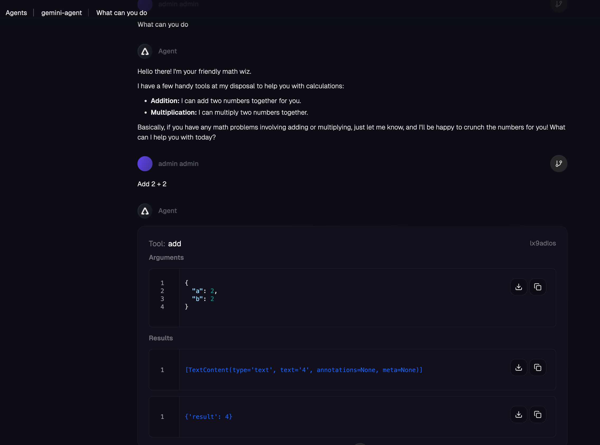

## MCP Setup

```
kubectl apply -f - <<EOF
apiVersion: v1
kind: ConfigMap
metadata:
  name: mcp-math-script
  namespace: default
data:
  server.py: |
    import uvicorn
    from mcp.server.fastmcp import FastMCP
    from starlette.applications import Starlette
    from starlette.routing import Route
    from starlette.requests import Request
    from starlette.responses import JSONResponse, Response

    mcp = FastMCP("Math-Service")

    @mcp.tool()
    def add(a: int, b: int) -> int:
        """Add two numbers together"""
        return a + b

    @mcp.tool()
    def multiply(a: int, b: int) -> int:
        """Multiply two numbers together"""
        return a * b

    async def handle_mcp(request: Request):
        try:
            data = await request.json()
            method = data.get("method")
            msg_id = data.get("id")
            result = None
            
            if method == "initialize":
                result = {
                    "protocolVersion": "2024-11-05",
                    "capabilities": {"tools": {}},
                    "serverInfo": {"name": "Math-Service", "version": "1.0"}
                }
            
            elif method == "notifications/initialized":
                # Notifications are fire-and-forget, return empty 202 response
                return Response(status_code=202)

            elif method == "tools/list":
                tools_list = await mcp.list_tools()
                result = {
                    "tools": [
                        {
                            "name": t.name,
                            "description": t.description,
                            "inputSchema": t.inputSchema
                        } for t in tools_list
                    ]
                }

            elif method == "tools/call":
                params = data.get("params", {})
                name = params.get("name")
                args = params.get("arguments", {})
                
                # Call the tool
                tool_result = await mcp.call_tool(name, args)
                
                # --- FIX: Serialize the content objects manually ---
                serialized_content = []
                for content in tool_result:
                    if hasattr(content, "type") and content.type == "text":
                        serialized_content.append({"type": "text", "text": content.text})
                    elif hasattr(content, "type") and content.type == "image":
                         serialized_content.append({
                             "type": "image", 
                             "data": content.data, 
                             "mimeType": content.mimeType
                         })
                    else:
                        # Fallback: wrap as TextContent so MCP clients can parse it
                        serialized_content.append({"type": "text", "text": str(content)})

                result = {
                    "content": serialized_content,
                    "isError": False
                }

            elif method == "ping":
                result = {}

            else:
                return JSONResponse(
                    {"jsonrpc": "2.0", "id": msg_id, "error": {"code": -32601, "message": "Method not found"}},
                    status_code=404
                )

            return JSONResponse({"jsonrpc": "2.0", "id": msg_id, "result": result})

        except Exception as e:
            # Print error to logs for debugging
            import traceback
            traceback.print_exc()
            return JSONResponse(
                {"jsonrpc": "2.0", "id": None, "error": {"code": -32603, "message": str(e)}},
                status_code=500
            )

    app = Starlette(routes=[
        Route("/mcp", handle_mcp, methods=["POST"]),
        Route("/", lambda r: JSONResponse({"status": "ok"}), methods=["GET"])
    ])

    if __name__ == "__main__":
        print("Starting Fixed Math Server on port 8000...")
        uvicorn.run(app, host="0.0.0.0", port=8000)
---
apiVersion: apps/v1
kind: Deployment
metadata:
  name: mcp-math-server
  namespace: default
spec:
  replicas: 1
  selector:
    matchLabels:
      app: mcp-math-server
  template:
    metadata:
      labels:
        app: mcp-math-server
    spec:
      containers:
      - name: math
        image: python:3.11-slim
        command: ["/bin/sh", "-c"]
        args:
        - |
          pip install "mcp[cli]" uvicorn starlette && 
          python /app/server.py
        ports:
        - containerPort: 8000
        volumeMounts:
        - name: script-volume
          mountPath: /app
        readinessProbe:
          httpGet:
            path: /
            port: 8000
          initialDelaySeconds: 5
          periodSeconds: 5
      volumes:
      - name: script-volume
        configMap:
          name: mcp-math-script
---
apiVersion: v1
kind: Service
metadata:
  name: mcp-math-server
  namespace: default
spec:
  selector:
    app: mcp-math-server
  ports:
  - port: 80
    targetPort: 8000
EOF
```

## Gateway/Backend Setup

```
kubectl apply -f - <<EOF
apiVersion: gateway.networking.k8s.io/v1
kind: Gateway
metadata:
  name: agentgateway-mcp
  namespace: agentgateway-system
spec:
  gatewayClassName: enterprise-agentgateway
  listeners:
  - name: http
    port: 8081
    protocol: HTTP
    allowedRoutes:
      namespaces:
        from: Same
EOF
```

```
kubectl apply -f - <<EOF
apiVersion: agentgateway.dev/v1alpha1
kind: AgentgatewayBackend
metadata:
  name: demo-mcp-server
  namespace: agentgateway-system
spec:
  mcp:
    targets:
      - name: demo-mcp-server
        static:
          host: mcp-math-server.default.svc.cluster.local
          port: 80
          path: /mcp
          protocol: StreamableHTTP
EOF
```

```
kubectl apply -f - <<EOF
apiVersion: gateway.networking.k8s.io/v1
kind: HTTPRoute
metadata:
  name: mcp-route
  namespace: agentgateway-system
spec:
  parentRefs:
  - name: agentgateway-mcp
  rules:
  - backendRefs:
    - name: demo-mcp-server
      namespace: agentgateway-system
      group: agentgateway.dev
      kind: AgentgatewayBackend
EOF
```

```
export GATEWAY_IP=$(kubectl get svc agentgateway-mcp -n agentgateway-system -o jsonpath='{.status.loadBalancer.ingress[0].ip}')
echo $GATEWAY_IP
```

```
npx modelcontextprotocol/inspector#0.18.0
```

URL to put into Inspector: `http://YOUR_ALB_LB_IP:8081/mcp`

## Gemini Gateway

```
export GEMINI_API_KEY=
```

```
kubectl apply -f- <<EOF
apiVersion: v1
kind: Secret
metadata:
  name: gemini-secret
  namespace: agentgateway-system
  labels:
    app: agentgateway-route-gemini
type: Opaque
stringData:
  Authorization: $GEMINI_API_KEY
EOF
```

```
kubectl apply -f - <<EOF
apiVersion: gateway.networking.k8s.io/v1
kind: Gateway
metadata:
  name: agentgateway-route-gemini
  namespace: agentgateway-system
  labels:
    app: agentgateway-route-gemini
spec:
  gatewayClassName: enterprise-agentgateway
  listeners:
    - name: http
      port: 8082
      protocol: HTTP
      allowedRoutes:
        namespaces:
          from: Same
EOF
```

```
kubectl apply -f - <<EOF
apiVersion: agentgateway.dev/v1alpha1
kind: AgentgatewayBackend
metadata:
  name: gemini
  namespace: agentgateway-system
spec:
  ai:
    provider:
      gemini:
        model: gemini-3.1-flash-lite-preview
  policies:
    auth:
      secretRef:
        name: gemini-secret
EOF
```

```
kubectl apply -f - <<EOF
apiVersion: gateway.networking.k8s.io/v1
kind: HTTPRoute
metadata:
  name: gemini-route
  namespace: agentgateway-system
  labels:
    app: agentgateway-route-gemini
spec:
  parentRefs:
    - name: agentgateway-route-gemini
      namespace: agentgateway-system
  rules:
  - matches:
    - path:
        type: PathPrefix
        value: /gemini
    filters:
    - type: URLRewrite
      urlRewrite:
        path:
          type: ReplaceFullPath
          replaceFullPath: /v1/chat/completions
    backendRefs:
    - name: gemini
      namespace: agentgateway-system
      group: agentgateway.dev
      kind: AgentgatewayBackend
EOF
```

```
export GEMINI_GATEWAY=$(kubectl get svc agentgateway-route-gemini -n agentgateway-system -o jsonpath='{.status.loadBalancer.ingress[0].ip}')
echo $GEMINI_GATEWAY
```

```
curl http://$GEMINI_GATEWAY:8082/gemini \
-H "Content-Type: application/json" \
-d '{
    "model": "GEMINI_MODEL",
    "max_tokens": 50,
    "messages": [
    {"role": "user", "content": "Say hello in one sentence."}
    ]
}'
```

Example output:

```
{"model":"gemini-3.1-flash-lite-preview","usage":{"prompt_tokens":7,"completion_tokens":10,"total_tokens":17},"choices":[{"message":{"content":"Hello, it is a pleasure to meet you!","role":"assistant","extra_content":{"google":{"thought_signature":"EjQKMgG+Pvb7QzMAVJQFwJ29uxx7xdeCFCeE5GEx9Od9rN0+gY7kODFfyVygE/lLQVbPfsx7"}}},"finish_reason":"stop","index":0}],"created":1774205541,"id":"ZTrAadnBGNCMmtkP4vemsAk","object":"chat.completion"}%  
```

## Agent Setup

```
export GEMINI_API_KEY=
```

```
kubectl apply -f- <<EOF
apiVersion: v1
kind: Secret
metadata:
  name: gemini-secret
  namespace: kagent
type: Opaque
stringData:
  Authorization: $GEMINI_API_KEY
EOF
```

```
export MCP_SERVER_GATEWAY=$(kubectl get svc agentgateway-mcp -n agentgateway-system -o jsonpath='{.status.loadBalancer.ingress[0].ip}')
echo $MCP_SERVER_GATEWAY
```

```
kubectl apply -f - <<EOF
apiVersion: kagent.dev/v1alpha2
kind: RemoteMCPServer
metadata:
  name: math-server
  namespace: kagent
spec:
  description: Math MCP Server
  url: http://$MCP_SERVER_GATEWAY:8081/mcp
  protocol: STREAMABLE_HTTP
  timeout: 5s
  terminateOnClose: true
EOF
```

```
export GEMINI_GATEWAY=$(kubectl get svc agentgateway-route-gemini -n agentgateway-system -o jsonpath='{.status.loadBalancer.ingress[0].ip}')
echo $GEMINI_GATEWAY
```

```
kubectl apply -f - <<EOF
apiVersion: kagent.dev/v1alpha2
kind: ModelConfig
metadata:
  name: llm-gemini-model-config
  namespace: kagent
spec:
  apiKeySecret: gemini-secret
  apiKeySecretKey: Authorization
  model: gemini-3.1-flash-lite-preview
  provider: OpenAI
  openAI:
    baseUrl: http://$GEMINI_GATEWAY:8082/gemini
EOF
```

```
kubectl apply -f - <<EOF
apiVersion: kagent.dev/v1alpha2
kind: Agent
metadata:
  name: gemini-agent
  namespace: kagent
spec:
  description: This is using Gemini as the LLM and has an MCP Server to add and multiply
  type: Declarative
  declarative:
    modelConfig: llm-gemini-model-config
    systemMessage: |-
      You're a friendly math wiz
    tools:
    - type: McpServer
      mcpServer:
        name: math-server
        kind: RemoteMCPServer
        toolNames:
        - add
        - multiply
EOF
```

```
kubectl logs agentgateway-route-gemini-78b74d57f5-lws6f -n agentgateway-system
```

```
2026-03-22T18:52:21.457877Z     info    request gateway=agentgateway-system/agentgateway-route-gemini listener=http route=agentgateway-system/bedrock-route endpoint=generativelanguage.googleapis.com:443 src.addr=10.142.0.29:33568 http.method=POST http.host=34.75.221.163 http.path=/gemini http.version=HTTP/1.1 http.status=200 protocol=llm gen_ai.operation.name=chat gen_ai.provider.name=gcp.gemini gen_ai.request.model=gemini-3.1-flash-lite-preview gen_ai.response.model=gemini-3.1-flash-lite-preview gen_ai.usage.input_tokens=7 gen_ai.usage.output_tokens=10 gen_ai.request.max_tokens=50 duration=1238ms
```

