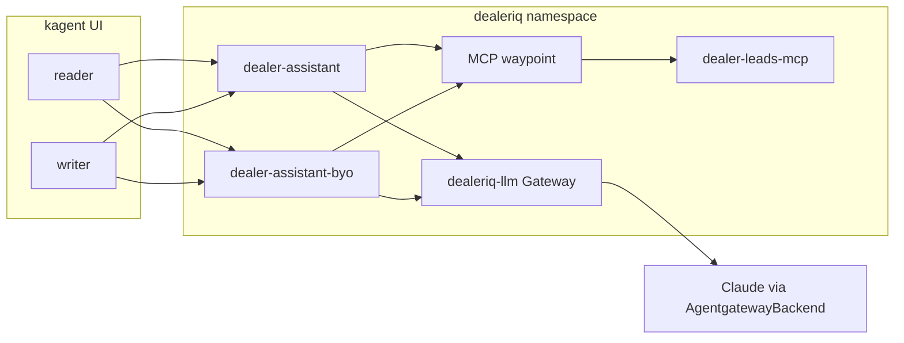

# DealerIQ

A live, repeatable demo of an AI lead-generation assistant for dealerships on Solo Enterprise for kagent (0.5.5) and enterprise agentgateway (2026.8.2).

One assistant, built two ways (declarative kagent Agent and BYO LangGraph), working inbound leads with identity-scoped tools, centralized sessions, human-in-the-loop offer approval, and spend circuit breakers.

## Personas

Uses the Keycloak users already configured for the kagent UI (`kagent-dev` realm). No demo Keycloak is installed.

| Login | Role | Demo use |
|---|---|---|
| `reader` | BDC / internet sales | Baseline chat and HITL requester |
| `writer` | Sales manager | Manager chat and HITL approver |

MCP tool allow-lists are AccessPolicy on the agent ServiceAccount, not the UI username. Baseline is read-tier only. Demo 1 applies `policies/20-writer.yaml` to add `send_customer_offer` and `update_lead_status`. `export_leads` stays denied.

## Architecture



All demo resources live in `dealeriq`. `make clean` deletes that namespace only.

## Prerequisites

- kubectl context `gke_field-engineering-us_us-east1_kagent-ee-felevan`
- Docker + `gcloud` auth to `northamerica-northeast1-docker.pkg.dev`
- `kagent-controller` Ready
- Existing `anthropic-secret` (agentgateway-system), `kagent-anthropic`, and `regcred` (copied into `dealeriq` at setup)

## Quickstart

kagent must already be installed (CRDs and the UI). This demo does not install kagent. It applies its own objects into `dealeriq`, including the two Agent CRs the UI lists as **dealer-assistant** and **dealer-assistant-byo**.

```bash
cd production-demos/kagent-enterprise-demos/dealeriq
make setup
make deploy
make validate
```

`make deploy` is what creates the agents. Then follow [RUNBOOK.md](RUNBOOK.md). Between deliveries: `make demo-reset` (does not delete the agents). Tear down with `make clean`.

## Project structure

```
dealeriq/
├── PLAN.md
├── README.md
├── RUNBOOK.md
├── Makefile
├── mcp/                 # FastMCP CRM + inventory
├── agents/declarative/  # dealer-assistant
├── agents/byo/          # dealer-assistant-byo
├── policies/            # AccessPolicy baseline + live-edit
├── gateway/             # LLM route, budget, rate limit
├── identity/            # notes for existing Keycloak users
└── scripts/
```

## Make targets

| Target | Behavior |
|---|---|
| `make setup` | Namespace, copy secrets, build/push images, seed ConfigMap |
| `make deploy` | Apply MCP, LLM route, policies, and the `dealer-assistant` / `dealer-assistant-byo` Agent CRs |
| `make seed` | Reload CRM/inventory ConfigMap and restart MCP |
| `make demo-reset` | Restore baseline AccessPolicies, delete Demo 4 budget and rate-limit, re-seed MCP data, clear chat sessions. Does not delete Agents or CRDs. |
| `make validate` | Pre-demo health checks |
| `make clean` | Delete the `dealeriq` namespace |
