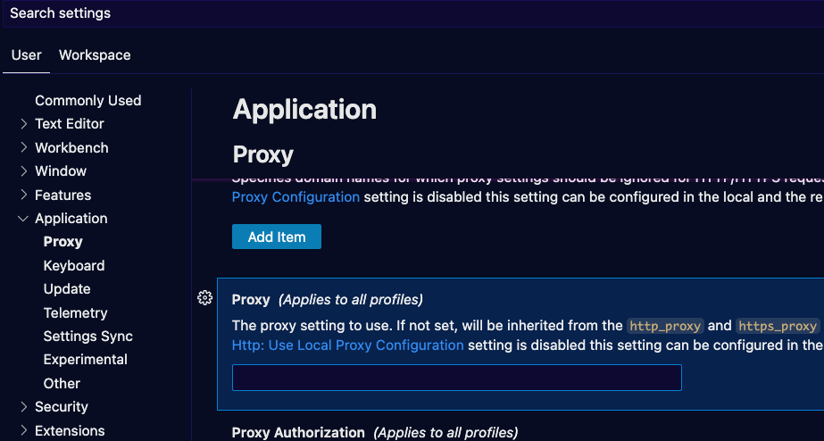
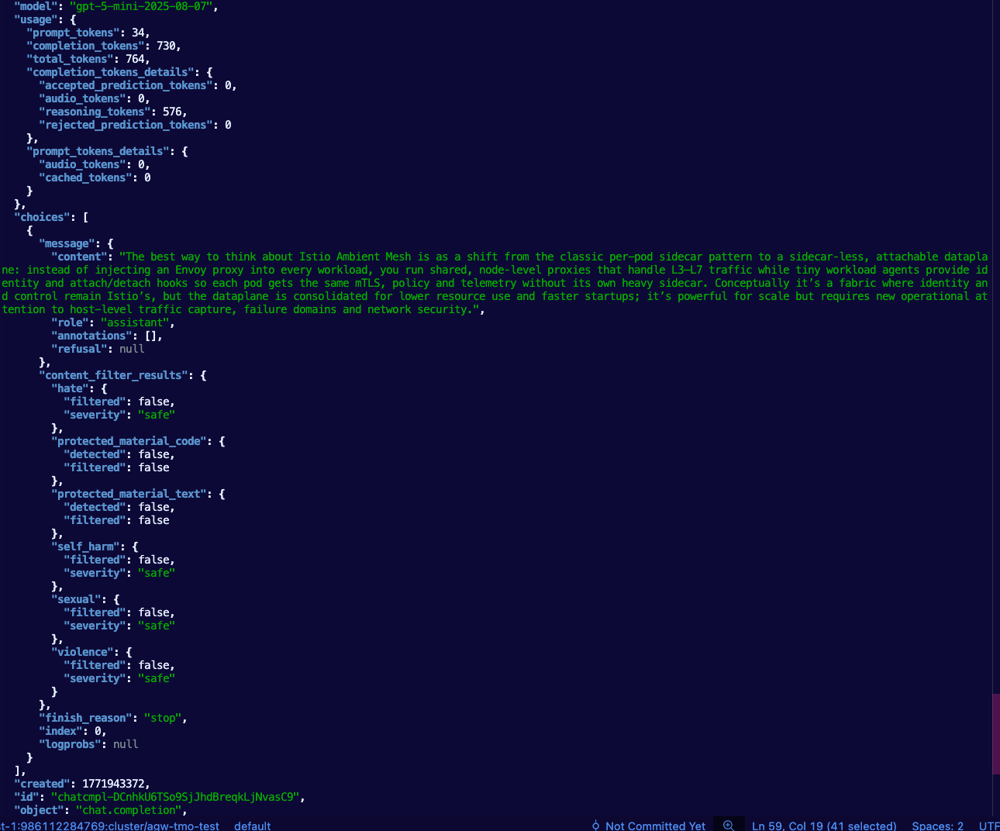

## Copilot w/ Agentgateway

Per GitHub docs: 
```
GitHub also notes that if the proxy URL starts with https://, that proxy is not supported

https://docs.github.com/copilot/how-tos/personal-settings/configuring-network-settings-for-github-copilot
```

### In VS Code

1. Open **Settings** on the bottom left (the gear icon)
2. In the left panel, go to **Application -> Proxy**
3. Set the Proxy to your agentgateway instance (e.g - `http://AGENTGATEWAY_HOST:8080/anthropic`).



https://docs.github.com/en/copilot/how-tos/configure-personal-settings/configure-network-settings

### Copilot CLI

The below configuration gives an example of routing traffic through agentgateway using an Anthropic Model. The port and endpoint will be specified by the `Gateway` and `HTTPRoute` object that you create.

```
export COPILOT_PROVIDER_TYPE=anthropic
export COPILOT_PROVIDER_BASE_URL=http://AGENTGATEWAY_HOST:8080/anthropic
export COPILOT_PROVIDER_API_KEY=dummy
export COPILOT_MODEL=claude-opus-4-7
```

```
copilot
```

---

## Microsoft Foundry w/ Agentgateway

```
export AZURE_FOUNDRY_API_KEY=
```

```
kubectl apply -f- <<EOF
kind: Gateway
apiVersion: gateway.networking.k8s.io/v1
metadata:
  name: agentgateway-azureopenai-route
  namespace: agentgateway-system
  labels:
    app: agentgateway-azureopenai-route
spec:
  gatewayClassName: enterprise-agentgateway
  infrastructure:
    parametersRef:
      group: enterpriseagentgateway.solo.io
      kind: EnterpriseAgentgatewayParameters
      name: tracing
  listeners:
  - protocol: HTTP
    port: 8088
    name: http
    allowedRoutes:
      namespaces:
        from: All
EOF
```

```
export INGRESS_GW_ADDRESS=$(kubectl get svc -n agentgateway-system agentgateway-azureopenai-route -o jsonpath="{.status.loadBalancer.ingress[0]['hostname','ip']}")
echo $INGRESS_GW_ADDRESS
```

```
kubectl apply -f- <<EOF
apiVersion: v1
kind: Secret
metadata:
  name: azureopenai-secret
  namespace: agentgateway-system
  labels:
    app: agentgateway-azureopenai-route
type: Opaque
stringData:
  Authorization: $AZURE_FOUNDRY_API_KEY
EOF
```

```
kubectl apply -f- <<EOF
apiVersion: agentgateway.dev/v1alpha1
kind: AgentgatewayBackend
metadata:
  labels:
    app: agentgateway-azureopenai-route
  name: azureopenai
  namespace: agentgateway-system
spec:
  ai:
    provider:
      azureopenai:
        endpoint: mlevantesting.services.ai.azure.com
        deploymentName: gpt-4.1-mini
        apiVersion: 2025-01-01-preview
  policies:
    auth:
      secretRef:
        name: azureopenai-secret
EOF
```

```
kubectl get agentgatewaybackend -n agentgateway-system
```

```
kubectl apply -f- <<EOF
apiVersion: gateway.networking.k8s.io/v1
kind: HTTPRoute
metadata:
  name: azureopenai
  namespace: agentgateway-system
  labels:
    app: agentgateway-azureopenai-route
spec:
  parentRefs:
    - name: agentgateway-azureopenai-route
      namespace: agentgateway-system
  rules:
  - matches:
    - path:
        type: PathPrefix
        value: /azureopenai
    filters:
    - type: URLRewrite
      urlRewrite:
        path:
          type: ReplaceFullPath
          replaceFullPath: /v1/chat/completions
    backendRefs:
    - name: azureopenai
      namespace: agentgateway-system
      group: agentgateway.dev
      kind: AgentgatewayBackend
EOF
```

```
curl "$INGRESS_GW_ADDRESS:8088/azureopenai" -v -H content-type:application/json -d '{
  "messages": [
    {
      "role": "system",
      "content": "You are a skilled cloud-native network engineer."
    },
    {
      "role": "user",
      "content": "Write me a paragraph containing the best way to think about Istio Ambient Mesh"
    }
  ]
}' | jq
```



---

## Agentgateway Direct To Anthropic

```
export ANTHROPIC_API_KEY=
```

```
kubectl apply -f- <<EOF
kind: Gateway
apiVersion: gateway.networking.k8s.io/v1
metadata:
  name: agentgateway-route
  namespace: agentgateway-system
  labels:
    app: agentgateway-route
spec:
  gatewayClassName: enterprise-agentgateway
  infrastructure:
    parametersRef:
      group: enterpriseagentgateway.solo.io
      kind: EnterpriseAgentgatewayParameters
      name: tracing
  listeners:
  - protocol: HTTP
    port: 8082
    name: http
    allowedRoutes:
      namespaces:
        from: All
EOF
```

```
export INGRESS_GW_ADDRESS=$(kubectl get svc -n agentgateway-system agentgateway-route -o jsonpath="{.status.loadBalancer.ingress[0]['hostname','ip']}")
echo $INGRESS_GW_ADDRESS
```

```
kubectl apply -f- <<EOF
apiVersion: v1
kind: Secret
metadata:
  name: anthropic-secret
  namespace: agentgateway-system
  labels:
    app: agentgateway-route
type: Opaque
stringData:
  Authorization: $ANTHROPIC_API_KEY
EOF
```

```
kubectl apply -f- <<EOF
apiVersion: agentgateway.dev/v1alpha1
kind: AgentgatewayBackend
metadata:
  labels:
    app: agentgateway-route
  name: anthropic
  namespace: agentgateway-system
spec:
  ai:
    provider:
        anthropic:
          model: "claude-sonnet-4-6"
  policies:
    auth:
      secretRef:
        name: anthropic-secret
EOF
```

```
kubectl get agentgatewaybackend -n agentgateway-system
```

```
kubectl apply -f- <<EOF
apiVersion: gateway.networking.k8s.io/v1
kind: HTTPRoute
metadata:
  name: claude
  namespace: agentgateway-system
  labels:
    app: agentgateway-route
spec:
  parentRefs:
    - name: agentgateway-route
      namespace: agentgateway-system
  rules:
  - matches:
    - path:
        type: PathPrefix
        value: /anthropic
    filters:
    - type: URLRewrite
      urlRewrite:
        path:
          type: ReplaceFullPath
          replaceFullPath: /v1/chat/completions
    backendRefs:
    - name: anthropic
      namespace: agentgateway-system
      group: agentgateway.dev
      kind: AgentgatewayBackend
EOF
```

```
curl "$INGRESS_GW_ADDRESS:8082/anthropic" -H content-type:application/json -H "anthropic-version: 2023-06-01" -d '{
  "messages": [
    {
      "role": "system",
      "content": "You are a skilled cloud-native network engineer."
    },
    {
      "role": "user",
      "content": "Write me a paragraph containing the best way to think about Istio Ambient Mesh"
    }
  ]
}' | jq
```

---

## Switching Model Providers

Docs: https://docs.solo.io/agentgateway/2.3.x/llm/failover/

The key in the example below is the `providers` parmater. You can think of them like "first, second, third, etc.". If `gpt-4.1` fails (provider block 1), it'll fail over the `gpt-5.1` (provider block 2)

```
kubectl apply -f- <<EOF
apiVersion: agentgateway.dev/v1alpha1
kind: AgentgatewayBackend
metadata:
  name: model-failover
  namespace: agentgateway-system
spec:
  ai:
    groups:
      - providers:
          - name: openai-gpt-41
            openai:
              model: gpt-4.1
            policies:
              auth:
                secretRef:
                  name: openai-secret
      - providers:
          - name: openai-gpt-51
            openai:
              model: gpt-5.1
            policies:
              auth:
                secretRef:
                  name: openai-secret
      - providers:
          - name: openai-gpt-3-5-turbo
            openai:
              model: gpt-3.5-turbo
            policies:
              auth:
                secretRef:
                  name: openai-secret
EOF
```

The way that the actual failover occurs based on things like failures and performance is with an `EnterpriseAgentgatewayPolic`. In this example, its based off of failures or rate limit responses.

```
kubectl apply -f- <<EOF
apiVersion: enterpriseagentgateway.solo.io/v1alpha1
kind: EnterpriseAgentgatewayPolicy
metadata:
  name: model-failover-health
  namespace: agentgateway-system
spec:
  targetRefs:
  - group: agentgateway.dev
    kind: AgentgatewayBackend
    name: model-failover
  backend:
    health:
      unhealthyCondition: "response.code >= 500 || response.code == 429"
      eviction:
        duration: 10s
        consecutiveFailures: 1
EOF
```

---

## Agentgateway Direct To On-Prem

Please note: this section is for an example of how to route traffic through an on-prem/open model. The idea of routing traffic through an on-prem/open model isn't tied to Ollama only.

This section routes agentgateway to a self-hosted Llama model running on-cluster via Ollama. Because Ollama exposes an OpenAI-compatible API, agentgateway uses the `openai` provider block with a custom `host` pointing to the in-cluster Ollama service.

### Deploy Ollama with Llama3

1. Create the `ollama` namespace

```
kubectl create ns ollama
```

2. Deploy Ollama with an init container that pulls the Llama3 model. This step can take several minutes depending on node size and network speed.

```
kubectl apply -f- <<EOF
apiVersion: apps/v1
kind: Deployment
metadata:
  name: ollama
  namespace: ollama
spec:
  selector:
    matchLabels:
      name: ollama
  template:
    metadata:
      labels:
        name: ollama
    spec:
      initContainers:
      - name: model-puller
        image: ollama/ollama:0.6.2
        command: ["/bin/sh", "-c"]
        args:
          - |
            ollama serve &
            sleep 10
            ollama pull llama3
            pkill ollama
        volumeMounts:
        - name: ollama-data
          mountPath: /root/.ollama
        resources:
          requests:
            memory: "8Gi"
          limits:
            memory: "12Gi"
      containers:
      - name: ollama
        image: ollama/ollama:0.6.2
        ports:
        - name: http
          containerPort: 11434
          protocol: TCP
        volumeMounts:
        - name: ollama-data
          mountPath: /root/.ollama
        resources:
          requests:
            memory: "8Gi"
          limits:
            memory: "12Gi"
      volumes:
      - name: ollama-data
        emptyDir: {}
---
apiVersion: v1
kind: Service
metadata:
  name: ollama
  namespace: ollama
spec:
  type: ClusterIP
  selector:
    name: ollama
  ports:
  - port: 80
    name: http
    targetPort: http
    protocol: TCP
EOF
```

3. Wait for the Ollama pod to be ready (the init container needs to finish downloading Llama3)

```
kubectl rollout status deployment/ollama -n ollama --timeout=600s
```

4. Confirm the model was downloaded

```
kubectl exec -n ollama deployment/ollama -- ollama list
```

You should see output similar to:
```
NAME             ID              SIZE      MODIFIED
llama3:latest    365c0bd3c000    4.7 GB    About a minute ago
```

### Route Agentgateway to Ollama

5. Set a placeholder API key. The OpenAI-compatible API spec requires a secret even though Ollama does not use one.

```
export OLLAMA_PLACEHOLDER_KEY="placeholder"
```

6. Create a Gateway for the on-prem Llama route

```
kubectl apply -f- <<EOF
kind: Gateway
apiVersion: gateway.networking.k8s.io/v1
metadata:
  name: agentgateway-llama-route
  namespace: agentgateway-system
  labels:
    app: agentgateway-llama-route
spec:
  gatewayClassName: enterprise-agentgateway
  listeners:
  - protocol: HTTP
    port: 8084
    name: http
    allowedRoutes:
      namespaces:
        from: All
EOF
```

7. Capture the LB IP of the service

```
export INGRESS_GW_ADDRESS=$(kubectl get svc -n agentgateway-system agentgateway-llama-route -o jsonpath="{.status.loadBalancer.ingress[0]['hostname','ip']}")
echo $INGRESS_GW_ADDRESS
```

8. Create a placeholder secret (required by the OpenAI provider spec)

```
kubectl apply -f- <<EOF
apiVersion: v1
kind: Secret
metadata:
  name: ollama-secret
  namespace: agentgateway-system
  labels:
    app: agentgateway-llama-route
type: Opaque
stringData:
  Authorization: $OLLAMA_PLACEHOLDER_KEY
EOF
```

9. Create the `AgentgatewayBackend` pointing to the in-cluster Ollama service. The `openai` provider block is used because Ollama exposes an OpenAI-compatible API.

```
kubectl apply -f- <<EOF
apiVersion: agentgateway.dev/v1alpha1
kind: AgentgatewayBackend
metadata:
  labels:
    app: agentgateway-llama-route
  name: llama-backend
  namespace: agentgateway-system
spec:
  ai:
    groups:
    - providers:
      - name: ollama-llama3
        host: ollama.ollama.svc.cluster.local
        port: 80
        openai:
          model: "llama3:latest"
        policies:
          auth:
            secretRef:
              name: ollama-secret
EOF
```

10. Verify the backend was created

```
kubectl get agentgatewaybackend -n agentgateway-system
```

11. Create the HTTPRoute to expose the Llama endpoint

```
kubectl apply -f- <<EOF
apiVersion: gateway.networking.k8s.io/v1
kind: HTTPRoute
metadata:
  name: llama
  namespace: agentgateway-system
  labels:
    app: agentgateway-llama-route
spec:
  parentRefs:
    - name: agentgateway-llama-route
      namespace: agentgateway-system
  rules:
  - matches:
    - path:
        type: PathPrefix
        value: /llama
    filters:
    - type: URLRewrite
      urlRewrite:
        path:
          type: ReplaceFullPath
          replaceFullPath: /v1/chat/completions
    backendRefs:
    - name: llama-backend
      namespace: agentgateway-system
      group: agentgateway.dev
      kind: AgentgatewayBackend
EOF
```

12. Test connectivity to Llama through agentgateway.

```
curl "$INGRESS_GW_ADDRESS:8084/llama" -H content-type:application/json -d '{
  "messages": [
    {
      "role": "system",
      "content": "You are a skilled cloud-native network engineer."
    },
    {
      "role": "user",
      "content": "What is Istio Ambient Mesh?"
    }
  ]
}' | jq
```

---

## Traces

This section covers collecting and viewing traces from an MCP Server and an LLM.

### Agentic runtime to mcp server

#### Gateway Creation

This section covers an example of using the GitHub Copilot MCP Server. This same flow works regardless of what Streamable HTTP MCP Server you're using. The GitHub Copilot MCP Server was only chosen as its an easy example because all it requires is a GitHub PAT.

1. Create a gateway for the MCP server you deployed
```
kubectl apply -f - <<EOF
apiVersion: gateway.networking.k8s.io/v1
kind: Gateway
metadata:
  name: mcp-gateway
  namespace: agentgateway-system
  labels:
    app: github-mcp-server
spec:
  gatewayClassName: enterprise-agentgateway
  listeners:
    - name: mcp
      port: 3000
      protocol: HTTP
      allowedRoutes:
        namespaces:
          from: Same
EOF
```

2. Create a Kubernetes `Secret` holding your GitHub PAT. The value must be the full `Authorization` header (prefixed with `Bearer `), stored under the key `Authorization` — agentgateway uses this value verbatim as the header on upstream requests.

```
export GITHUB_PAT=

kubectl apply -f - <<EOF
apiVersion: v1
kind: Secret
metadata:
  name: github-pat
  namespace: agentgateway-system
type: Opaque
stringData:
  Authorization: "Bearer ${GITHUB_PAT}"
EOF
```

3. Create the MCP backend

```
kubectl apply -f - <<EOF
apiVersion: agentgateway.dev/v1alpha1
kind: AgentgatewayBackend
metadata:
  name: github-mcp-server
  namespace: agentgateway-system
spec:
  mcp:
    targets:
      - name: github-copilot
        static:
          host: api.githubcopilot.com
          port: 443
          path: /mcp/
          protocol: StreamableHTTP
          policies:
            tls: {}
            auth:
              secretRef:
                name: github-pat
EOF
```

4. Create a route
```
kubectl apply -f - <<EOF
apiVersion: gateway.networking.k8s.io/v1
kind: HTTPRoute
metadata:
  name: mcp-route
  namespace: agentgateway-system
  labels:
    app: github-mcp-server
spec:
  parentRefs:
    - name: mcp-gateway
  rules:
    - matches:
        - path:
            type: PathPrefix
            value: /mcp
      backendRefs:
        - name: github-mcp-server
          namespace: agentgateway-system
          group: agentgateway.dev
          kind: AgentgatewayBackend
EOF
```

```
export GATEWAY_IP=$(kubectl get svc mcp-gateway -n agentgateway-system -o jsonpath='{.status.loadBalancer.ingress[0].ip}')
echo $GATEWAY_IP
```

```
npx modelcontextprotocol/inspector#0.18.0
```

```
http://YOUR_ALB_IP:3000/mcp
```

#### Trace View

This section configures agentgateway to emit OpenTelemetry traces for MCP calls and sends them to Tempo through an OpenTelemetry Collector.

Trace path:

```text
mcp-gateway pod -> opentelemetry-collector-traces -> tempo -> grafana
```

The MCP tool call appears as a `call_tool` trace operation. The literal tool name, such as `get_me`, is available as a span attribute, not necessarily as the trace operation name.

1. Install Tempo

```
helm upgrade --install tempo tempo \
  --repo https://grafana.github.io/helm-charts \
  --version 1.16.0 \
  --namespace telemetry \
  --create-namespace \
  --values - <<EOF
persistence:
  enabled: false
tempo:
  receivers:
    otlp:
      protocols:
        grpc:
          endpoint: 0.0.0.0:4317
EOF
```

2. Install the OpenTelemetry traces collector

```
helm upgrade --install opentelemetry-collector-traces opentelemetry-collector \
  --repo https://open-telemetry.github.io/opentelemetry-helm-charts \
  --version 0.127.2 \
  --set mode=deployment \
  --set image.repository="otel/opentelemetry-collector-contrib" \
  --set command.name="otelcol-contrib" \
  --namespace telemetry \
  --create-namespace \
  -f - <<EOF
config:
  receivers:
    otlp:
      protocols:
        grpc:
          endpoint: 0.0.0.0:4317
        http:
          endpoint: 0.0.0.0:4318
  exporters:
    otlp/tempo:
      endpoint: http://tempo.telemetry.svc.cluster.local:4317
      tls:
        insecure: true
    debug:
      verbosity: detailed
  service:
    pipelines:
      traces:
        receivers: [otlp]
        processors: [batch]
        exporters: [debug, otlp/tempo]
EOF
```

3. Install Grafana with a Tempo datasource

```
helm upgrade --install kube-prometheus-stack kube-prometheus-stack \
  --repo https://prometheus-community.github.io/helm-charts \
  --namespace telemetry \
  --create-namespace \
  --values - <<EOF
alertmanager:
  enabled: false
prometheus:
  prometheusSpec:
    enableRemoteWriteReceiver: true
grafana:
  enabled: true
  datasources:
    datasources.yaml:
      apiVersion: 1
      datasources:
      - name: Prometheus
        type: prometheus
        uid: prometheus
        access: proxy
        url: http://kube-prometheus-stack-prometheus.telemetry:9090
      - name: Tempo
        type: tempo
        uid: tempo
        access: proxy
        url: http://tempo.telemetry.svc.cluster.local:3100
EOF
```

4. Allow the cross-namespace policy reference

`AgentgatewayPolicy` runs in `agentgateway-system`, but the collector service is in `telemetry`, so Gateway API requires a `ReferenceGrant`.

```
kubectl apply -f - <<EOF
apiVersion: gateway.networking.k8s.io/v1beta1
kind: ReferenceGrant
metadata:
  name: allow-otel-collector-traces-access
  namespace: telemetry
spec:
  from:
  - group: agentgateway.dev
    kind: AgentgatewayPolicy
    namespace: agentgateway-system
  to:
  - group: ""
    kind: Service
    name: opentelemetry-collector-traces
EOF
```

5. Enable tracing on the MCP Gateway

```
kubectl apply -f - <<EOF
apiVersion: enterpriseagentgateway.solo.io/v1alpha1
kind: EnterpriseAgentgatewayPolicy
metadata:
  name: mcp-tracing
  namespace: agentgateway-system
spec:
  targetRefs:
  - group: gateway.networking.k8s.io
    kind: Gateway
    name: mcp-gateway
  frontend:
    tracing:
      backendRef:
        name: opentelemetry-collector-traces
        namespace: telemetry
        port: 4317
      protocol: GRPC
      clientSampling: "true"
      randomSampling: "true"
      resources:
      - name: service.name
        expression: '"agentgateway-mcp"'
      - name: deployment.environment.name
        expression: '"development"'
      attributes:
        add:
        - name: mcp.method_name
          expression: 'default(mcp.methodName, "")'
        - name: mcp.session_id
          expression: 'default(mcp.sessionId, "")'
        - name: mcp.tool_name
          expression: 'default(mcp.tool.name, "")'
        - name: mcp.tool_target
          expression: 'default(mcp.tool.target, "")'
        - name: backend.name
          expression: 'default(backend.name, "")'
        - name: backend.type
          expression: 'default(backend.type, "")'
    accessLog:
      attributes:
        add:
        - name: mcp.tool_name
          expression: 'default(mcp.tool.name, "")'
        - name: mcp.tool_target
          expression: 'default(mcp.tool.target, "")'
        - name: mcp.method_name
          expression: 'default(mcp.methodName, "")'
EOF
```

Do not add `mcp.tool.arguments`, `mcp.tool.result`, or `mcp.tool.error` unless you intentionally want payloads in traces or logs. Those fields can expose repository names, user data, or tool output.

6. Verify the telemetry stack

```
kubectl get pods -n telemetry
kubectl get agentgatewaypolicy -n agentgateway-system
kubectl logs -n telemetry -l app.kubernetes.io/instance=opentelemetry-collector-traces --tail=100
```

After running `get_me`, the collector debug logs should show trace spans with attributes like:

```text
mcp.method_name: tools/call
mcp.tool_name: get_me
mcp.tool_target: github-copilot
service.name: agentgateway-mcp
```

7. View the trace in Grafana

```
kubectl --namespace telemetry port-forward svc/kube-prometheus-stack-grafana 3000:80
```

Open:

```text
http://localhost:3000
```

Log in:

```text
username: admin
password: `kubectl get secret kube-prometheus-stack-grafana -n telemetry -o jsonpath='{.data.admin-password}' | base64 --decode`
```

Then:

1. Go to Explore.
2. Select `Tempo`.
3. Query by service name `agentgateway-mcp`.
4. Select operation `call_tool`.
5. Open a recent trace.
6. Inspect span attributes for `mcp.tool_name=get_me`.

8. Debug useful failure points

```
kubectl logs -n agentgateway-system deploy/mcp-gateway --since=10m
kubectl logs -n telemetry -l app.kubernetes.io/instance=opentelemetry-collector-traces --since=10m
kubectl get referencegrant -n telemetry
kubectl describe agentgatewaypolicy mcp-tracing -n agentgateway-system
```

### Agentic runtime to LLM

You can use the same OTel configuration from the MCP section. The key difference is you will need another `EnterpriseAgentgatewayPolicy` that is referencing the LLM Gateway instead of the MCP Gateway. If you have one Gateway that does both, you'll just need to add the `attributes` for the LLM `EnterpriseAgentgatewayPolicy` to the previous `EnterpriseAgentgatewayPolicy` created for MCP.

```
kubectl apply -f- <<EOF
apiVersion: enterpriseagentgateway.solo.io/v1alpha1
kind: EnterpriseAgentgatewayPolicy
metadata:
  name: tracing
  namespace: agentgateway-system
spec:
  targetRefs:
    - kind: Gateway
      name: agentgateway-proxy
      group: gateway.networking.k8s.io
  frontend:
    tracing:
      backendRef:
        name: opentelemetry-collector-traces
        namespace: telemetry
        port: 4317
      protocol: GRPC
      clientSampling: "true"
      randomSampling: "true"
      resources:
        - name: deployment.environment.name
          expression: '"production"'
        - name: service.version
          expression: '"test"'
      attributes:
        add:
          - expression: 'request.headers["x-header-tag"]'
            name: request
          - expression: 'request.host'
            name: host
EOF
```

---

## Agentic Security
1. Rate Limiting
2. Audit Logging
3. AuthN/Z
4. Prompt guards
5. OBO (entra)

---

## Agents
1. 1-2 business Agents

---

## MCP Server & Security

1. User identity
2. Control of MCP Server tools (which can be used, which can't be used, and which need auth)
3. Respect existing OIDC / AD controls
4. Need-to-know access / no leakage

---

## Performance/Benchmarks