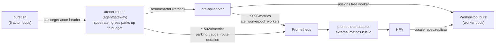

# Burst Without 503s: Request Parking + an Autoscaled WorkerPool

This lab essentially answers three questions:
  1. What happens when a new request for an Actor comes in, but there aren't any free Wortkers for the Actor to run on
  2. How HPA comes into play to scale up Workers/Worker Pools so when new requests for an Actor come in, they aren't sitting and waiting

Tldr; when more agents want to run than you have warm workers, Substrate has
two answers on two time scales:

- The **router parks** a request for a few seconds while a worker frees up.
- An **HPA grows the WorkerPool** when the pool stays full.

This lab shows each one alone, where each one fails, and then both together.

The router here is **agentgateway**: Substrate installed with
`--atenet-dataplane=agentgateway`, where agentgateway's `substrateIngress`
policy resumes actors and does the parking.

## Key terms

**Parked request.** A request for an actor that has no worker yet.

**Park budget** (just "budget" in this lab). The longest the router keeps a
parked request waiting. The clock starts when the router first tries to resume
the actor.

- A worker frees up within the budget: the request is served with `200`, late
  by however long it waited.
- The budget runs out first: the router gives up and returns `504`.

Requests for the same actor that arrive while it is parked wait on the same
resume and end with it.

It is the `budget` field of agentgateway's `substrateIngress.requestParking`
setting, which defaults to `5s`. `./scripts/router-parking.sh budget <secs>`
changes it. Your clients need timeouts longer than the budget, or they give up
before the router does.

**Parking off.** The sibling setting `requestParking.max` caps how many
requests can be parked at once (default `1024`). `max: 0` turns parking off: a
request that finds no free worker gets `429` right away, with no wait.

## What this lab proves

1. **Parking absorbs short contention.** With 6 actors on 2 workers and actors
   that keep suspending, every request returns `200`. Turn parking off and the
   same load returns `429`s.
2. **Parking does not add capacity.** When actors stay hot, a 5s park budget
   runs out and requests fail with `504`. The pool is simply too small.
3. **The HPA adds capacity.** `ate-api-server` exports
   `ate_workerpool_workers{ate_worker_state="at_capacity"}`. prometheus-adapter
   serves it to an HPA that writes `WorkerPool.spec.replicas`. The pool grows
   from 2 to 8 and the `504`s stop.
4. **Together they cover the gap.** Raise the park budget to cover the HPA's
   scale-up time, and a burst that starts on 2 workers is served while the
   pool grows, with far fewer `504`s.
5. **The metrics tell you which problem you have.**
   `agentgateway_substrate_request_parking_active` staying high while
   `agentgateway_atenet_router_route_duration_seconds{ate_router_outcome="resume_error"}`
   climbs means you are short on capacity, not hitting a fault.

## What Substrate pieces this uses

| Piece | Role in this lab | Source |
|---|---|---|
| `WorkerPool` (`ate.dev/v1alpha1`) | Warm worker pods. Has a `/scale` subresource (`specpath=.spec.replicas`), so an HPA can target it directly. | `pkg/api/v1alpha1/workerpool_types.go` |
| ActorTemplate (ate API, not a CRD) | The counter workload, created with `kubectl ate create actor-template`. | `manifests/actortemplate.yaml.tmpl` |
| agentgateway dataplane for atenet | `--atenet-dataplane=agentgateway` swaps the `atenet-router` Deployment's containers for a single `agentgateway` container. Its config is the ConfigMap `ate-system/atenet-router-agentgateway-config`. | `manifests/ate-install/components/agentgateway/` |
| `substrateIngress.requestParking` | On a retryable resume failure (`ResourceExhausted`, `FailedPrecondition`, `Unavailable`) agentgateway holds the request and retries `ResumeActor` until `budget` (default `5s`) runs out, then returns `504`. `max` (default `1024`) caps waiting requests; `max: 0` turns parking off. On by default. | agentgateway `crates/agentgateway/src/http/substrate/ingress.rs` |
| `ate.workerpool.workers` metric | Worker count per pool and state (`idle`, `partial`, `at_capacity`, `unschedulable`). Exported as `ate_workerpool_workers` on `ate-api-server:9090/metrics`. | `cmd/ateapi/internal/controlapi/metrics.go` |
| Router metrics | `agentgateway_substrate_request_parking_active` (gauge) and `agentgateway_atenet_router_route_duration_seconds` (labels `ate_router_outcome`, `ate_router_resume`), on the router pod's `:15020/metrics`. | agentgateway `crates/agentgateway/src/telemetry/metrics.rs` |
| HPA + prometheus-adapter | External metric, `AverageValue` target, adapted from upstream. | `demos/autoscaled-workerpool/` |

## How the two mechanisms fit



*The request path (top) and the capacity loop (bottom). Parking works on the
request path in seconds. The HPA works on the capacity loop in tens of
seconds.*

They work on different time scales:

| | Request parking | HPA on `at_capacity` |
|---|---|---|
| Reacts in | ~100ms retries | scrape (15s) + HPA sync (~15s) + worker pod start |
| Fixes | moments of contention: a worker frees up soon | lasting demand: you need more workers |
| Fails as | `504` once the budget runs out | `504`s while the pool is still growing |

---

## Prerequisites

1. Cluster

- A **GKE Standard** cluster with Agent Substrate installed and healthy, set up
  as in the [setup lab](../setup.md) (`./hack/install-ate.sh --deploy-ate-system`).
  This lab was written against Substrate `main` at commit `ea273bda`. The API is
  pre-1.0, so use that commit or later and build the images below from the same
  checkout you installed from.
- The **agentgateway** router dataplane. Add these flags to your install
  command (or re-run it with them):
  `--atenet-dataplane=agentgateway --credential-provider='{"enabled":false}'`.
  The installer only allows a credential provider with the Envoy dataplane, so
  egress credential injection must be off. The `atenet-router` Deployment then
  runs a single `agentgateway` container.
- The snapshot **GCS bucket** from setup, with atelet's IAM already granted.
- Room for **10 extra worker pods** (the HPA's `maxReplicas`). Worker pods run
  privileged gVisor sandboxes. If your node pool is small, enable the cluster
  autoscaler or lower `maxReplicas` in `manifests/hpa.yaml`.
- **No other external-metrics adapter.** `v1beta1.external.metrics.k8s.io` is
  a cluster singleton. Step 4 checks for this.

2. Tools

- `jq` and `yq` v4 ([mikefarah](https://github.com/mikefarah/yq)):
  `scripts/router-parking.sh` edits the router's YAML config with them.

Health check before you start:

```bash
kubectl get pods -n ate-system
kubectl -n ate-system get deploy atenet-router \
  -o jsonpath='{.spec.template.spec.containers[*].name}{"\n"}'
# expect: agentgateway
kubectl ate get atespaces
```

---

## Environment

```bash
export SUBSTRATE_DIR=~/gitrepos/substrate            # your Substrate checkout
export KO_DOCKER_REPO=gcr.io/<project-id>/ate-images  # same as setup
export BUCKET_NAME=<your-snapshot-bucket>             # same as setup

cd ~/gitrepos/agentic-demo-repo/substrate/autoscaling
```

Every command below runs from this `autoscaling/` directory.

## Step 1: Build the worker and workload images

The pool needs the `ateom-gvisor` worker image, and the template needs the
upstream counter workload. Build both from the checkout you installed from, so
the worker matches the control plane version. `ko build` prints the pushed
image reference (with digest) on stdout.

```bash
export ATEOM_IMAGE=$(cd "$SUBSTRATE_DIR" && \
  ./hack/run-tool.sh ko build --platform=linux/amd64 ./cmd/ateom-gvisor)
export COUNTER_IMAGE=$(cd "$SUBSTRATE_DIR" && \
  ./hack/run-tool.sh ko build --platform=linux/amd64 ./demos/counter)

echo "ATEOM_IMAGE=$ATEOM_IMAGE"
echo "COUNTER_IMAGE=$COUNTER_IMAGE"
```

> Already running another pool built from the same install? You can reuse its
> worker image:
> `kubectl get workerpools -A -o custom-columns=NS:.metadata.namespace,NAME:.metadata.name,IMAGE:.spec.workerImage`

## Step 2: Deploy the pool, atespace, and template

```bash
# Namespace + 2-worker WorkerPool
envsubst '${ATEOM_IMAGE}' < manifests/workerpool.yaml.tmpl | kubectl apply -f -
kubectl -n ate-lab-burst rollout status deployment/burst --timeout=10m

# Atespace + ActorTemplate (through the ate API)
kubectl ate create atespace ate-lab-burst
envsubst '${COUNTER_IMAGE} ${BUCKET_NAME}' < manifests/actortemplate.yaml.tmpl \
  | kubectl ate create actor-template -f -
```

Creating the template starts the **golden snapshot** build. The template can
be used once `GOLDEN TAG` is filled in:

```bash
kubectl ate get actor-templates -a ate-lab-burst
```

To wait for it from a script, poll the template until `goldenTag` appears and
stop on a build error (up to 15 minutes):

```bash
for i in $(seq 1 180); do
  out=$(kubectl ate get actor-template burst -a ate-lab-burst -o yaml)
  echo "$out" | grep -q 'errorMessage:' && { echo "$out"; break; }
  echo "$out" | grep -q 'goldenTag:' && { echo "golden snapshot ready"; break; }
  sleep 5
done
```

Confirm both workers registered and are free:

```bash
kubectl ate get workers -n ate-lab-burst
```

## Step 3: Create six actors

Six actors, two workers: oversubscribed 3:1.

```bash
for i in 1 2 3 4 5 6; do
  kubectl ate create actor "a$i" -a ate-lab-burst --template burst
done
kubectl ate get actors -a ate-lab-burst
```

All six start in `ACTOR_STATE_SUSPENDED`. They exist only as records, plus the
golden snapshot in GCS.

Keep a helper handy. You will reset to "everything suspended" between scenarios:

```bash
suspend_all() {
  for i in 1 2 3 4 5 6; do
    kubectl ate suspend actor "a$i" -a ate-lab-burst >/dev/null 2>&1 || true
  done
  kubectl ate get actors -a ate-lab-burst
}
```

## Step 4: Install Prometheus, prometheus-adapter, and check the metric

Preflight: make sure nothing else owns the external metrics API.

```bash
kubectl get apiservice v1beta1.external.metrics.k8s.io 2>/dev/null \
  && echo "STOP: another external-metrics adapter owns this API; see Prerequisites" \
  || echo "OK: external metrics API is free"
```

Deploy:

```bash
kubectl apply -f manifests/prometheus.yaml
kubectl -n ate-lab-burst-monitoring rollout status deployment/prometheus --timeout=5m

kubectl apply -f manifests/prometheus-adapter.yaml
kubectl -n ate-lab-burst-monitoring rollout status deployment/prometheus-adapter --timeout=5m
kubectl wait --for=condition=Available apiservice/v1beta1.external.metrics.k8s.io --timeout=5m
```

Check that Prometheus scrapes both Substrate components. Open a forward in a
spare terminal and leave it running for the rest of the lab:

```bash
kubectl -n ate-lab-burst-monitoring port-forward svc/prometheus 9091:9090
```

```bash
curl -s localhost:9091/api/v1/targets \
  | jq -r '.data.activeTargets[] | "\(.labels.app)\t\(.labels.pod)\t\(.health)"'
# expect ate-api-server (x2) and atenet-router, all "up"

curl -s localhost:9091/api/v1/query \
  --data-urlencode 'query=max by (ate_worker_state) (ate_workerpool_workers{ate_workerpool_namespace="ate-lab-burst",ate_workerpool_name="burst"})' \
  | jq -r '.data.result[] | "\(.metric.ate_worker_state)\t\(.value[1])"'
# with everything suspended: idle 2, partial 0, at_capacity 0, unschedulable 0
```

Check that the metric resolves through the External Metrics API, exactly as
the HPA will request it:

```bash
kubectl get --raw "/apis/external.metrics.k8s.io/v1beta1/namespaces/ate-lab-burst/ate_workerpool_workers?labelSelector=ate_worker_state%3Dat_capacity,ate_workerpool_namespace%3Date-lab-burst,ate_workerpool_name%3Dburst" \
  | jq '.items[] | {metricLabels, value}'
```

Also confirm the router's agentgateway metrics are there (Prometheus scrapes
the router pod on `:15020`):

```bash
curl -s localhost:9091/api/v1/label/__name__/values \
  | jq -r '.data[] | select(startswith("agentgateway_substrate") or startswith("agentgateway_atenet_router"))'
# expect agentgateway_substrate_request_parking_active and
# agentgateway_atenet_router_route_duration_seconds_{bucket,count,sum}
```

---

## Scenario 1: Parking absorbs short contention

Check that parking is on with the upstream defaults:

```bash
./scripts/router-parking.sh status
```

```text
==> requestParking in ate-system/atenet-router-agentgateway-config ({} = agentgateway defaults)
    set:       {}
    effective: budget=5s max=1024 retryInterval=100ms retryFactor=1.1
==> live gauge from the router's stats port (:15020/metrics)
    agentgateway_substrate_request_parking_active 0
```

### a. Watch one request park

Open a router port-forward in **terminal 1** and leave it running:

```bash
kubectl -n ate-system port-forward svc/atenet-router 8000:80
```

In **terminal 2**, fill both workers:

```bash
curl -s -H "ate-target-actor: ate-lab-burst/a1" http://localhost:8000
curl -s -H "ate-target-actor: ate-lab-burst/a2" http://localhost:8000
kubectl ate get workers -n ate-lab-burst      # both ASSIGNED
```

Now request `a3`, timing it. The pool is full, so the request **parks** and
`curl` hangs:

```bash
curl -s -w '-> HTTP %{http_code} in %{time_total}s\n' \
  -H "ate-target-actor: ate-lab-burst/a3" http://localhost:8000
```

Within 5 seconds, free a worker from **terminal 3**:

```bash
kubectl ate suspend actor a1 -a ate-lab-burst
```

Terminal 2 finishes with `HTTP 200` and a `time_total` of a few seconds: the
time it spent parked. Wait longer than 5s instead and you get `504` once the
budget runs out.

```bash
suspend_all
```

### b. Churn load: zero failures

`churn` mode runs one request → suspend loop per actor. Six actors fight over
two workers, but each one gives its worker back right after its request:

```bash
./scripts/burst.sh -m churn -d 45
```

Expected shape (your counts will differ):

```text
==> results (churn, 45s, pool now 2/2)
    total requests : <n>
    200 OK         : <n>
    504            : 0   <- park budget ran out
    429            : 0   <- pool full, parking off
    503            : 0   <- parking lot full / transient / stale assignment
    other          : 0
    200 latency    : avg <s>  p50 <s>  p95 <s>  max <s>
    200s over 1s   : <n>   <- requests that waited (parked) before being served

    => 0 failures: every request was served.
```

The `200s over 1s` line counts requests that parked and then succeeded.

agentgateway caches an actor's worker assignment for 5s (`cacheTtl`). In churn
mode an actor's next request often arrives within 5s of its suspend, so it
first goes to the old worker. That worker's tunnel answers `421` with
`x-ate-assignment-stale`, and agentgateway drops the cached entry and resolves
again. An occasional `503` in churn mode is that retry running out, not
parking.

### c. Same load, parking off

```bash
./scripts/router-parking.sh off      # sets requestParking.max: 0, restarts the router
./scripts/burst.sh -m churn -d 45
```

Now short saturation shows up right away, mostly as `429`s: with parking off,
agentgateway turns the control plane's `ResourceExhausted` (no free worker)
into `429 rate limited` instead of waiting. Expect some `503`s too, from
actors caught mid-suspend (`FailedPrecondition`). Restore the default:

```bash
./scripts/router-parking.sh default
suspend_all
```

> The router restarts on every `router-parking.sh` change, which kills any
> manual port-forward from terminal 1 and drops requests parked at that moment
> (agentgateway drains for about 5s in this install). Change settings between
> runs, and restart your port-forward if you use it again.
> `burst.sh` opens its own forward on each run.

---

## Scenario 2: Parking is not capacity

`hold` mode never suspends. Each actor sends a request every second and stays
hot, so the first two actors to land keep both workers:

```bash
./scripts/burst.sh -m hold -d 60
```

The live ticker shows the pool stuck at `2/2` while `504`s keep coming:

```text
    t      pool s/r     200     429     503     504     other
    5s     2/2          <n>     0       0       <n>     0
    10s    2/2          <n>     0       0       <n>     0
    ...
```

Four actors park, wait the full 5s budget, get `504`, and try again. No worker
ever frees up. Parking delays the failure; it does not prevent it. Check the
parked-requests gauge while it runs (in another terminal); it stays above
zero:

```bash
./scripts/router-parking.sh status
```

```bash
suspend_all
```

---

## Scenario 3: The HPA adds capacity

```bash
kubectl apply -f manifests/hpa.yaml
kubectl -n ate-lab-burst get hpa burst
```

Wait until `TARGETS` shows a value (for example `0/700m (avg)`) instead of
`<unknown>`. That means the HPA can read the metric.

In a spare terminal, watch the pool:

```bash
kubectl -n ate-lab-burst get hpa burst -w
```

Run the same sustained burst that failed in Scenario 2:

```bash
./scripts/burst.sh -m hold -d 180
```

What to look for in the ticker:

- `pool s/r` climbs: `2/2 -> 3/... -> 5/... -> 8/8`, one HPA step at a time
  (see the blind spot above).
- `504` per window falls to `0` once the pool has a worker for each hot actor.
- The summary's `failure window` gives you the **time to absorb the burst**.
  Write it down in the [results table](#results-template).

At the end, six actors are running on an 8-worker pool with 2 idle workers as
headroom. It stops at 8, not `ceil(6 / 0.7) = 9`, because of the HPA's
default 10% tolerance: at 8 replicas the ratio is `6 / (0.7 × 8) ≈ 1.07`,
which is within 10% of target, so the HPA leaves the pool alone. That is
expected, not a stuck HPA.

```bash
kubectl ate get workers -n ate-lab-burst
kubectl -n ate-lab-burst get hpa burst
```

### Scale back down

Suspend everything. `at_capacity` drops to 0, and after the 60s scale-down
window the HPA removes 2 workers every 30s until it reaches the floor of 2:

```bash
suspend_all
kubectl -n ate-lab-burst get workerpool burst -w
```

Wait for `2` before Scenario 4. Scenario 4 has to start from a cold pool to mean
anything.

---

## Scenario 4: Size the park budget to cover scale-up

Scenario 3's `504`s came from the pool's climb: a parked request gives up after 5s,
but each HPA step takes longer than that. Give parked requests enough budget
to cover the climb:

```bash
./scripts/router-parking.sh budget 90
```

This sets `requestParking.budget: 90s` on the shared `substrateIngress` block
in `atenet-router-agentgateway-config` and restarts the router. agentgateway
uses the budget as the whole deadline for its `ResumeActor` retry loop, so
nothing else needs to change. Nothing else cuts a 90s wait short either:
agentgateway has no default request timeout (it only applies one when a route
sets a `timeout` policy, and this install's routes don't).

Run the burst from the cold 2-worker pool:

```bash
./scripts/burst.sh -m hold -d 180
```

Compare with Scenario 3:

- **504s:** expect far fewer. Requests that would have failed now wait in the
  parking lot until the HPA adds a worker.
- **Latency:** `p95` and `max` for `200`s are much higher. That is the cost:
  the client waits instead of failing. Your callers need client timeouts that
  are longer than the budget.
- If `504`s remain, the climb to the last worker took longer than 90s. The
  `failure window` in the summary tells you by how much. Raise the budget, lower
  `averageValue` in `hpa.yaml` for bigger HPA steps, or raise `minReplicas`.

Put the router back when you are done:

```bash
./scripts/router-parking.sh default
suspend_all
```

---

## Read it in Prometheus

Using the `localhost:9091` forward from Step 4, run these in the Prometheus UI
(`http://localhost:9091/graph`) or with
`curl -s localhost:9091/api/v1/query --data-urlencode 'query=...' | jq`.
Use the graph view across the time of Scenarios 1-4.

Pool occupancy by worker state, the HPA's input:

```promql
max by (ate_worker_state) (
  ate_workerpool_workers{ate_workerpool_namespace="ate-lab-burst", ate_workerpool_name="burst"}
)
```

Requests waiting on a resume right now (one router pod, so `max` is the value):

```promql
max(agentgateway_substrate_request_parking_active)
```

This counts every request agentgateway is resolving through ate-api, including
ones about to succeed on the first try, so short spikes are normal. A gauge
that stays up for the whole run means requests keep waiting for workers that
never free up (Scenario 2).

How resolutions ended:

```promql
sum by (ate_router_outcome) (
  increase(agentgateway_atenet_router_route_duration_seconds_count[2m]))
```

- `ok`: agentgateway got a worker for the actor, from its cache or from ate-api.
- `resume_error`: it gave up. In this lab that is almost always the park
  budget running out (`504`), or `429` with parking off. agentgateway doesn't
  label the reason, so match it against `burst.sh`'s code counts or the router
  log, where budget exhaustion shows `grpc.code=DeadlineExceeded`:
  `kubectl -n ate-system logs deploy/atenet-router | grep "substrate ResumeActor failed"`

Whether a successful request triggered a resume, joined one already running,
or needed none:

```promql
sum by (ate_router_resume) (
  increase(agentgateway_atenet_router_route_duration_seconds_count{ate_router_outcome="ok"}[2m]))
```

`triggered` is a resume of a suspended actor. `joined` is a request that waited
on another request's resume of the same actor. `none` means the actor was
already running.

p95 time to get a worker for successful requests, which includes time spent
parked:

```promql
histogram_quantile(0.95, sum by (le) (
  rate(agentgateway_atenet_router_route_duration_seconds_bucket{ate_router_outcome="ok"}[1m])))
```

The top bucket is 80s, so in Scenario 4 with a 90s budget the slowest waits show as
`+Inf`.

How to read them together: a pool stuck at `at_capacity == replicas`, a parked
gauge that stays up, and rising `resume_error` is a capacity problem (Scenario 2).
Mostly `ok`, with p95 time to a worker rising, is parking covering for
scale-up (Scenario 4).

---

## Cleanup

```bash
make clean
```


Check for leftover snapshot objects under the lab's prefix, and delete them
only if you are sure nothing else uses that prefix:

```bash
gcloud storage ls "gs://${BUCKET_NAME}/ate-lab-burst/"
# gcloud storage rm -r "gs://${BUCKET_NAME}/ate-lab-burst/"
```

---

## References

- Substrate: `manifests/ate-install/components/agentgateway/` (the agentgateway
  dataplane overlay), `demos/autoscaled-workerpool/README.md`,
  `cmd/kubectl-ate/README.md`. `docs/request-parking.md` and
  `demos/parking/README.md` describe the Envoy router's parking; agentgateway's
  uses the same defaults and retryable errors.
- agentgateway: `crates/agentgateway/src/http/substrate/ingress.rs`
  (`substrateIngress`, `requestParking`) and
  `crates/agentgateway/src/telemetry/metrics.rs`
- Kubernetes HPA external metrics:
  <https://kubernetes.io/docs/tasks/run-application/horizontal-pod-autoscale/#scaling-on-metrics-not-related-to-kubernetes-objects>
- prometheus-adapter: <https://github.com/kubernetes-sigs/prometheus-adapter>
