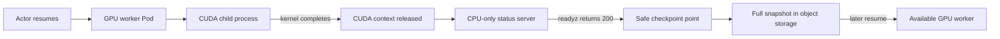

# GPU-Backed Actors with Agent Substrate

This lab runs CUDA inside an Agent Substrate actor and demonstrates how many
intermittent GPU workloads can take turns using a smaller pool of GPU-backed
workers.

The important constraint is that gVisor cannot checkpoint an open CUDA context.
The workload therefore runs CUDA in a short-lived child process, waits for that
process to release the GPU, and then starts a CPU-only HTTP server. Substrate
only snapshots the actor after that server reports ready.

This is the safe pattern supported today. A model server that keeps weights in
GPU memory cannot currently be suspended.

## What This Demonstrates

| Capability | Proof in this lab |
|---|---|
| GPU passthrough | A CUDA vector-add kernel runs inside a gVisor actor. |
| GPU-specific placement | The ActorTemplate only matches a labeled GPU WorkerPool. |
| Golden snapshot safety | Readiness is reported only after the CUDA child exits. |
| Full suspend and restore | The CPU-only server is checkpointed and restored after GPU work finishes. |
| Temporal multiplexing | Multiple suspended actors can take turns on one GPU worker. |

It does **not** demonstrate fractional GPU sharing. Each worker Pod reserves one
GPU, and one running actor occupies that worker. The optimization comes from
reusing that GPU over time instead of reserving one GPU Pod for every logical
agent.



## Demo Files

```text
gpu-backed-actors/
├── Makefile
├── README.md
├── manifests/
│   ├── actortemplate.yaml.tmpl
│   └── workerpool.yaml.tmpl
└── workload/
    ├── Dockerfile
    ├── cuda_probe.cu
    ├── start.sh
    └── status_server.c
```

The generated images and rendered manifests are written to `.build/`, which is
ignored by Git.

## Current Support Boundary

GPU actors are currently:

- NVIDIA-only.
- Linux-only.
- gVisor-only. MicroVM GPU passthrough is not implemented.
- Limited to checkpoints taken after every CUDA context has closed.
- Covered by unit tests with fake devices and CDI data, but not by a
  hardware-backed upstream E2E lane.

Treat this as preview functionality and validate the complete driver, toolkit,
CUDA, gVisor, and Substrate version combination before relying on it.

This lab was authored against Substrate commit `bc51ef2452c4` and its
2026-08-03 gVisor `SandboxConfig`. The workload pins CUDA 12.8.1 on Ubuntu
22.04. No driver or Container Toolkit version is prescribed because those must
match the selected GKE version and node image.

## Prerequisites

Run the lab from this directory. You need:

- A current checkout of the Agent Substrate repository. By default, the
  Makefile expects it at `../../../../substrate`; override `SUBSTRATE_DIR` if it
  is elsewhere.
- Agent Substrate installed on a GKE Standard cluster.
- A Linux `amd64` GPU node pool. The provided manifest targets an NVIDIA T4 by
  default.
- An NVIDIA device plugin exposing `nvidia.com/gpu`.
- NVIDIA driver files mounted into GPU Pods, normally under
  `/usr/local/nvidia`.
- The NVIDIA Container Toolkit on the GPU nodes, including `nvidia-ctk` and
  `nvidia-cdi-hook`, normally under `/usr/local/nvidia/toolkit`.
- `atelet` scheduled on every GPU node.
- `docker` with Buildx, `jq`, `envsubst`, Ruby, `kubectl`, `gcloud`, Go, and
  `kubectl-ate`.
- A registry configured through `KO_DOCKER_REPO` and a GCS snapshot bucket in
  `BUCKET_NAME`.

The standard Substrate `setup-gcp` flow creates CPU nodes and the snapshot
bucket. It does not create GPU nodes or install the NVIDIA stack. Provision
those components using the instructions for your GKE version and node image.
Do not install a second device plugin over a GKE-managed device plugin without
checking how your cluster supplies drivers and devices.

This lab uses one T4. Override the accelerator selector if your pool uses a
different label value:

```bash
export GPU_ACCELERATOR=nvidia-tesla-t4
```

## Step 1: Verify the Cluster Contract

Source the environment used for your Substrate installation:

```bash
source /path/to/substrate/.ate-dev-env.sh
export SUBSTRATE_DIR=/path/to/substrate
```

Confirm Substrate is healthy:

```bash
kubectl get pods -n ate-system
kubectl get sandboxconfig gvisor-default
kubectl ate get workers
```

Find a GPU node and confirm Kubernetes advertises the device:

```bash
export GPU_NODE=$(kubectl get nodes \
  -l "cloud.google.com/gke-accelerator=${GPU_ACCELERATOR:-nvidia-tesla-t4}" \
  -o jsonpath='{.items[0].metadata.name}')

test -n "$GPU_NODE"
kubectl get node "$GPU_NODE" \
  -o custom-columns=NAME:.metadata.name,GPU:.status.allocatable.nvidia\.com/gpu
```

`GPU` must be at least `1`.

If the GPU nodes use an `nvidia.com/gpu:NoSchedule` taint, add a matching
toleration to `atelet`. The strategic merge preserves its existing Substrate
toleration:

```bash
kubectl -n ate-system patch daemonset atelet --type=strategic -p '
spec:
  template:
    spec:
      tolerations:
      - key: nvidia.com/gpu
        operator: Exists
        effect: NoSchedule
'
```

Wait until an `atelet` Pod is ready on the GPU node:

```bash
kubectl -n ate-system get pods \
  -l app=atelet \
  --field-selector "spec.nodeName=${GPU_NODE}" \
  -o wide
```

If your toolkit or driver paths differ from Substrate's defaults, configure the
controller before creating the WorkerPool:

```bash
kubectl -n ate-system set env deployment/ate-controller \
  ATE_NVIDIA_TOOLKIT_HOST_PATH=/actual/host/toolkit/path \
  ATE_NVIDIA_DRIVER_ROOT=/actual/in-pod/driver/root

kubectl -n ate-system rollout status deployment/ate-controller --timeout=5m
```

Omit that command when the defaults are correct. The toolkit host directory
must contain executable `nvidia-ctk` and `nvidia-cdi-hook` binaries. The driver
root is the path the device plugin mounts inside the worker Pod, not necessarily
the driver's path on the node.

## Step 2: Build the Images

The normal `ateom-gvisor` image uses a static distroless base and cannot execute
the host's dynamically linked `nvidia-ctk`. This lab builds a separate
glibc-based image for the GPU WorkerPool.

Set the registry and authenticate Docker:

```bash
export KO_DOCKER_REPO="gcr.io/${PROJECT_ID}/ate-images"
gcloud auth configure-docker gcr.io
```

Build and push both digest-addressed images:

```bash
make images
```

This produces:

- `.build/ateom-gpu-image`: glibc-based `ateom-gvisor`.
- `.build/workload-image`: CUDA probe plus CPU-only status server.

Inspect the immutable references:

```bash
cat .build/ateom-gpu-image
cat .build/workload-image
```

The workload image uses pinned CUDA 12.8.1 build and runtime base-image
digests. Confirm CUDA 12.8 user-space compatibility with the driver installed
on your nodes before deployment.

## Step 3: Render and Deploy the GPU Pool

Render the manifests and run local syntax checks:

```bash
make render
```

Review the exact resources before applying them:

```bash
kubectl diff -f .build/workerpool.yaml
kubectl diff -f .build/actortemplate.yaml
```

Deploy the one-worker GPU pool first, then the ActorTemplate. The ordering
matters because template reconciliation immediately starts a golden actor:

```bash
make deploy
```

The WorkerPool requests and limits one `nvidia.com/gpu`. This both makes the
Kubernetes device plugin assign a GPU and tells Substrate to inject the device,
driver libraries, and approved CDI edits into the actor sandbox.

Verify placement and the generated worker shape:

```bash
kubectl get workerpool,actortemplate -n ate-demo-gpu
kubectl get pods -n ate-demo-gpu -o wide
kubectl get deployment gpu-workers -n ate-demo-gpu \
  -o jsonpath='{.spec.template.spec.containers[0].resources}'
```

Confirm the worker has the toolkit mount and a GPU device:

```bash
export GPU_WORKER=$(kubectl get pods -n ate-demo-gpu \
  -l ate.dev/worker-pool=gpu-workers \
  -o jsonpath='{.items[0].metadata.name}')

kubectl exec -n ate-demo-gpu "$GPU_WORKER" -c ateom -- \
  sh -c 'test -x /opt/nvidia-toolkit/nvidia-ctk || test -x /opt/nvidia-toolkit/nvidia-ctk.real'

kubectl exec -n ate-demo-gpu "$GPU_WORKER" -c ateom -- \
  sh -c 'set -- /dev/nvidia[0-9]*; test -e "$1"'
```

The template becomes `Ready` only after its golden actor runs the CUDA probe,
the probe process exits, `/readyz` returns `200`, and the full golden snapshot
completes.

## Step 4: Run CUDA and Test Suspend/Restore

Run the automated lifecycle test:

```bash
make test
```

The target performs this sequence:

1. Creates the `gpu-demo` Atespace and `gpu-1` actor.
2. Uses `--boot` so this actor executes CUDA instead of restoring the golden
   snapshot.
3. Checks its logs for `GPU_PROBE_OK`.
4. Suspends the actor after the CUDA child has exited.
5. Restores the full snapshot.
6. Suspends it again, leaving it in a safe state for inspection or cleanup.

Inspect the actor and its logs:

```bash
kubectl ate get actor gpu-1 --atespace gpu-demo -o yaml
kubectl ate resume actor gpu-1 --atespace gpu-demo
kubectl ate logs actors gpu-1 --atespace gpu-demo
```

Expected probe output resembles:

```text
GPU_PROBE_OK device=0 name=NVIDIA Tesla T4 vector_items=4096 expected_sum=3
STATUS_SERVER_READY port=80 result_file=/run/gpu-demo/probe-result.txt
```

Query the actor through the Substrate router:

```bash
kubectl -n ate-system port-forward svc/atenet-router 8000:80
```

In another terminal:

```bash
curl -sS \
  -H 'Host: gpu-1.gpu-demo.actors.resources.substrate.ate.dev' \
  http://localhost:8000/
```

The response contains the saved CUDA result. The server itself has not opened a
CUDA context, which is why subsequent suspension is safe.

## Step 5: Demonstrate Temporal Multiplexing

One GPU worker can run one actor at a time. Create a second logical GPU actor:

```bash
kubectl ate suspend actor gpu-1 --atespace gpu-demo

kubectl ate create actor gpu-2 \
  --atespace gpu-demo \
  --template ate-demo-gpu/gpu-context-release

kubectl ate resume actor gpu-2 --atespace gpu-demo --boot
kubectl ate logs actors gpu-2 --atespace gpu-demo
kubectl ate get workers -l workload=gpu-context-release
```

Suspend `gpu-2`, then resume `gpu-1`:

```bash
kubectl ate suspend actor gpu-2 --atespace gpu-demo
kubectl ate resume actor gpu-1 --atespace gpu-demo
kubectl ate get actors --atespace gpu-demo
kubectl ate get workers -l workload=gpu-context-release
```

Both logical actors exist, but only the running actor holds the GPU worker.
Scale the WorkerPool when you need more concurrent GPU actors:

```bash
kubectl scale workerpool gpu-workers -n ate-demo-gpu --replicas=2
```

That command requires enough allocatable GPUs for the additional worker. It
does not create more GPU nodes.

## Why the Process Split Matters

The container starts two sequential processes:

```text
start.sh
  -> cuda-probe          # opens CUDA, runs a kernel, resets, exits
  -> status-server       # CPU-only steady state, reports ready
```

Process exit is the synchronization boundary. It guarantees the CUDA context is
gone before readiness can succeed. `cudaDeviceReset()` is also called, but the
child-process exit is the stronger guarantee.

Do not replace this with a long-running Python, PyTorch, TensorFlow, vLLM, or
CUDA process that remains alive after loading a model. Substrate does not
currently have a pre-suspend hook that asks an application to unload its model,
and gVisor cannot serialize the GPU context.

## Troubleshooting

### Worker Pod stays Pending

Check GPU capacity, node labels, taints, and events:

```bash
kubectl describe pod -n ate-demo-gpu "$GPU_WORKER"
kubectl get nodes \
  -l "cloud.google.com/gke-accelerator=${GPU_ACCELERATOR:-nvidia-tesla-t4}"
```

The WorkerPool must set `nvidia.com/gpu` in both requests and limits. GPU
requests on a `microvm` pool are rejected by the CRD.

### `nvidia-toolkit` hostPath is missing

The controller defaults to `/usr/local/nvidia/toolkit` on the node. Install the
NVIDIA Container Toolkit or set `ATE_NVIDIA_TOOLKIT_HOST_PATH` to the actual
directory, then restart the generated worker Deployment.

### `nvidia-ctk cdi generate failed`

Confirm the worker sees the toolkit, driver libraries, driver binaries, and GPU
devices:

```bash
kubectl exec -n ate-demo-gpu "$GPU_WORKER" -c ateom -- \
  sh -c 'ls -l /opt/nvidia-toolkit /usr/local/nvidia/lib64 /usr/local/nvidia/bin /dev/nvidia*'
```

If the device plugin uses a different in-Pod driver root, configure
`ATE_NVIDIA_DRIVER_ROOT` on `ate-controller` and recreate the worker Pod.

### ActorTemplate never becomes Ready

Inspect the golden actor and platform logs:

```bash
kubectl get actortemplate gpu-context-release -n ate-demo-gpu -o yaml
kubectl ate get actors -a ate-golden
kubectl logs -n ate-system deployment/ate-controller
kubectl logs -n ate-system -l app=atelet --all-containers=true --prefix
kubectl logs -n ate-demo-gpu deployment/gpu-workers -c ateom
```

Readiness intentionally fails when the CUDA probe fails. This prevents the
controller from taking a golden snapshot at an unsafe or unverified point.

### Suspend fails with an nvproxy encoding error

A process still owns a CUDA context. This demo's `status-server` never calls
CUDA. For another workload, stop every CUDA-owning process before suspension.
The failed checkpoint may leave the actor crashed; inspect its state before
retrying or cleaning up.

## Cleanup

The lifecycle test leaves `gpu-1` suspended. If you created `gpu-2`, suspend and
delete it first:

```bash
kubectl ate suspend actor gpu-2 --atespace gpu-demo
kubectl ate delete actor gpu-2 --atespace gpu-demo
```

Remove the standard demo resources:

```bash
make clean
```

This deletes `gpu-1`, its Atespace, the ActorTemplate, WorkerPool, and demo
namespace. It also removes the template's golden actor when its ID is available.
It does not remove GPU nodes, the NVIDIA stack, pushed images, the `atelet`
toleration, controller environment overrides, or snapshot objects. Cleanup
refuses to delete a namespace that is not labeled `gpu-backed-actors-demo=true`
or an Atespace that was not created and marked by `make test`.

Substrate does not currently garbage-collect snapshot objects. Review the
prefix before deleting it manually:

```bash
gcloud storage ls "gs://${BUCKET_NAME}/ate-demo-gpu/**"
gcloud storage rm --recursive "gs://${BUCKET_NAME}/ate-demo-gpu/"
```

The second command permanently deletes the demo snapshots. Run it only after
confirming that the bucket and prefix are dedicated to this lab.

## Takeaway

GPU-backed actors are useful for bursty jobs that can release their CUDA state:
embedding batches, image transforms, finite inference subprocesses, evaluation
jobs, and tool calls. Suspended logical actors can greatly outnumber expensive
GPU workers, while active actors receive the complete assigned device through
gVisor's nvproxy path.

The current boundary is equally important: resident GPU state is not
checkpointable. Design the workload around explicit GPU phases and a CPU-only
safe point before suspension.
